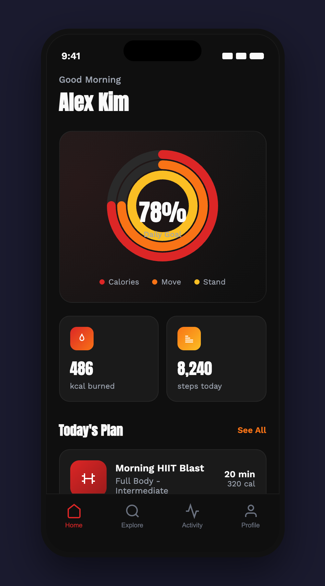
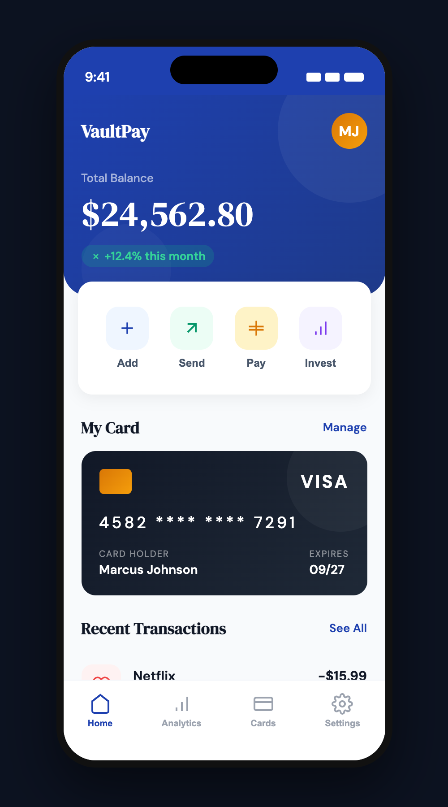
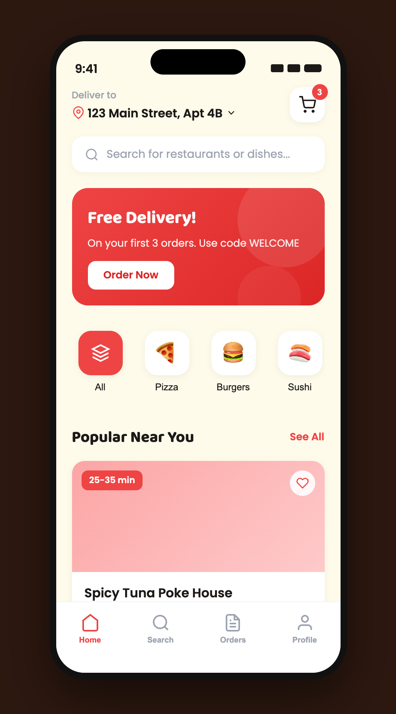

# Mobile App Design Pro

**A Claude Code skill that generates production-grade mobile app UI with an AI-powered design system engine.**

Give Claude a simple prompt like *"design a fitness app"* and get a complete, polished mobile app mockup — with intelligent theme selection, proper typography, animations, and a realistic phone frame.

---

## What It Does

```
"Design a finance app" → Complete design system + polished phone mockup
```

This skill supercharges Claude Code's ability to design mobile app interfaces by providing:

- **67 Visual Styles** — From Glassmorphism to Neubrutalism to Cyberpunk UI
- **96 Color Palettes** — Industry-matched, curated for mobile
- **57 Font Pairings** — Google Fonts, organized by mood & personality
- **100 Reasoning Rules** — Auto-matches industry/product type to the perfect design system
- **Disney's 12 Principles** — Applied to mobile UI animations
- **Platform Guidelines** — iOS HIG + Material Design 3 baked in

No more generic purple-gradient-with-Inter designs. Every output is intentional, industry-aware, and production-quality.

---

## Sample Outputs

<p align="center">
  &nbsp;&nbsp;&nbsp;&nbsp;
  &nbsp;&nbsp;&nbsp;&nbsp;
  
</p>

<p align="center">
  <b>FitPulse</b> &nbsp;&bull;&nbsp; <b>VaultPay</b> &nbsp;&bull;&nbsp; <b>BiteBuddy</b>
</p>

Each design is generated from a single prompt. The skill automatically selects the right style, colors, typography, and layout patterns based on the app's industry.

### FitPulse — Fitness App
> `"Design a fitness tracking app"`

| Property | Value |
|----------|-------|
| Style | Motion-Driven + Dark Mode OLED |
| Palette | Power Red (`#DC2626`, `#F97316`, `#FBBF24`) |
| Fonts | Anton / Work Sans |
| Pattern | Dashboard Hub with activity rings |

### VaultPay — Finance App
> `"Design a banking finance app"`

| Property | Value |
|----------|-------|
| Style | Soft UI Evolution + Swiss Modernism |
| Palette | Trust Blue (`#1E40AF`, `#059669`, `#D97706`) |
| Fonts | DM Serif Display / DM Sans |
| Pattern | Dashboard Hub with credit card |

### BiteBuddy — Food Delivery App
> `"Design a food delivery app"`

| Property | Value |
|----------|-------|
| Style | Flat Design + Claymorphism accents |
| Palette | Warm Appetite (`#EF4444`, `#F97316`, `#FBBF24`) |
| Fonts | Baloo 2 / Poppins |
| Pattern | Tab-Based Feed with restaurant cards |

Interactive HTML demos are also available in the [`samples/`](samples/) folder — open them in your browser to see animations and navigation.

---

## How It Works

```
┌─────────────────────────────────────────────────────┐
│  1. USER PROMPT                                      │
│     "Design a meditation app"                        │
├─────────────────────────────────────────────────────┤
│  2. REASONING ENGINE                                 │
│     Match → Rule #31 (Meditation)                    │
│     Pattern: Tab-Based Feed                          │
│     Style: Nature Distilled                          │
│     Colors: Calm Sage palette                        │
│     Fonts: Quicksand / Open Sans                     │
│     Anti-patterns: Bright colors, dense info         │
├─────────────────────────────────────────────────────┤
│  3. DESIGN SYSTEM GENERATION                         │
│     Complete token system: colors, fonts, spacing,   │
│     radius, shadows, animations, effects             │
├─────────────────────────────────────────────────────┤
│  4. USER CONFIRMATION                                │
│     Present design system → user approves/adjusts    │
├─────────────────────────────────────────────────────┤
│  5. BUILD                                            │
│     React artifact with phone frame, 3-5 screens,   │
│     working navigation, animations, realistic data   │
└─────────────────────────────────────────────────────┘
```

---

## Installation

### Claude Code (recommended)

Copy the skill folder to your Claude Code skills directory:

```bash
# Clone this repo
git clone https://github.com/NguyenKhacPhuc/mobile-app-design-pro.git

# Copy to Claude Code skills directory
cp -r mobile-app-design-pro ~/.claude/skills/mobile-app-design-pro
```

That's it. Claude Code will automatically detect the skill when you ask it to design a mobile app.

### Manual Usage

You can also reference the files directly in any Claude conversation:
1. Share `SKILL.md` as context
2. Share the `references/` files for the full database
3. Ask Claude to design your app

---

## File Structure

```
mobile-app-design-pro/
├── SKILL.md                          # Main skill instructions
├── references/
│   ├── design-system.md              # Component specs & platform guidelines
│   ├── theme-engine.md               # 67 styles, 96 palettes, 57 fonts, 100 rules
│   └── ux-animation.md               # UX philosophy, Disney's 12 principles, motion
├── samples/
│   ├── fitness-app.html              # FitPulse demo
│   ├── finance-app.html              # VaultPay demo
│   └── food-delivery-app.html        # BiteBuddy demo
└── README.md
```

---

## Supported Industries

The reasoning engine covers **100 product categories** across these sectors:

| Sector | Categories |
|--------|-----------|
| **Tech & SaaS** | SaaS, Micro SaaS, B2B, Dev Tools, AI/Chatbot, PM, CRM, Analytics, Collaboration, No-Code, APIs, Cloud, Email, Notes, Calendar |
| **Finance** | Fintech, Banking, Crypto, Insurance, Trading, Personal Finance, Invoicing, Payments, Budgeting, Investment |
| **Healthcare** | Medical, Pharmacy, Dental, Mental Health, Fitness, Meditation, Nutrition, Veterinary, Elderly Care, Pregnancy |
| **E-commerce** | General, Luxury, Marketplace, Subscription, Grocery, Fashion, Electronics, Furniture, Artisan, Streetwear |
| **Food & Delivery** | Food Delivery, Restaurant, Coffee, Recipes, Meal Prep, Nightlife, Bakery |
| **Social** | Social Network, Messaging, Dating, Community, Photo, Video, Podcasts, Streaming, Professional, Anonymous |
| **Education** | Online Learning, Kids, Languages, University, Coding, Music, Flashcards, Tutoring |
| **Travel** | Booking, Hotels, Airlines, City Guides, Ride-Share, Vacation Rental, Cruise, Tourism |
| **Entertainment** | Music, Gaming, Movies, Sports, News, Weather, Photography, Journaling, Habits, Pets, Events, Fashion |
| **Emerging** | Web3/NFT, Spatial Computing, Smart Home, Autonomous, Sustainability, Real Estate, Legal, Nonprofit, Government, Quantum |

---

## Example Prompts

Try these with Claude Code:

```
"Design a meditation app with dark mode"
"Create a crypto trading dashboard"
"Build a food delivery app like DoorDash"
"Design a kids education app for learning math"
"Make a luxury fashion e-commerce app"
"Design a podcast player with glassmorphism style"
"Create a habit tracker with bento grid layout"
```

---

## What Makes This Different

| Feature | Without This Skill | With This Skill |
|---------|-------------------|-----------------|
| **Typography** | Inter/Roboto default | Industry-matched from 57 curated pairings |
| **Colors** | Generic blue/purple | Mood-appropriate from 96 palettes |
| **Layout** | Desktop-like | True mobile-first with thumb zone design |
| **Navigation** | Top nav only | Bottom tab bar + proper screen structure |
| **Animations** | None or basic | Disney's 12 principles + platform-specific motion |
| **Phone Frame** | Raw webpage | Realistic device with Dynamic Island + status bar |
| **Content** | Lorem ipsum | Realistic, industry-specific placeholder data |
| **Anti-patterns** | Common mistakes | 100 rules of what to avoid per industry |

---

## Contributing

Found a bug? Want to add more styles, palettes, or reasoning rules? PRs welcome!

---

## License

MIT License. Use freely for personal and commercial projects.
