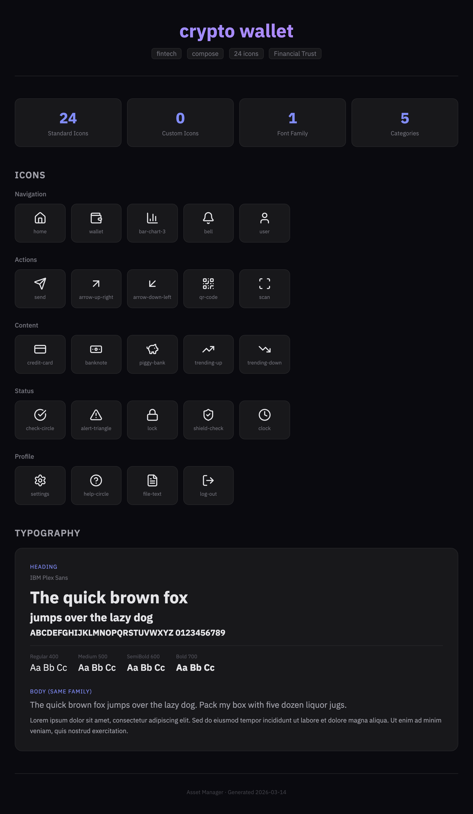
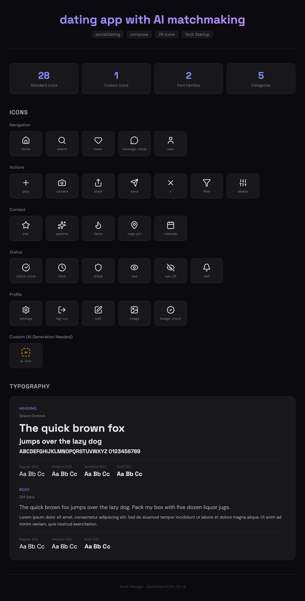
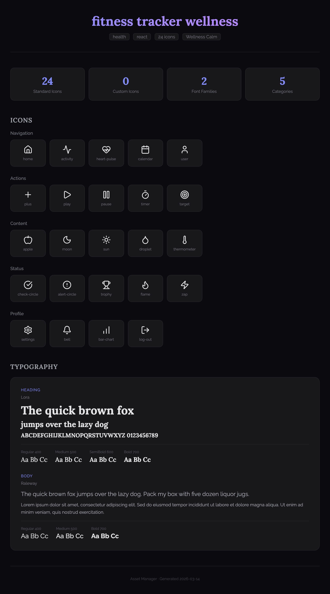

# Asset Manager — Claude Code Skill

Unified icon and font management for any project. Audit existing codebases, bootstrap assets from an app idea, or set up typography — with a visual HTML preview.

## Preview

The `--preview` flag generates a dark-themed HTML page with live icons and font samples, auto-opened in your browser.

| Fintech | Social/Dating | Health/Wellness |
|---------|---------------|-----------------|
|  |  |  |

> Each preview shows: summary stats, all icons rendered live from Lucide CDN grouped by category, font samples at multiple sizes/weights, and AI-generated icon placeholders.

## What It Does

- **Audit** — Scan projects for emoji icons and hardcoded fonts, get replacement suggestions
- **Bootstrap** — Generate a complete icon + font plan from an app description
- **Fonts** — Select, fetch, and integrate Google Fonts with framework-specific config
- **Preview** — Visual HTML preview showing all icons and font samples in the browser
- **AI Fallback** — Custom icon generation via Imagen 4 for icons not in any CDN

## Supported Frameworks

| Framework | Icons | Fonts | Config Output |
|-----------|-------|-------|---------------|
| Compose (KMP) | SVG → drawable resources | .ttf + FontFamily/Typography | `AppIcons.kt`, `Typography.kt` |
| React / Next.js | lucide-react imports | @import + CSS vars | `index.ts`, `fonts.css` |
| Tailwind | SVG files | fontFamily extension | `index.ts`, `tailwind-fonts.config.js` |
| Flutter | flutter_svg assets | google_fonts package | `app_icons.dart`, `app_fonts.dart` |
| SwiftUI | SF Symbols + custom SVG | .ttf + Font extensions | `AppIcons.swift`, `FontExtensions.swift` |

## Quick Start

### Bootstrap a new project's assets

```bash
# Generate asset plan + open visual preview
node scripts/generate-asset-plan.mjs \
  --app "crypto wallet" \
  --framework compose \
  --preview /tmp/asset-preview

# Fetch the recommended icons
node scripts/fetch-icons.mjs \
  --icons "home,wallet,send,trending-up,lock" \
  --source lucide \
  --output ./assets/icons/

# Fetch fonts and generate config
node scripts/fetch-fonts.mjs \
  --fonts "IBM Plex Sans" \
  --output ./fonts/ \
  --format compose
```

### Audit an existing project

```bash
# Scan for emoji and hardcoded fonts
node scripts/audit-icons.mjs /path/to/project --fonts

# JSON output for programmatic use
node scripts/audit-icons.mjs /path/to/project --fonts --json
```

### Set up fonts only

```bash
node scripts/fetch-fonts.mjs \
  --fonts "Space Grotesk,DM Sans" \
  --output ./fonts/ \
  --format tailwind
```

## App Categories

The bootstrap workflow auto-detects your app category from the description and recommends matching icons + fonts:

| Category | Font Pairing | Example Keywords |
|----------|-------------|------------------|
| Social/Dating | Space Grotesk + DM Sans | dating, social, match, chat |
| Fintech | IBM Plex Sans | crypto, wallet, bank, payment |
| Health | Lora + Raleway | fitness, wellness, meditation |
| E-commerce | Rubik + Nunito Sans | shop, store, marketplace |
| Productivity | Plus Jakarta Sans | task, todo, project, schedule |
| Gaming | Russo One + Chakra Petch | game, esports, rpg |
| Education | Fredoka + Nunito | learn, course, study |

## Icon Sources (Priority Order)

1. **Lucide** — Default. 1400+ icons, MIT licensed
2. **Material Symbols** — Google's icon set, 2500+ icons
3. **Phosphor** — 6 weight variants, 1200+ icons
4. **AI Generation** — Imagen 4 fallback for custom icons

## File Structure

```
asset-manager/
├── SKILL.md                          # Skill definition (3 workflows)
├── README.md                         # This file
├── GUIDE.md                          # Detailed usage guide
├── references/
│   ├── icon-sources.md               # CDN URLs, emoji mappings, AI prompts
│   ├── framework-integration.md      # Code snippets per framework
│   ├── icon-audit-patterns.md        # Regex patterns, detection rules
│   ├── font-pairings.md             # 20 curated pairings by mood
│   └── asset-bootstrap-guide.md     # Icon templates per app type
├── scripts/
│   ├── generate-asset-plan.mjs      # App idea → icon+font JSON + preview
│   ├── fetch-icons.mjs              # Download SVGs from CDN
│   ├── fetch-fonts.mjs              # Fetch Google Fonts + config
│   ├── convert-icons.mjs            # SVG → framework wrappers
│   └── audit-icons.mjs             # Scan for emoji + font issues
└── assets/
    └── zodiac/                      # Example custom assets
```

## In Claude Code

The skill activates automatically when you mention icons, fonts, or asset management. You can also invoke it directly:

```
/asset-manager crypto wallet
/asset-manager audit my project for emoji icons
/asset-manager recommend fonts for a wellness app
```

## License

MIT
