# my_brain

[](https://github.com/wuben154-maker/my_brain/actions/workflows/ci.yml)
[](./LICENSE)
[](./docs/mobile/BUILD.md)

**Voice-first · Local-first · Concept graph · Interruptible by design**

> 不是 RSS 阅读器，也不是聊天框里堆链接。  
> **my_brain** 是一款沉浸式 **AI 知识伴侣**：全屏「大脑星图 + 语音光球」，用**可打断**的实时语音陪你聊 AI 资讯与 GitHub 趋势，把信息沉淀成**概念级知识图谱**——你决定什么入库，入库后结构由 AI 自动整理，且可撤销。

[中文](#中文) · [English](#english) · [构建安装](./docs/mobile/BUILD.md) · [产品 PRD](./PRODUCT.md)

<p align="center">
  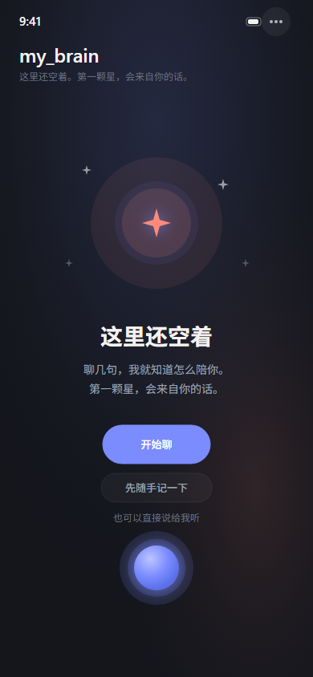
  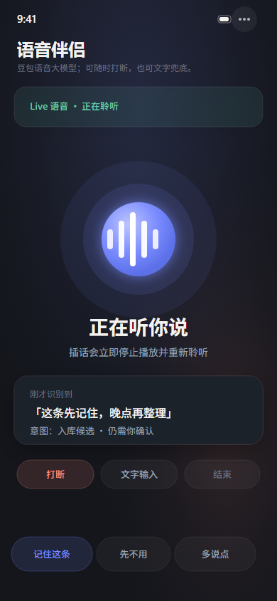
  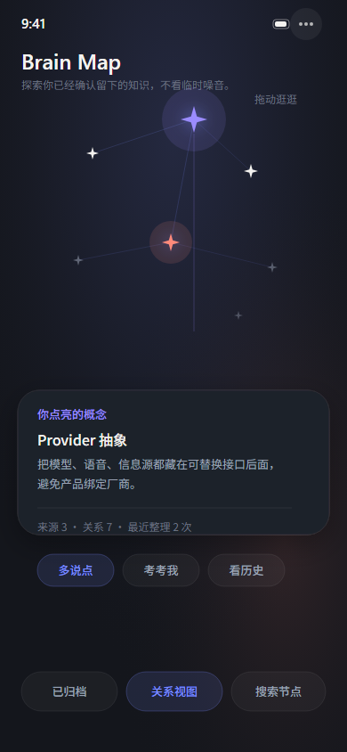
</p>

<p align="center">
  <sub>Living Brain 首页 · 语音会话 · 知识星图（设计稿源文件见 <code>app-development/UI/</code>）</sub>
</p>

---

<a id="中文"></a>

## 中文

### 一句话

**像和一个懂 AI 的朋友语音聊天，同时看着自己的「大脑星图」一点点长大。**

只有两件事：**和它说话** + **看图谱演化**。没有仪表盘式导航，没有逐条审批收件箱——沉浸、口语化、本地优先。

### 为什么不一样

| 常见产品 | my_brain |
|----------|----------|
| 资讯 App：刷 feed、收藏链接 | **概念节点**：多源资讯收敛到同一概念，不是新闻剪报堆 |
| 聊天 Bot：聊完即散或全量入库 | **三层记忆分离**：会话原文 ephemeral；图谱与画像 persistent |
| 知识库：手动建文件夹 / 标签 | **语音三意图**：「入 / 不要 / 讲细点」——**新建节点只能经你确认** |
| 自动整理 = 黑盒改库 | **入库后 auto-curation**：merge / link / archive **自动执行**，写入**可撤销**变更历史 |
| 云端账号绑定 | **Local-first**：SQLite 在设备；API Key 进 Secure Store，**不进 APK/IPA** |

### 核心体验（移动 App · iOS / Android）

<p align="center">
  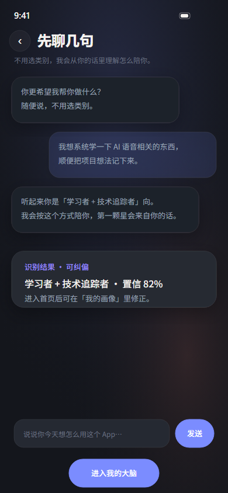
  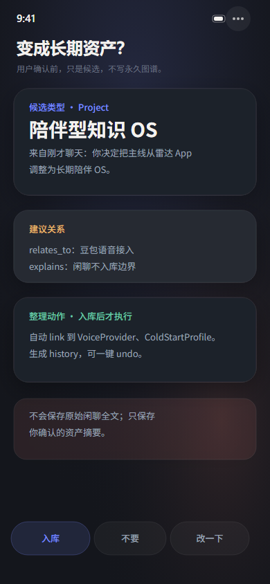
  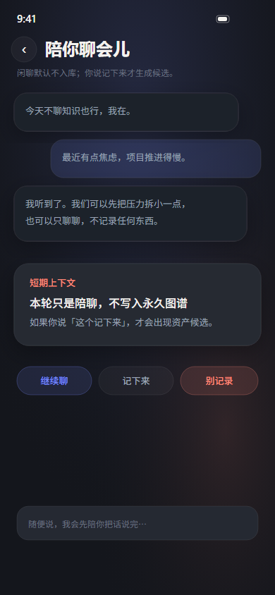
  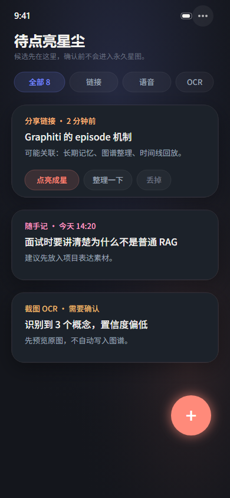
</p>

1. **Living Brain 首页** — 全屏星座场 + 底部语音光球；空态引导「第一颗星，会来自你的话」
2. **可打断语音** — 随时插话，助手立刻停说转听（豆包 Realtime / OpenAI Realtime，Provider 可切换）
3. **冷启动对话** — 自然口语 onboarding，识别你的模式，点亮第一颗个人星
4. **入库门控** — 每条候选经语音或决策层确认；**Memory 引擎与分享/OCR 均不得 bypass**
5. **入库后自动整理** — 连边、合并、软归档由 AI 执行；偶尔口头汇报；**一键撤销**结构变更
6. **Capture Inbox** — Android 分享 intent → 候选队列 → 同一套入库门控
7. **Brain Map / Memory Review / 画像纠偏** — 图谱浏览、周回顾、Profile Review 与 correction history

<p align="center">
  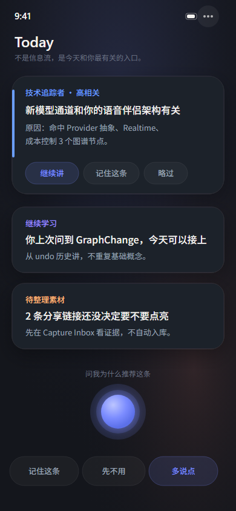
  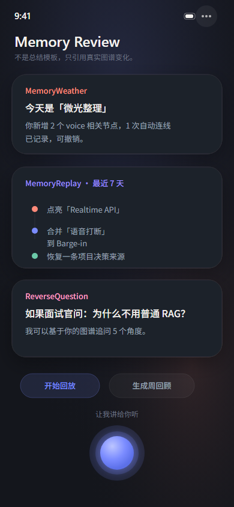
  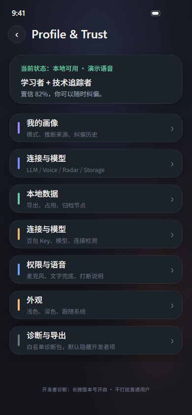
  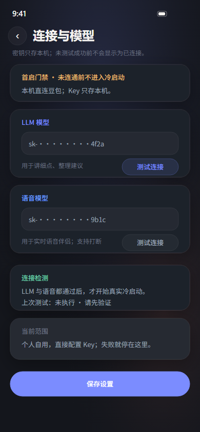
</p>

### 信任边界（产品不变量）

```
你确认「入」 → 新建概念节点（永久）
入库之后   → AI 自动 merge / link / archive（可撤销历史）
闲聊默认   → ephemeral，不进库，除非你说要存
```

- 新建永久知识节点**只能**由用户确认触发（语音 / 明确决策）
- 记忆引擎（EverMemOS 等）**只读注入、只写蒸馏文本**，**不写图谱**
- 删除 = **归档**（隐藏可恢复），边会迁移到新节点
- Release 包**不内置** API Key；每人自行在 **信任与设置 → Provider 设置** 配置

详见 [`AGENTS.md`](./AGENTS.md) · [`docs/ARCHITECTURE.md`](./docs/ARCHITECTURE.md)

### 技术栈

| 层级 | 选型 |
|------|------|
| 移动壳 | Expo SDK 52 · React Native 0.76 · TypeScript strict |
| 共享逻辑 | `packages/core` — Conductor、入库门控、curation、providers |
| 持久化 | expo-sqlite · Secure Store（密钥） |
| 语音 | 豆包端到端 Realtime（默认）· OpenAI Realtime（可切换）· 原生 barge-in |
| LLM | ModelScope OpenAI-compatible · 可扩展 `LlmProvider` |
| 平台 | **Android** release APK 侧载 · **iOS** Xcode 或 EAS 云构建 |
| Legacy | Tauri 2 + Vite Web（开发 / Showcase，非移动主线） |

### 快速开始

**要求：** Node.js 20+ · pnpm 9+ · Android SDK 或 Mac/Xcode / [EAS](https://expo.dev)

```bash
git clone https://github.com/wuben154-maker/my_brain.git
cd my_brain
pnpm install
```

**Android release APK（推荐给他人安装）**

```bash
bash apps/mobile/scripts/build-android-release-apk.sh
# → apps/mobile/android/app/build/outputs/apk/release/app-release.apk
adb install -r apps/mobile/android/app/build/outputs/apk/release/app-release.apk
```

**API Key：** App 内 **信任与设置 → Provider 设置**（豆包语音 + ModelScope LLM）。  
开发期可复制 [`.env.example`](./.env.example) → `.env.local`，Metro 自动灌入（Release 不读取）。

**iOS / 双端详情：** [`docs/mobile/BUILD.md`](./docs/mobile/BUILD.md) · [`apps/mobile/README.md`](./apps/mobile/README.md)

### 仓库结构

| 路径 | 说明 |
|------|------|
| [`apps/mobile/`](./apps/mobile/) | 双端 App 第一入口 |
| [`packages/core/`](./packages/core/) | 业务内核（对话、图谱、curation、providers） |
| [`app-development/UI/`](./app-development/UI/) | 高保真 UI 设计稿（18 屏 + `index.html` 审阅） |
| [`docs/mobile/BUILD.md`](./docs/mobile/BUILD.md) | 编译安装完整说明 |
| [`PRODUCT.md`](./PRODUCT.md) | 产品 PRD v2 |

### 测试

```bash
pnpm --filter @my-brain/mobile test
pnpm --filter @my-brain/core test
pnpm scan:secrets
```

### 桌面 / Web Showcase 3 分钟体验

Legacy Web/Tauri 可用于无手机时的 mock 演示（**不是移动 App 默认入口**）：

```bash
pnpm dev
# → http://localhost:1420/?showcase=1
```

**默认启动体验（KP-01 / Radar mock-first）：** 无 query flag 时走 Radar mock-first 启动（今日 top 3 + `RadarSignal`，live 失败则 fixture 兜底）。`?showcase=1` 为固定演示脚本；RSS flatten legacy 仅在 Radar 全空/失败时兜底，**不是**默认主路径（not the default path）。

Showcase 复现与信任边界：[`docs/DEMO.md`](./docs/DEMO.md) · [`docs/ARCHITECTURE.md`](./docs/ARCHITECTURE.md) · [`docs/SHOWCASE_MOCK_LIVE.md`](./docs/SHOWCASE_MOCK_LIVE.md) · [`docs/KNOWLEDGE_OS_VISION.md`](./docs/KNOWLEDGE_OS_VISION.md) · [`docs/evals/README.md`](./docs/evals/README.md)

---

<a id="english"></a>

## English

### In one sentence

**A voice-first AI companion that talks like a friend, respects your ingest decisions, and grows a concept-level knowledge graph on your device—not a feed reader.**

<p align="center">
  
  
</p>

### Highlights

| | |
|---|---|
| **Immersive UI** | Full-screen constellation + voice orb; Warm Ink dark theme; no dashboard chrome |
| **Barge-in voice** | Full-duplex speech; stop speaking and listen instantly |
| **User-gated ingest** | New concept nodes require explicit confirmation—share/OCR cannot bypass |
| **Auto curation after ingest** | merge / link / soft-archive with undoable graph history |
| **Local-first** | SQLite on device; keys in Secure Store, never baked into release builds |
| **Dual platform** | Android release APK · iOS via Xcode or EAS |

### Quick start (mobile)

See **[`docs/mobile/BUILD.md`](./docs/mobile/BUILD.md)** for Android APK + iOS build paths.

```bash
git clone https://github.com/wuben154-maker/my_brain.git
cd my_brain && pnpm install
bash apps/mobile/scripts/build-android-release-apk.sh
```

Configure keys in-app: **Settings → Provider settings**.

### Desktop / Web Showcase In 3 Minutes

```bash
pnpm dev && open http://localhost:1420/?showcase=1
```

**Default launch (KP-01):** no query flag → **Radar mock-first** briefing; `?showcase=1` → fixed showcase script. RSS flatten legacy runs only when Radar fails — **not the default path**.

Docs: [`docs/DEMO.md`](./docs/DEMO.md) · [`docs/ARCHITECTURE.md`](./docs/ARCHITECTURE.md) · [`docs/SHOWCASE_MOCK_LIVE.md`](./docs/SHOWCASE_MOCK_LIVE.md) · [`docs/KNOWLEDGE_OS_VISION.md`](./docs/KNOWLEDGE_OS_VISION.md) · [`docs/evals/README.md`](./docs/evals/README.md)

---

## License

[MIT](./LICENSE) © 2026 wuben154-maker
