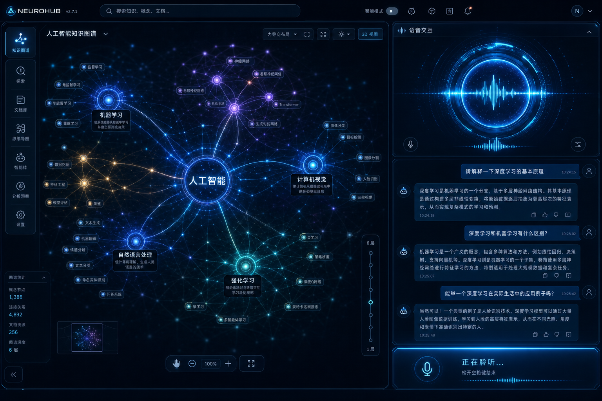

# my_brain

[](https://github.com/wuben154-maker/my_brain/actions/workflows/ci.yml)

> **不是又一个 Chat 窗口，而是一张会听你说话、自己长大的大脑星图。**

**语音优先 · 本地存储 · 概念级知识图谱 · 可打断对话**

Voice-first · Local-first · Concept graph · Interruptible by design

[中文](#中文) · [English](#english)



---

<a id="中文"></a>

## 中文

### 一句话

**my_brain** 是沉浸式 AI 知识伴侣：用**人话**讲 AI 资讯与 GitHub 趋势，**你**用语音决定什么入库，**AI** 自动整理图谱；全屏星图随讲解高亮，像真人一样可随时打断。

桌面（Tauri）与 Web 共用一套代码 → [github.com/wuben154-maker/my_brain](https://github.com/wuben154-maker/my_brain)

### 为什么不一样

| 常见做法 | my_brain |
|----------|----------|
| 侧边栏聊天 + 列表收藏 | **全屏星图 + 语音光球**，无仪表盘 |
| 每条笔记手动分类 | **概念节点**（非新闻碎片）；入库后 **merge / link / archive 自动完成** |
| 删了找不回 | **归档可恢复** + **变更历史一键撤销** |
| 云端记忆仓 | **SQLite 本地优先**；原文聊完即丢，图谱与画像留在本机 |
| 等它说完才能输入 | **barge-in 硬需求**：插话即停说转听 |

**信任模型（产品核心）：** 新建节点 = **你决定**（「入 / 不要 / 讲细点」）；入库之后 = **它自动**（整理不打扰你，但可撤销、可汇报）。

### 核心能力

- **可打断语音伴侣** — OpenAI Realtime barge-in + Mock 全路径测试
- **语音入库门控** — 禁止静默落库；歧义 reprompt 后再 skip
- **入库后自动整理** — 语义邻居 + 规则 curation；口头汇报变更摘要
- **三层记忆** — ① 原文/音频聊完即丢 ② 图谱永久 ③ 画像静默蒸馏
- **科幻星图** — 2D/3D、分层缩放、串讲同步高亮、悬停节点/边
- **Provider 架构** — Voice / LLM / Memory / News / Embedding 可替换，**mock-first**
- **只读 Brain MCP** — 外部 Agent 只读查询已确认知识，**不能绕过入库门控写库**

### 体验流程

```
开机自检 → 抓取资讯（RSS + GitHub 趋势）→ 伴侣主动开口
  ├ 闲聊 / 唠嗑          → 聊完即丢
  ├ 讲资讯 + 「入库?」   → 你：入 / 不要 / 讲细点 → 自动连边、合并、归档
  └ 串讲已有知识         → 星图节点与关系随语音高亮
```

### 技术栈

| 层 | 选型 |
|----|------|
| 语言 | TypeScript strict |
| 壳 | [Tauri 2](https://tauri.app/) + [Vite](https://vitejs.dev/) |
| UI | React 18 · Tailwind · Zustand |
| 图谱 | [react-force-graph](https://github.com/vasturiano/react-force-graph) 2D/3D |
| 存储 | SQLite（`better-sqlite3` / Tauri SQL） |
| 语音 | `VoiceProvider` → Mock / OpenAI Realtime |
| 测试 | Vitest · Playwright 视觉回归 · CI 覆盖率棘轮 |

### 快速开始

```bash
git clone https://github.com/wuben154-maker/my_brain.git
cd my_brain
pnpm install
pnpm dev          # http://localhost:1420，默认 Mock，无需 API Key
```

```bash
pnpm tauri dev    # 桌面
pnpm check        # typecheck + lint + test（与 CI 一致）
MY_BRAIN_MCP=1 pnpm brain:mcp   # 只读 MCP，见 docs/BRAIN_MCP.md
```

环境变量：`.env.example` → `.env`（验收期配置 `VITE_OPENAI_API_KEY` 等）。

### 文档

| 文档 | 说明 |
|------|------|
| [`PRODUCT.md`](./PRODUCT.md) | 产品 PRD v2 |
| [`AGENTS.md`](./AGENTS.md) | 架构 RFC · 七条不变量 |
| [`docs/PROJECT_STATUS.md`](./docs/PROJECT_STATUS.md) | 实现现状与差距 |
| [`specs/README.md`](./specs/README.md) | V0–V7 里程碑 spec |

**状态：** V 系列 spec + 测试已落地；默认 mock-first 可端到端演示。接真 API 清单见 [`docs/V2_REAL_API_ACCEPTANCE.md`](./docs/V2_REAL_API_ACCEPTANCE.md)。

---

<a id="english"></a>

## English

### One line

**my_brain** is an immersive, **voice-first** AI companion: plain-language AI news & GitHub trends, **you** voice-confirm what enters the graph, **AI** auto-curates it — full-screen star map highlights sync with speech, **interruptible** like a real conversation.

One codebase → desktop (Tauri) + web → [github.com/wuben154-maker/my_brain](https://github.com/wuben154-maker/my_brain)

### What makes it different

| Typical apps | my_brain |
|--------------|----------|
| Chat sidebar + bookmarks | **Full-screen graph + voice orb** — no dashboard |
| Manual tagging per item | **Concept nodes** (not news clips); **auto merge / link / archive** after ingest |
| Hard deletes | **Soft archive** + **undoable graph history** |
| Cloud memory vault | **Local SQLite**; raw chat discarded, graph & profile stay on device |
| Wait for TTS to finish | **Barge-in by design** — speak anytime, it stops and listens |

**Trust model:** **You** gate new nodes (voice: save / skip / explain more). **AI** curates structure after ingest — silently, reversibly, occasionally reported aloud.

### Core capabilities

- **Interruptible voice** — OpenAI Realtime barge-in + mock test coverage
- **Voice ingest gate** — no silent graph writes; reprompt on ambiguous commands
- **Post-ingest auto-curation** — semantic neighbors + rules; spoken change summaries
- **Three memory layers** — ephemeral raw chat · permanent graph · silent profile growth
- **Sci-fi graph UI** — 2D/3D, layered zoom, walkthrough highlight, hover cards
- **Swappable providers** — Voice / LLM / Memory / News / Embedding; **mock-first**
- **Read-only Brain MCP** — external agents query confirmed knowledge only; **no write bypass**

### Experience flow

```
Boot self-check → fetch news (RSS + GitHub trends) → companion speaks first
  ├ Chat / small talk     → discarded after session
  ├ News + “save it?”     → you: save / skip / explain more → auto link, merge, archive
  └ Teach existing graph  → nodes & edges highlight with speech
```

### Tech stack

| Layer | Choice |
|-------|--------|
| Language | TypeScript strict |
| Shell | [Tauri 2](https://tauri.app/) + [Vite](https://vitejs.dev/) |
| UI | React 18 · Tailwind · Zustand |
| Graph | [react-force-graph](https://github.com/vasturiano/react-force-graph) 2D/3D |
| Storage | SQLite (`better-sqlite3` / Tauri SQL) |
| Voice | `VoiceProvider` → Mock / OpenAI Realtime |
| Quality | Vitest · Playwright visual regression · CI coverage ratchet |

### Quick start

```bash
git clone https://github.com/wuben154-maker/my_brain.git
cd my_brain
pnpm install
pnpm dev          # http://localhost:1420 — mocks by default, no API key
```

```bash
pnpm tauri dev    # Desktop
pnpm check        # Same gate as CI
MY_BRAIN_MCP=1 pnpm brain:mcp   # Read-only MCP — see docs/BRAIN_MCP.md
```

Env: copy `.env.example` to `.env`; set `VITE_OPENAI_API_KEY` when leaving mocks.

### Documentation

| Doc | Contents |
|-----|----------|
| [`PRODUCT.md`](./PRODUCT.md) | Product spec v2 |
| [`AGENTS.md`](./AGENTS.md) | Architecture RFC · seven invariants |
| [`docs/PROJECT_STATUS.md`](./docs/PROJECT_STATUS.md) | Status & gaps |
| [`specs/README.md`](./specs/README.md) | V0–V7 milestone specs |

**Status:** V-series implemented at spec + test level; **mock-first** demo path. Real API cutover checklist: [`docs/V2_REAL_API_ACCEPTANCE.md`](./docs/V2_REAL_API_ACCEPTANCE.md).

---

## License

`package.json` is `"private": true`. Add a LICENSE before public redistribution.
