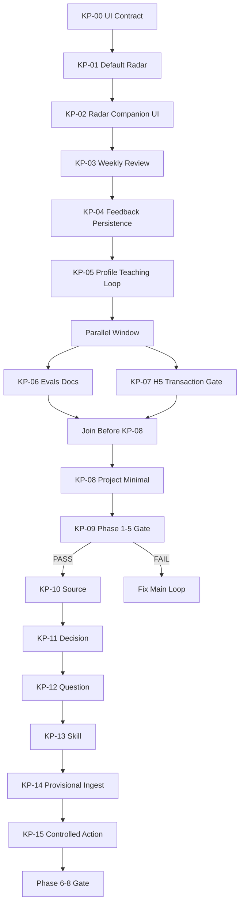

# KOS Agent Team Harness 方案

> 目标：组织一个从 `specs/kos-productization/KP-00` 一直执行到 `KP-15` 的 agent team。主 agent 负责调度、方向控制和最终验收；其他子 agent 默认使用 Composer 2.5。本文用 harness engineering 约束团队的动作空间、观察格式、恢复路径和上下文预算，确保执行准确、不漂移、不绕过产品不变量。

## 设计原则

本团队不是“多开几个编码 agent”，而是一套受控执行 harness：

- **单一主控**：主 agent 拥有任务编排、合并判断、停止权限和最终验收权。
- **职责隔离**：方向、执行、验收、修复、文档同步、质量门分别由不同角色承担，避免同一个 agent 自写自验。
- **Spec 驱动**：每次只执行一个 KP spec 或一个明确子任务；不得跨 spec 顺手扩 scope。
- **证据优先**：每个阶段输出必须包含改动文件、验证命令、失败证据、剩余风险。
- **不变量优先于完成率**：任何违反蓝图/AGENTS.md 不变量的实现，即使测试通过也不能进入下一阶段。
- **失败可恢复**：每个 agent 输出必须给出 root cause hint、safe retry instruction、stop condition。

## 对本方案的自我批评与整改

原方案能说明“有哪些角色”和“有哪些 gate”，但还不够像一个能跑 16 个 spec 的执行系统。主要问题：

- **缺少运行台账**：没有定义谁记录当前 spec、gate 结果、阻塞项、dogfood 证据，长链执行到 KP-09 容易丢上下文。
- **派单格式不够硬**：虽然有 prompt 模板，但没有一份不可省略的 dispatch packet，子 agent 仍可能少读文件或扩大范围。
- **并发协议偏弱**：写了允许并行，但没有说明并行任务如何避免改同一文件、如何合并结果。
- **质量度量缺位**：没有 tracking pass@1、返修次数、P0/P1 数、测试未运行次数，团队是否变好不可观察。
- **冲突升级路径不足**：没有定义两轮修复失败后谁裁定，是停 spec、拆小任务还是回到方向审查。

整改：本文新增运行台账、dispatch packet、并发/文件锁协议、质量指标、冲突升级规则，并把这些作为主 agent 的强制动作，而不是建议。

## 团队角色


| 角色                      | 模型           | 权限            | 主要职责                                                                        | 不允许做                        |
| ----------------------- | ------------ | ------------- | --------------------------------------------------------------------------- | --------------------------- |
| 主 agent / Orchestrator  | 当前主模型        | 调度、最终验收、必要时编辑 | 切分任务、派发子 agent、判断 gate、汇总风险、决定是否继续                                          | 在未验收前连续推进多个高风险 phase        |
| Direction Guardian      | Composer 2.5 | 只读优先          | 对照 `docs/KNOWLEDGE_OS_VISION.md` 和 `docs/KOS_PRODUCTIZATION_PLAN.md` 审查方向漂移 | 直接改代码                       |
| Spec Executor           | Composer 2.5 | 可改代码/文档       | 按单个 KP spec 实现功能，提交结构化执行报告                                                  | 擅自修改下游 spec、扩大 schema、跳过测试  |
| Acceptance Reviewer     | Composer 2.5 | 只读优先          | 对照当前 KP spec 做验收，输出 PASS/FAIL/P0/P1/P2                                      | 修复自己发现的问题                   |
| Fixer                   | Composer 2.5 | 可改代码/文档       | 只修 Acceptance Reviewer 指定的失败项                                               | 重构无关代码、添加新功能                |
| Boundary Reviewer       | Composer 2.5 | 只读优先          | 专查图谱写入、MCP、Memory、Action、Provisional、隐私和权限边界                                | 只看 happy path               |
| UX / Design Reviewer    | Composer 2.5 | 只读或可建议        | 对 KP-00/01/02/03/08/14/15 等用户可见入口做沉浸式 UI 审查                                 | 把 UI 拉回 dashboard           |
| Docs & Evals Maintainer | Composer 2.5 | 可改文档/测试索引     | 同步 README、ARCHITECTURE、PROJECT_STATUS、docs/evals、specs README               | 把 planned 能力写成默认已交付         |
| Gate Verifier           | Composer 2.5 | 只读优先，可运行验证    | 在 KP-09 和 Phase 6-8 总验收门执行整体验证                                              | 用 showcase PASS 替代默认路径 PASS |
| Run Scribe              | Composer 2.5 | 文档/台账           | 维护运行台账、phase handoff、dogfood/live source 证据索引                                  | 参与实现或验收裁定                   |


主 agent 可以复用同一类子 agent 多次，但每次任务必须给出明确 spec、允许修改范围和输出格式。

## 执行序列

执行顺序以 `specs/kos-productization/README.md` 的「执行序号」为准，不以 Phase 编号为准：




并行只允许在 README 已声明的边界内发生：

- KP-02 可与 KP-01 后半并行，但展示层必须等 KP-01 briefing 数据契约稳定。
- KP-03 与 KP-04 可并行，但 KP-04 必须在 KP-01 PASS 后启动。
- KP-07 可与 KP-06 并行启动，但 KP-09 需要 KP-06 文档口径一致。
- KP-10 到 KP-13 不可并行，每次只扩一种节点类型。

## 运行台账

团队执行时必须维护一个运行台账，建议文件名为 `docs/KOS_AGENT_TEAM_RUNBOOK.md` 或等价临时运行记录。台账由 Run Scribe 更新，主 agent 负责审核。

台账最小结构：

```json
{
  "active_spec": "KP-xx",
  "active_phase": "Phase n",
  "status": "not_started | running | blocked | pass | fail",
  "owner_agents": {
    "executor": "agent id or chat link",
    "acceptance_reviewer": "agent id or chat link",
    "boundary_reviewer": "agent id or chat link"
  },
  "locked_files": ["path/to/file.ts"],
  "commands_required": ["pnpm test -- ..."],
  "commands_run": [],
  "p0_p1_findings": [],
  "p2_findings": [],
  "gate_evidence": ["artifact path or note"],
  "decision_log": [
    {
      "decision": "why this path",
      "made_by": "main agent",
      "source": "spec/plan/vision reference"
    }
  ],
  "next_spec": "KP-yy"
}
```

任何 agent 启动前，主 agent 必须先检查台账中的 `active_spec`、`locked_files` 和 `p0_p1_findings`。存在未关闭 P0/P1 时，不得派发下一个 spec。

## Harness Action Space

### 主 agent 可用动作

主 agent 只做这些动作，避免亲自陷入实现细节：

1. **Load Context**：读取蓝图、计划、当前 KP spec、相关代码和测试。
2. **Dispatch**：派发一个子 agent，任务边界必须包含 spec、文件范围、禁止事项、输出格式。
3. **Inspect Diff**：读取子 agent 改动范围、关键 diff、验证报告。
4. **Request Fix**：只把验收失败项派给 Fixer，不重新打开 scope。
5. **Gate Decision**：根据验收证据决定 PASS/FAIL/STOP。
6. **Compact Handoff**：在阶段边界保存上下文摘要，下一阶段只带必要文件和 gate 结果。
7. **Update Ledger**：更新运行台账中的 active spec、文件锁、P0/P1、命令证据和 handoff。
8. **Escalate Conflict**：两轮修复仍失败时，冻结该 spec，要求 Direction Guardian 重新判断方向或把任务拆小。

### 子 agent 动作限制

所有 Composer 2.5 子 agent 必须遵守：

- 一次只处理一个 KP spec 或一个明确失败项。
- 不修改 `.env`、密钥、git config，不 commit，不 push。
- 不跳过 spec 中要求的 verification command；不能运行时必须说明原因。
- 不新增依赖，除非当前 spec 明确需要且主 agent 同意。
- 不把 `WorldItem`、provisional candidate、Memory signal 静默写入永久图谱。
- 不把 action draft 升级为外部写，除非 KP-15 且通过 dry-run、确认、审计。
- 不修改运行台账中未授权的 `locked_files`。
- 不把 reviewer 的 P0/P1 降级为 P2；严重度只能由主 agent 调整。

## Dispatch Packet

主 agent 派发任何子 agent 前，必须提供完整 dispatch packet。缺少任一字段，子 agent 应先返回 `blocked` 而不是自行补全。

```json
{
  "role": "Spec Executor | Acceptance Reviewer | Fixer | ...",
  "model": "composer-2.5-fast",
  "spec": "specs/kos-productization/KP-xx-name.md",
  "goal": "本次唯一目标",
  "required_context": [
    "docs/KNOWLEDGE_OS_VISION.md",
    "docs/KOS_PRODUCTIZATION_PLAN.md",
    "specs/kos-productization/README.md",
    "current KP spec"
  ],
  "allowed_files": ["src/...", "docs/..."],
  "forbidden_files": [".env", "package manager lock unless dependency approved"],
  "must_run": ["pnpm test -- ..."],
  "must_not_do": ["commit", "push", "expand scope"],
  "output_shape": "standard observation output",
  "stop_conditions": ["P0/P1", "missing tests", "scope conflict"]
}
```

执行类 agent 的 `allowed_files` 必须尽量窄；验收类 agent 的 `allowed_files` 默认为空或只读。

## 并发与文件锁协议

并行窗口只解决时间问题，不允许制造合并噪声：

- 主 agent 在派发前为每个执行 agent 声明 `locked_files`。
- 两个可写 agent 不得同时锁定同一文件；如果必须修改同一文档，先由主 agent 指定顺序。
- 只读 reviewer 可以读取任意文件，但不能写入运行台账之外的实现文件。
- 并行任务完成后先由主 agent 合并 diff 认知，再派 Docs & Evals Maintainer 做统一文档口径同步。
- 若并行结果互相矛盾，以 `docs/KNOWLEDGE_OS_VISION.md`、`docs/KOS_PRODUCTIZATION_PLAN.md`、当前 KP spec、AGENTS.md 不变量的顺序裁定。

冲突无法在 1 次主 agent 裁定内解决时，停止并行，回到单 spec 串行。

## 标准观察输出

每个子 agent 最终必须输出同一形状，主 agent 只根据该结构验收：

```json
{
  "status": "pass | fail | blocked | partial",
  "spec": "KP-xx-name",
  "summary": "一句话说明结果",
  "files_changed": ["path/to/file.ts"],
  "tests_run": [
    {
      "command": "pnpm test -- ...",
      "status": "pass | fail | not_run",
      "reason_if_not_run": "..."
    }
  ],
  "acceptance": [
    {
      "criterion": "spec 中的验收项",
      "status": "pass | fail | unknown",
      "evidence": "文件/测试/截图/日志"
    }
  ],
  "boundary_checks": [
    {
      "invariant": "WorldItem 不直写图谱",
      "status": "pass | fail | unknown",
      "evidence": "..."
    }
  ],
  "risks": ["剩余风险"],
  "next_actions": ["建议下一步"],
  "stop_condition_hit": "none | 描述"
}
```

如果输出缺少 `acceptance` 或 `boundary_checks`，主 agent 必须视为 `partial`，不得进入下一 spec。

## 严重度分级

所有 reviewer 必须使用同一套严重度，避免“建议”和“阻塞项”混在一起：

| 级别 | 定义 | 处理 |
|------|------|------|
| P0 | 违反核心不变量、数据损坏、权限绕过、永久图谱污染、外部写绕过确认 | 立即 STOP；不得合并；必须修复并重新验收 |
| P1 | 当前 spec 主要验收失败、默认主路径失败、测试缺失、文档口径冲突、UI 回 dashboard | 当前 spec FAIL；最多两轮 Fixer 修复 |
| P2 | 不阻塞当前 spec 的局部质量问题、命名小问题、非关键文档补充 | 可带债进入下一步，但必须登记 owner 和回收时机 |
| Note | 观察或未来建议 | 不进入 blocker 列表 |

严重度降级规则：只有主 agent 可以把 P1 降为 P2，且必须在运行台账 `decision_log` 写明原因。P0 不允许降级，除非原 finding 被证明事实错误。

## 每个 KP Spec 的执行循环

每个 spec 固定走 7 步：

1. **Direction Precheck**
  - Direction Guardian 读取蓝图、计划、当前 KP spec。
  - 输出本 spec 的产品目标、不变量、禁止漂移点。
2. **Implementation Plan**
  - Spec Executor 读取当前代码和测试，产出文件级计划。
  - 主 agent 检查计划是否越界。
3. **Implementation**
  - Spec Executor 执行修改。
  - 只允许修改当前 spec 涉及文件和必要测试/文档。
4. **Self Verification**
  - Spec Executor 运行 scoped tests。
  - 高风险阶段运行 `pnpm check` 或 spec 指定命令。
5. **Independent Acceptance**
  - Acceptance Reviewer 按 spec 验收清单逐条判定。
  - Boundary Reviewer 对写入、权限、持久化、导出、MCP 单独审查。
6. **Fix Loop**
  - 若有 FAIL/P0/P1，主 agent 派 Fixer 修复。
  - 修复后回到第 4 步。
  - 同一失败最多两轮修复；仍失败则 STOP，不能用下游 spec 掩盖。
7. **Phase Handoff**
  - Docs & Evals Maintainer 更新文档/状态。
  - 主 agent 记录 gate 结果、证据、未解决风险。

### 两轮修复失败后的升级路径

如果同一 P0/P1 两轮修复后仍未解决：

1. 主 agent 冻结当前 spec，禁止继续下游。
2. Direction Guardian 重新审查：问题是实现失败、spec 模糊，还是产品方向冲突。
3. 若是实现失败：主 agent 把任务拆成更小子任务重新派发。
4. 若是 spec 模糊：先修改 spec/plan，再重新执行。
5. 若是方向冲突：停止 team run，要求用户裁定。

冻结状态必须写入运行台账，并包含 safe retry instruction。

## 质量门

### 普通 Spec Gate

一个 KP spec PASS 需要满足：

- spec 验收清单全部 PASS 或有主 agent 明确批准的非阻塞 P2。
- scoped tests PASS；若测试未运行，有明确不可运行原因和替代观察。
- 无 P0/P1 问题。
- 无违反蓝图、AGENTS.md 不变量、KP README 硬约束。
- 文档口径不与 plan/specs README 冲突。

### KP-09 总 Gate

KP-09 是 Phase 1-5 唯一总验收门，必须由 Gate Verifier 执行，且主 agent 复核证据：

- 默认 E2E：Radar top3 → RadarSignal → 语音入库 → auto-curate → undo → Weekly Review。
- Showcase E2E：`?showcase=1` 全流程不回归。
- 边界：`WorldItem` 不直写图谱、MCP 只读、Action draft-only、Memory 不写图谱。
- H5-storage-transactions gate PASS。
- live source smoke 证据存在。
- dogfood 质量：连续 ≥3 天，每天 top3 至少 1 条有用或愿入库。
- KP-00 到 KP-08 的验证测试文件真实存在，无匹配视为 FAIL。

KP-09 FAIL 时，主 agent 必须停止 KP-10 到 KP-15。

### Phase 6-8 高风险 Gate

KP-15 后必须再跑一次总验：

- KP-10 到 KP-13：每种节点类型单独迁移、导出、undo、MCP read-only。
- KP-14：provisional 与 permanent 在数据和 UI 上清晰分离；晋升仅用户确认。
- KP-15：external write 必须 dry-run + 用户确认 + 审计；`local_file_write` 只能写沙箱。
- KP-09 默认主闭环仍 PASS。

## 质量指标

Run Scribe 在每个 spec 结束时更新以下指标，主 agent 用它判断 team 是否可用：

| 指标 | 目标 | 预警 |
|------|------|------|
| pass@1 | 普通 spec 首轮 PASS ≥ 60% | 连续 3 个 spec 首轮 FAIL |
| 平均修复轮数 | ≤ 1.0 | 任一 spec 达到 2 轮修复 |
| P0 数 | 0 | 任意 P0 立即暂停 |
| P1 数 | 每个 spec 归零后才继续 | P1 带入下游 |
| 测试未运行次数 | 0 或有明确原因 | `not_run` 无替代观察 |
| scope 违规次数 | 0 | 改动未授权文件 |
| 文档口径冲突次数 | 0 | README/plan/spec 描述不一致 |
| dogfood useful rate | KP-09 前连续 3 天达标 | 连续 2 天 top3 无有用项 |

如果 pass@1 长期低于目标，主 agent 不应继续扩大并行，而应缩小 dispatch packet 和 allowed files。

## 关键不变量检查表

每个 Acceptance Reviewer 必须显式回答：

- 新建永久知识是否只能来自用户确认？
- `WorldItem` 是否仍是短期信息，而不是 `KnowledgeNode`？
- auto-curate 是否只整理已确认图谱，并记录 reason/history/undo？
- archive 是否仍是隐藏而非 hard-delete？
- MemoryProvider 是否仍不写图谱/画像？
- Brain MCP 是否仍只读？
- Action 是否仍 draft-only，或在 KP-15 后满足权限模型？
- Provisional candidate 是否未进入永久 export？
- UI 是否仍是星图 + 光球 + companion shell，而非 dashboard？
- 文档是否没有把 experimental/harness-backed 能力写成默认已交付？

## Agent Wave 矩阵

不同 spec 不需要同样重的团队配置。主 agent 按下面矩阵派发，避免过度并行，也避免高风险阶段缺 reviewer。

| Spec 范围 | 必需 wave | 可选 wave | 重点 |
|-----------|-----------|-----------|------|
| KP-00 | Direction Guardian → Spec Executor → UX Reviewer → Acceptance Reviewer | Docs Maintainer | UI contract 可执行、CompanionShell slot、不得 dashboard |
| KP-01/KP-02 | Direction Guardian → Spec Executor → UX Reviewer → Boundary Reviewer → Acceptance Reviewer | Gate Verifier spot-check | 默认 Radar、signals、live source、WorldItem 不写图谱 |
| KP-03 | Direction Guardian → Spec Executor → UX Reviewer → Acceptance Reviewer | Boundary Reviewer | Weekly Review 引用真实 graph history，空态不编造 |
| KP-04/KP-05 | Spec Executor → Boundary Reviewer → Acceptance Reviewer | UX Reviewer（若改 UI） | feedback/profile 作用范围、correction 优先级 |
| KP-06 | Docs Maintainer → Acceptance Reviewer | Direction Guardian | default/harness/experimental 口径一致 |
| KP-07 | Spec Executor → Boundary Reviewer → Acceptance Reviewer | Gate Verifier | transaction、recovery、schema migration 框架 |
| KP-08 | Direction Guardian → Spec Executor → Boundary Reviewer → UX Reviewer → Acceptance Reviewer | Docs Maintainer | 只扩 Project，用户确认，export/MCP/undo |
| KP-09 | Gate Verifier → Boundary Reviewer → UX Reviewer → Direction Guardian | Docs Maintainer | 默认 E2E、dogfood、live source、总 gate |
| KP-10–13 | Spec Executor → Boundary Reviewer → Acceptance Reviewer | UX Reviewer（若视觉变化） | 每次只扩一种节点类型 |
| KP-14 | Direction Guardian → Spec Executor → Boundary Reviewer → UX Reviewer → Acceptance Reviewer | Gate Verifier | provisional 不进永久图谱，晋升仅用户确认 |
| KP-15 | Direction Guardian → Spec Executor → Boundary Reviewer → UX Reviewer → Gate Verifier | Acceptance Reviewer | 权限模型、dry-run、确认、审计、沙箱 |

任何 spec 只要涉及永久图谱写入、迁移、MCP、Memory、Provisional 或 Action，就必须包含 Boundary Reviewer。

## Git 与工作区卫生

多 agent 长链执行时，工作区混乱会直接污染验收：

- 主 agent 在每个 spec 开始前记录 `git status --short`。
- 不要求每个 spec 自动 commit；只有用户明确要求才提交。
- 若工作区已有无关改动，运行台账必须标注哪些文件是本 spec 可触碰的。
- 执行 agent 不得 revert 用户已有改动；遇到冲突应报告 `blocked`。
- Fixer 只能修改 reviewer finding 指向的文件；若必须改额外文件，先由主 agent 更新 `locked_files`。
- Gate Verifier 验收时必须区分“本 spec 改动”和“既有脏树”。

## 子 Agent Prompt 模板

### Spec Executor 模板

```text
你是 KOS Spec Executor，模型为 Composer 2.5。

任务：执行 <KP-xx spec path>。

上下文必读：
- docs/KNOWLEDGE_OS_VISION.md
- docs/KOS_PRODUCTIZATION_PLAN.md
- specs/kos-productization/README.md
- <KP-xx spec path>
- 与 spec 涉及的源文件/测试文件

允许修改：
- <明确文件/目录>

禁止：
- 不修改无关 spec
- 不跳过用户确认写入边界
- 不 commit / push
- 不新增依赖，除非 spec 明确要求

执行要求：
1. 先给文件级计划。
2. 按 spec 最小实现。
3. 运行 spec 要求的验证命令；不能运行时说明原因。
4. 最终按标准观察输出 JSON 汇报。
```

### Acceptance Reviewer 模板

```text
你是 KOS Acceptance Reviewer，模型为 Composer 2.5。

任务：只读验收 <KP-xx spec path> 的当前实现。

必须检查：
- spec 验收清单
- Harness 验收协议
- Forbidden behaviors
- Failure recovery
- 与 docs/KOS_PRODUCTIZATION_PLAN.md 是否一致
- 与 AGENTS.md / docs/KNOWLEDGE_OS_VISION.md 不变量是否一致

禁止：
- 不修代码
- 不提出泛泛建议，必须给 file/symbol/test 证据

输出：
- status: pass/fail/blocked
- P0/P1/P2 findings
- 每条验收项 pass/fail/unknown
- 必须修复项
```

### Fixer 模板

```text
你是 KOS Fixer，模型为 Composer 2.5。

任务：只修复 Acceptance Reviewer 指定的失败项。

输入：
- 原 spec
- reviewer findings
- 当前 diff

禁止：
- 不新增范围外功能
- 不重写已 PASS 模块
- 不修改 reviewer 未要求的文件，除非修复失败项必须如此

输出：
- 修复文件
- 对应 finding
- 重跑验证命令
- 未解决风险
```

## 上下文预算策略

为避免长链执行到后期漂移：

- 每个 KP spec 开始时只带四类上下文：蓝图不变量摘要、产品化 plan 当前 phase、当前 spec、上一 gate 结果。
- 不把全部 KP spec 一次性塞给执行者；由主 agent按需读取。
- 每个 gate 后产出 `phase_handoff` 摘要：

```json
{
  "last_passed_spec": "KP-xx",
  "current_branch_state": "clean | dirty",
  "critical_decisions": ["..."],
  "open_risks": ["..."],
  "must_not_regress": ["..."],
  "next_spec": "KP-yy"
}
```

- Phase 6 后尤其要压缩上下文，只保留 schema migration 规则、node type matrix、boundary tests。

## 风险与恢复


| 风险             | 发现信号                                           | 恢复策略                            | Stop condition          |
| -------------- | ---------------------------------------------- | ------------------------------- | ----------------------- |
| spec 执行漂移      | 改动文件超出 spec                                    | 主 agent 退回改动或派 Fixer 最小修复       | 连续两轮仍越界                 |
| 自写自验           | executor 声称 PASS 但无独立验收                        | 必须派 Acceptance Reviewer         | reviewer 未完成不得进入下一 spec |
| 测试名静默通过        | `pnpm test -- name` 无匹配                        | Gate Verifier 查测试文件路径           | 无匹配即 FAIL               |
| UI 回 dashboard | 出现多页 tab/dashboard 主路径                         | UX Reviewer P1                  | KP-00/KP-09 不通过         |
| 图谱污染           | WorldItem/provisional/memory 写 permanent graph | Boundary Reviewer P0            | 立即 STOP                 |
| schema 扩展过快    | 一个 PR 引入多个节点类型                                 | 回退到单类型 spec                     | KP-10 到 KP-13 不得并行      |
| 文档吹过头          | README 承诺 experimental 为默认                     | Docs Maintainer 修复              | KP-09 文档 gate FAIL      |
| 质量不成立          | dogfood top3 无有用项                              | 回到 KP-01/04 调整 ranking/feedback | KP-09 STOP              |


## 主 Agent 最终验收清单

主 agent 在每个 spec PASS 前必须确认：

- 子 agent 输出结构完整。
- 独立 reviewer 与 executor 不是同一个运行结果。
- 所有 P0/P1 为 0。
- tests run 与 spec verification command 对齐。
- 对应 docs/evals 或 README 口径已同步。
- git diff 只包含本 spec 合理范围。
- 新增测试文件真实存在。
- 若涉及 UI，已跑 design-review/qa 或 visual smoke。
- 若涉及 storage/schema，H5 gate 已通过或当前任务正是 H5 gate。
- 若涉及 provisional/action，信任边界 UI 已重点审查。

## 最小可用版本

如果一开始不想全量启用所有角色，最小 team 为：

1. 主 agent：调度和最终验收。
2. Spec Executor：执行单个 KP spec。
3. Acceptance Reviewer：独立验收。
4. Boundary Reviewer：检查不变量和写入边界。
5. Fixer：只修 reviewer 指定问题。

从 KP-09 开始必须加入 Gate Verifier；从 KP-14/KP-15 开始必须加入 UX / Design Reviewer。

## 成功标准

这套 team harness 成功，不是因为所有 agent 都“很忙”，而是因为：

- KP spec 能按顺序推进，不靠记忆猜下一步。
- 每个 PASS 都有证据，而不是口头完成。
- 方向守门能阻止“做更多功能”掩盖主闭环不成立。
- 子 agent 失败后能被局部修复，不会污染全局上下文。
- 到 KP-09 时，默认主路径真实可跑，而不是只有 showcase 或 harness green。
- 到 KP-15 时，系统仍守住 local-first、用户确认写入、可解释、可撤销、draft/execute 分离这些核心信任边界。

