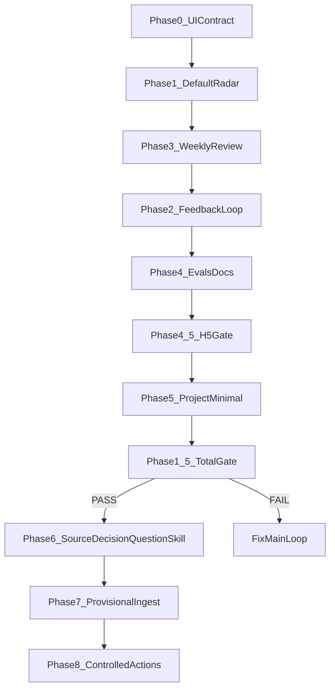

# KOS Productization Plan

## 判断

当前项目最需要的不是继续扩新模式，而是把已经存在的 KOS A-F 能力从“库函数 + golden test + 设置浮层”收束成一个主产品体验。对照 [`docs/KNOWLEDGE_OS_VISION.md`](./KNOWLEDGE_OS_VISION.md)，近期切口应固定为：

- AI 信息雷达
- 语音入库
- 自动整理
- 每周脑图回顾

## 对计划的自我批评

上一版计划方向是对的，但有三个问题：

- `Project` 节点扩展放得太早，容易在 Radar 主路径还没证明价值时先扩大 schema 和 UI 复杂度。
- “统一评测和文档口径”不应放到最后；它应该贯穿每个阶段，否则容易继续出现 `spec 全 ✅` 但产品体验不清晰的误读。
- 缺少明确 stop condition，容易从“产品化主闭环”滑回“继续堆 harness 能力”。

修正原则：

- 每个阶段只证明一个用户可感知结果。
- 每个阶段都要有 fixture eval、UI observation、boundary assertion 三类验收。
- 默认不扩 schema；只有当现有 `Concept` 无法表达真实产品价值时，才引入一个新对象。
- 文档同步不是收尾杂活，而是每阶段 DoD。

## 默认体验裁定

**无 query flag 时，默认走 Radar mock-first / fallback 路径**——打开 App 即生成“今日 top 3 最值得知道的变化”，而非固定 showcase 或普通 RSS flatten 队列。

| 路径 | 触发 | 定位 |
|------|------|------|
| **Radar 默认** | 无 flag / 正常启动 | 主体验：mock-first briefing，真实 source 成功则增强，失败则 fallback |
| **Showcase 演示** | `?showcase=1` | 作品演示：固定 curated 演示流，保留给面试/截图 |
| **RSS flatten legacy** | 内部 fallback | 降级/遗留：仅在 Radar/source 失败时承接，**不是主体验** |

口径要求：README、DEMO、ARCHITECTURE 统一区分上述三条路径；不得把 legacy flatten 写成默认入口。

## V2 执行版总规则

每个 Phase 必须同时具备：

- **执行步骤**：明确改哪些模块、先做什么、后做什么。
- **验收标准**：用用户可观察结果、数据状态、不变量边界判断是否完成。
- **验证命令或观察点**：至少有 scoped test；高风险阶段还要 `pnpm check`、UI smoke 或视觉快照。
- **Stop condition**：达不到质量门时停止扩展，不进入下一阶段。

适用 skill：

- `spec-runner`：把每个 Phase 拆成小 spec 后按依赖执行，防止一次性大改。
- `spec-acceptance-review`：每个 Phase 完成后做 lite 验收，检查 AC、范围漂移和关键不变量。
- `spec-verifier`：Phase 1-5 完成后做总体验收门；Phase 6-8 完成后再做一次高风险验收。

### 各阶段 skill 使用建议

| Phase | 规划期 | 落地后 |
|-------|--------|--------|
| **0** | 必须 `/plan-design-review` | `design-review` + `qa` 或 companion visual smoke |
| **1** | 必须 `/plan-design-review` | `design-review` + `qa` |
| **2** | 仅 store/storage → 不需要 design-review | 若改反馈入口 / 画像面板 / 伴侣卡片 → `design-review` + `qa` |
| **3** | 必须 `/plan-design-review` | `design-review` + `qa` |
| **4** | — | docs/evals tests 即可，不需要设计审 |
| **4.5 (H5)** | — | storage tests，不需要设计审 |
| **5** | 若改星图视觉 → `/plan-design-review` | 必须 `design-review` + `qa` |
| **6-8** | 凡有用户可见入口 | `design-review` + `qa`；**Phase 7/8 必须重点审信任边界 UI** |

## Phase 0: UI Contract 与主路径信息架构

> **Phase 0 是第一步，必须先完成 UI contract，再进入 Phase 1。** 未完成则禁止启动 Radar 默认路径改造。

目标：先定 v2 主界面如何承载 Radar、解释信号、Weekly Review 和 Action drafts，避免后续每个能力单独做一套 UI 后返工。

### v2 主界面信息架构

| 区域 | 职责 | 边界 |
|------|------|------|
| **星图主舞台** | 知识图谱 force-directed 可视化，zoom/pan，入库后节点点亮 | 主视觉，不可被 dashboard 替代 |
| **语音光球** | 实时语音伴侣、打断、barge-in、入库确认对话 | 主交互入口，承载“入/不要/讲细点” |
| **Radar companion card/overlay** | 今日 top 3、RadarSignal 解释、briefing 状态 | 统一 shell，非独立页面 |
| **Weekly Review overlay** | 本周认知变化、graph history 引用、薄弱点 | 入库/整理后的自然后续，非设置子页 |
| **Action drafts** | 行动建议草稿、preview、draft-only 边界展示 | 不可默认执行外部写操作 |
| **Settings** | API key、persona、实验开关、诊断 | **不承载主流程**；Radar/Review/Action 主入口不得只在设置里 |

### 防返工策略

- **统一 companion card/overlay shell**：Radar briefing、curation report、weekly review、action draft 共用同一承载模式（位置、动效、关闭/返回语义一致）。
- **不恢复 dashboard**：禁止回到多分区仪表盘或多页面 tab 导航。
- **设置不承载主流程**：用户无需打开设置即可发现并完成 Radar → 入库 → Review 主闭环。
- 约定测试 ID、视觉快照场景、响应式规则，写入 UI contract 文档。

执行：

- 新增或更新 UI contract 文档，明确 [`src/components/shell/ImmersiveScene.tsx`](../src/components/shell/ImmersiveScene.tsx) 的区域分工。
- 定义统一的 companion card / overlay shell（见上表）。
- 保留“星图主舞台 + 语音光球”的 v2 主形态。

验收：

- Radar、Review、Action 都有明确入口和承载区域。
- 用户不用打开设置也能发现主闭环能力。
- UI contract 写清楚哪些是主路径，哪些是实验入口（含 `?showcase=1`）。
- 视觉主形态仍是沉浸式星图，不变成管理后台。

验证：

- **规划期**：`/plan-design-review` 完成并记录裁定。
- **落地后**：`design-review` + `qa`（或 companion visual smoke / `pnpm visual:loop --companion`）。
- 相关 UI 单测通过。
- `spec-acceptance-review` 对 Phase 0 返回 PASS。

Stop condition：如果 UI 承载位置没有定清楚，不进入 Phase 1；否则 Radar、Review、Action 会继续各自长出一套 UI。

## Phase 1-5 执行验收矩阵

### Phase 1: Radar 默认入口

- 执行：调整启动路径、接入 v2 Radar UI、展示 RadarSignal、补真实 source 成功和失败降级路径；扩充 ranking golden（≥20 条 `WorldItem`，五类覆盖）。
- 验收：无 flag 默认可见 top 3；每条有解释；WorldItem 不写永久图谱；`?showcase=1` 不受影响；RSS flatten 仅作 fallback；**live source smoke**（真实联网 GitHub public API 或公开 RSS，附证据）；**ranking golden** 五类 fixture 硬验收。
- 验证：daily briefing integration、radar ranking eval（含五类 golden）、v2 Radar UI test、source failure recovery test、live source smoke 证据。
- Skill：规划 `/plan-design-review`；落地 `design-review` + `qa`。

### Phase 2: 反馈与画像闭环

- 执行：把 feedback 写入 store/storage，将 feedback 用于下次 ranking 和 teaching depth，将 profile correction 放进可见 UI。
- 验收：用户反馈影响下一轮排序或讲解；画像修正优先于蒸馏；用户能看到系统为何这样推荐。
- 验证：profile rerank integration、teaching depth snapshot、feedback replay/persistence test。
- Skill：仅改 store/storage → 不需要 design-review；改反馈入口/画像面板/伴侣卡片 → `design-review` + `qa`。

### Phase 3: Weekly Review 主路径

- 执行：把 Weekly Review 从设置入口提升到入库/整理后的自然入口，Review 内容绑定 graph history。
- 验收：Review 引用真实新增、连线、合并、归档；空 history 不编造；action 仍 draft-only。
- 验证：weekly review golden、graph history citation test、mainflow UI behavior test、draft-only boundary test。
- Skill：规划 `/plan-design-review`；落地 `design-review` + `qa`。

### Phase 4: 评测与文档

- 执行：建立 `docs/evals/`，同步 README、ARCHITECTURE、PROJECT_STATUS、specs/README 的成熟度口径。
- 验收：默认能力、harness-backed 能力、experimental live 能力边界清楚；每个主路径能力都有验证命令；默认体验裁定口径一致。
- 验证：docs surface test、文档链接/关键词测试、人工 review checklist。
- Skill：docs/evals tests 即可，不需要设计审。

### Phase 4.5: H5 Storage Transaction Gate

> **Phase 5 的前置 gate。** schema expansion 前必须完成，否则禁止进入 Project 节点扩展。

目标：解决 **H5-storage-transactions** 债务（原 specs/README 债务表 H2-storage 项），避免 graph mutation 与 history persist 出现半写状态。

原因：Phase 5 起将扩展 graph schema；若在 transaction 未收敛时扩 schema，graph/history/storage 半写会导致迁移、undo、export 不可信。

执行：

- 审计并修复 graph write + history persist 的原子性或可恢复性缺口（参照 H5-storage-transactions 债务项）。
- 补齐 storage layer 的 transaction / rollback / recovery 路径。
- 明确哪些 mutation 必须同事务提交 graph + history。
- **定义 graph schema versioning + 节点类型迁移框架**（forward / rollback），供 Phase 5/6 复用（基于 `src/storage/migrations.ts`、`src/storage/schemaMigrations.ts`）。

验收：

- graph mutation + history persist 具备原子性，或具备可验证的恢复路径（失败后可检测并重试/回滚）。
- 无“图谱已变但 history 未记”或“history 已记但图谱回滚失败”的半写窗口。
- 现有 ingest、auto-curate、undo 路径在 transaction 修复后仍通过回归。

验证：

- graph mutation + history persist 原子性/可恢复性测试（integration 或 storage-focused unit）。
- undo round-trip 在并发/失败注入下仍可靠。
- `pnpm check` scoped 通过。
- Skill：storage tests，不需要设计审。

Stop condition：transaction 债务未验收 PASS，**不进入 Phase 5**。

### Phase 5: Project 最小落库（主闭环价值证明）

目标：在 Radar + Weekly Review 主闭环已跑通、且 H5-storage-transactions gate 通过后，用 **最小** `Project` 节点证明“外部趋势与 my_brain 项目有何关系”——**仅此一种新类型，不预扩 Decision/Question/Skill**。

关键改动方向：

- 在 [`src/domain/graph.ts`](../src/domain/graph.ts) 最小扩展节点类型，先支持 `Concept` 与 `Project`。
- 保持 UI 仍是简洁星图，不做复杂 dashboard。
- 让 Project Suggestions 能引用 Project 节点，而不是只引用概念或 mock 文案。
- **不在本阶段引入** `Source`、`Decision`、`Question`、`Skill`——留给 Phase 6。

验收重点：Project 节点有 `title`、`intro`、`sourceRefs`、`updatedAt`，外部信息可通过 `used_in` 或等价关系连到项目；新增节点类型不破坏现有 ingest gate、auto-curate、history/undo 和 export；MCP 仍只读。

验证：schema migration test、export round-trip、MCP boundary、project suggestions golden。
Skill：必须 `design-review` + `qa`；若改星图视觉则加 `/plan-design-review`。

Stop condition：如果默认 Radar 不能稳定解释“为什么这 3 条和我有关”，或 H5 gate 未 PASS，不要进入 Project 扩展。

## Phase 1: 让 Radar 成为默认信息入口

目标：打开 App 后（无 query flag）稳定生成“今日 3 条最值得知道的变化”，而非 showcase 或 legacy RSS flatten 队列。

关键改动方向：

- 在 [`src/lib/runLaunchSequence.ts`](../src/lib/runLaunchSequence.ts) 中把 Radar briefing 提升为**默认 mock-first 路径**；保留 `?showcase=1` 作为作品演示模式；普通 RSS flatten 仅作 fallback/legacy，不作为主体验。
- 在 [`src/components/shell/ImmersiveScene.tsx`](../src/components/shell/ImmersiveScene.tsx) 或语音伴侣展示层里挂载 Radar briefing 状态，不只投影成 legacy `newsQueue`。
- 把 [`src/components/briefing/BriefingSignalChip.tsx`](../src/components/briefing/BriefingSignalChip.tsx) 的“为什么和我有关”展示进 v2 主界面，而不是只出现在 legacy `NewsCard`。
- **live source smoke**：至少一个真实联网 source（无需 API key 的 GitHub public API 或公开 RSS）在真实网络下返回数据并完成 ranking（附证据；网络失败可降级，但须曾成功记录过一次）。fixture-adapter 仅作结构回归。
- 扩充 ranking golden：≥20 条 `WorldItem`，覆盖「明显相关、弱相关、无关、重复、过时」五类（蓝图 Milestone B）。

验收重点：top 3 有 `RadarSignal`，无关项不进 top 3，`WorldItem` 不直接写图谱；README 和 DEMO 明确区分 showcase 固定演示与默认 Radar 路径。

Stop condition：如果默认 Radar 不能稳定解释“为什么这 3 条和我有关”，不要进入 schema 扩展。

## Phase 2: 把反馈闭环产品化

目标：用户说“不要 / 已知道 / 太浅 / 太深”后，下次推荐或讲解真的变化。

关键改动方向：

- 把 [`src/stores/briefingStore.ts`](../src/stores/briefingStore.ts) 的 feedback 用到下一次 `runRadarBriefing`，并在 UI/语音路径中给出入口。
- 将 [`src/conversation/teachingDepth.ts`](../src/conversation/teachingDepth.ts) 与 Radar feedback、profile correction 串起来，避免讲解深度只停留在单测。
- 在 [`src/components/profile/ProfilePanel.tsx`](../src/components/profile/ProfilePanel.tsx) 中让用户能看见“系统为什么这样推荐/讲解”，形成可修正画像。

验收重点：同一 WorldItem 或相似主题，在不同 feedback/profile 下排序和讲解深度可观察地变化；画像修正必须覆盖 AI 蒸馏结果。

Stop condition：如果用户反馈只能影响单次 UI 状态，不能影响下一轮排序或讲解，不继续做更复杂的成长伴侣能力。

## Phase 3: Weekly Review 进入主叙事

目标：让图谱不是只“保存知识”，而是能反过来总结本周认知变化并给行动建议。

关键改动方向：

- 将 [`src/components/review/WeeklyReviewOverlay.tsx`](../src/components/review/WeeklyReviewOverlay.tsx) 从设置入口提升为入库/整理后的自然后续入口。
- 强化 [`src/cognitive/buildWeeklyBrainReview.ts`](../src/cognitive/buildWeeklyBrainReview.ts) 对真实 `graphHistoryStore` 的引用，展示新增、连线、合并、归档和薄弱点。
- 在 [`docs/DEMO.md`](./DEMO.md) 加入“入库后看 Weekly Review”的复现步骤，证明图谱能反哺价值。

验收重点：Weekly Review 必须引用真实 GraphChange，不凭空总结；行动建议保持 draft-only；用户能从主路径发现入口，不只在设置里找。

Stop condition：如果 Review 只是模板化摘要，没有引用真实图谱变化，不进入 Project 扩展或后续 schema 类型。

## Phase 4: 先统一评测和文档口径

目标：避免“spec 全 ✅”被误解成“长期 OS 已成熟”，并把每次产品化改动都变成可复查的证据。

关键改动方向：

- 新增 `docs/evals/`：Radar relevance、Ingest quality、Curation undo、Profile growth、Action usefulness 五类评测说明。
- 更新 [`docs/ARCHITECTURE.md`](./ARCHITECTURE.md)、[`docs/PROJECT_STATUS.md`](./PROJECT_STATUS.md)、[`specs/README.md`](../specs/README.md)，明确区分“harness 已实现”和“产品主路径已体验”。
- README 只承诺默认可体验的能力；把隐藏能力标成 experimental 或 harness-backed。
- 文档统一默认体验裁定（Radar 默认 / showcase / legacy fallback）。

验收重点：新 agent、GitHub 访客、面试官都能准确理解项目成熟度；每个默认主路径能力都有对应验证命令。

## Phase 5: Project 最小落库（主闭环价值证明）

> 详见上文「Phase 1-5 执行验收矩阵 → Phase 5」及 H5 gate 前置要求。本阶段完成后，`Project` 类型已落地，**Phase 6 不再重复扩展 Project**。

## Phase 1-5 总体验收门

目标：确认项目已经从“mock/harness 宽覆盖原型”收束成可信主闭环，再进入高风险的 Controlled Autonomy。

执行：

- 用 `spec-verifier` 编排一次总验，范围覆盖 Phase 0-5（含 Phase 4.5 H5-storage-transactions gate）。
- 跑客观闸：`pnpm check`，必要时加 build、默认启动 smoke、showcase smoke、companion visual smoke。
- **跑主路径 E2E（必须）**：默认路径（无 flag）完成整条链：
  1. Radar top 3 可见
  2. RadarSignal 解释可见
  3. 用户语音确认入库
  4. auto-curate 执行
  5. undo 可恢复
  6. Weekly Review 引用真实 graph history
- **跑 showcase E2E**：`?showcase=1` 演示路径仍可完整运行。
- **跑边界验收（口径一致）**：
  - `WorldItem` 不直写图谱
  - MCP 只读
  - Action draft-only
  - `MemoryProvider` 不写图谱
- **跑质量验收（dogfood）**：连续 ≥3 天真实使用，每天 top3 中至少 1 条愿意入库或标记「有用」；未达标 = 质量 P1 → gate FAIL（允许人工记录证据）。
- **跑 live source smoke 证据核对**（KP-01）。
- **跑验证测试文件存在性核对**（KP-00–08 所列测试名须对应真实文件；过滤无匹配 = FAIL）。
- 跑文档验收：README、ARCHITECTURE、PROJECT_STATUS、specs/README 对成熟度与默认体验裁定无冲突。

通过标准：

- P0/P1 问题为 0。
- 默认主路径 E2E 与 showcase 路径都可运行。
- UI contract 未被破坏，没有回到 dashboard。
- H5-storage-transactions gate 已 PASS。
- dogfood 质量验收通过（连续 ≥3 天，每天 top3 至少 1 条有用/愿入库）。
- live source smoke 证据已附。
- 所有高风险写入边界都有测试证据。
- 文档能清楚说明哪些是默认能力、哪些是 harness-backed、哪些是 experimental。

不通过时：

- 停止 Phase 6-8。
- 先修复主路径、边界、H5 gate、质量验收或文档口径。
- 不用新增节点类型或自动化能力掩盖主闭环缺陷。

## Phase 6: Controlled Schema Expansion

> **`Project` 已在 Phase 5 完成最小落库；本阶段不重复扩展 Project。**

目标：按风险顺序引入其余节点类型，每次只扩一种，并保留迁移、导出、回滚和 UI 降噪。

执行顺序：

1. `Source`：先把来源从字段提升为一等对象，增强 provenance。
2. `Decision`：记录项目关键取舍。
3. `Question`：记录反复追问和学习盲点。
4. `Skill`：记录能力成长和复习目标。

执行要求：

- 每种节点类型单独 spec、单独迁移、单独测试，不一次性全塞进 schema。
- 每种节点类型必须定义进入条件、可见性、导出形状、MCP read shape、归档规则。
- UI 只做轻量区分和过滤，不做复杂 dashboard；凡有用户可见入口须 `design-review` + `qa`。
- 关系类型受控扩展，优先复用现有关系，不随节点类型无限增加。

验收：

- 旧 Concept-only（及 Phase 5 Project）graph 可迁移、可导出、可回滚。
- 每种节点类型都有 fixture 和 round-trip test。
- 星图默认视图不会因为新类型变乱。
- 新类型不绕过用户确认入库和 auto-curate history/undo。

验证：

- Graph schema / migration / export round-trip 测试通过。
- MCP read-only 边界测试通过。
- 每个节点类型完成后跑 `spec-acceptance-review`。
- 全部类型完成后跑 `pnpm check`。

Stop condition：任何一种节点类型导致 UI 噪声、迁移不可逆、导出不稳定或写入边界不清，停止后续类型扩展。

## Phase 7: Provisional AI Ingest

目标：允许 AI 自动创建候选知识，但先进入隔离区，不直接污染永久图谱。

执行：

- 新增 `ProvisionalNode` 或等价隔离区模型，包含 `sourceRefs`、`reason`、`confidence`、`expiresAt`、`suggestedRelations`。
- AI 可自动生成候选，但默认不进入长期 `KnowledgeGraph`。
- 设计晋升机制：**仅**用户确认可晋升为永久节点；重复高置信信号、严格规则仅影响候选排序/高亮/推荐强度，**不得**自动创建永久节点。
- 所有候选必须可解释、可撤销、可过期、可批量丢弃。
- UI 上明确区分“候选知识”和“长期知识”，不能在星图里混淆。

验收：

- AI 自动候选不会出现在永久图谱导出中，除非完成晋升。
- 候选有明确 reason 和 sourceRefs。
- 低置信或过期候选自动清理，不积累噪声。
- 用户可以查看、确认、拒绝和撤销晋升。
- 晋升后必须进入 graph history，并可 undo。

验证：

- Boundary test：AI candidate path 不调用永久 graph create。
- Promotion test：只有满足条件才创建长期节点。
- Expiry/cleanup test 通过。
- UI behavior test 能区分 provisional 与 permanent。
- **信任边界 UI**：`design-review` + `qa` 重点审候选/永久区分、晋升确认流。
- `spec-acceptance-review` 对 Phase 7 返回 PASS。

Stop condition：如果候选和永久知识在数据或 UI 上无法清晰区分，停止该 Phase。

## Phase 8: Controlled Action Agent

目标：把行动层从 draft-only 扩展为受控执行，但只允许低风险、可审计、可回滚的动作先执行。

执行：

- 建立 action permission model：`local_draft`、`local_file_write`、`external_write`、`destructive_action`。
- 先开放低风险本地动作，例如生成本地 markdown 草稿、创建本地 task、更新非关键 docs 草稿。
- 外部写操作必须 dry-run、用户确认、权限白名单、审计日志。
- 禁止默认发布文章、创建 GitHub issue、改代码或删除数据。
- 所有 action 都要有 preview、risk level、required permission、audit log。

验收：

- 没有用户确认不能执行外部写操作。
- destructive action 默认不可用。
- 执行失败有 rollback 或 safe retry instruction。
- Action UI 清楚显示“草稿 / 可执行 / 已执行 / 失败 / 可回滚”。
- Phase 8 不破坏 Phase 1-5 的主闭环。

验证：

- Draft-only 旧测试继续通过。
- 新增 permission boundary tests。
- 新增 dry-run preview tests。
- 新增 audit log tests。
- **信任边界 UI**：`design-review` + `qa` 重点审权限、preview、确认流。
- Phase 6-8 完成后用 `spec-verifier` 再做一次总体验收。

Stop condition：如果 action 无法提供 preview、审计或用户确认，不允许从 draft-only 升级为执行。

## 推荐顺序

1. **Phase 0**：先定 UI contract（第一步，阻塞后续）。
2. Phase 1：让 Radar 成为默认入口（mock-first / fallback）。
3. Phase 3：让 Weekly Review 证明图谱能反哺价值。
4. Phase 2：串反馈和画像，让推荐与讲解随用户变化。
5. Phase 4：同步建立评测和文档口径。
6. **Phase 4.5**：H5-storage-transactions gate（阻塞 Phase 5）。
7. Phase 5：Project 最小落库，证明主闭环价值。
8. **Phase 1-5 总体验收门**：PASS（含默认 E2E + showcase + 边界）才进入 Controlled Autonomy。
9. Phase 6-8：从 `Source` 等后续类型继续；provisional ingest；controlled action agent。

```mermaid
flowchart LR
  worldItems["WorldItems"] --> radar["RadarTop3"]
  radar --> signals["ExplainableSignals"]
  signals --> companion["VoiceCompanion"]
  companion --> userIntent["UserIntent"]
  userIntent --> ingest["ConfirmedIngest"]
  ingest --> graphStore["KnowledgeGraph"]
  graphStore --> curation["AutoCuration"]
  curation --> history["GraphHistory"]
  history --> weeklyReview["WeeklyReview"]
  weeklyReview --> actionDrafts["ActionDrafts"]
```

## 对蓝图的显式裁剪清单

相对 [`docs/KNOWLEDGE_OS_VISION.md`](./KNOWLEDGE_OS_VISION.md)，本执行方案 **显式推迟** 以下蓝图能力，避免静默砍掉：

| 能力 | 蓝图代号 | 推迟理由 | 回归条件 |
|------|----------|----------|----------|
| **Interview Mode** | KOS-C3 | 先收束 Radar → 入库 → 整理 → Review 主闭环，避免并行扩交互模式 | **KP-09 PASS** 后，作为 Phase 5.5 或 Phase 6 并行候选评估 |
| **LearningTrace / 复习提醒** | KOS-C1 | 同上；Review 主路径优先证明图谱反哺价值 | **KP-09 PASS** 后，与 Interview Mode 同理评估回归 |

未列入上表的能力若需推迟，须在本节或对应 KP spec 中 **显式登记**，不得静默删除。

## 仍然不建议跳过的护栏

- 不做手机端、云同步、多用户。
- 不做复杂插件市场。
- 不跳过 Phase 0 和 Phase 1-5 总体验收门。
- 不跳过 Phase 4.5 H5-storage-transactions gate 就扩 schema。
- 不让 AI 候选绕过隔离区直接写永久图谱。
- 不让外部写动作绕过 dry-run、用户确认和审计。
- 不把 legacy RSS flatten 或 showcase 写成默认主体验。

原因：这些都会扩大不可逆写入面或混淆主路径，而项目当前最稀缺的不是能力数量，是用户能否信任“什么会进长期图谱、为什么会被整理、哪些行动只是草稿”。
