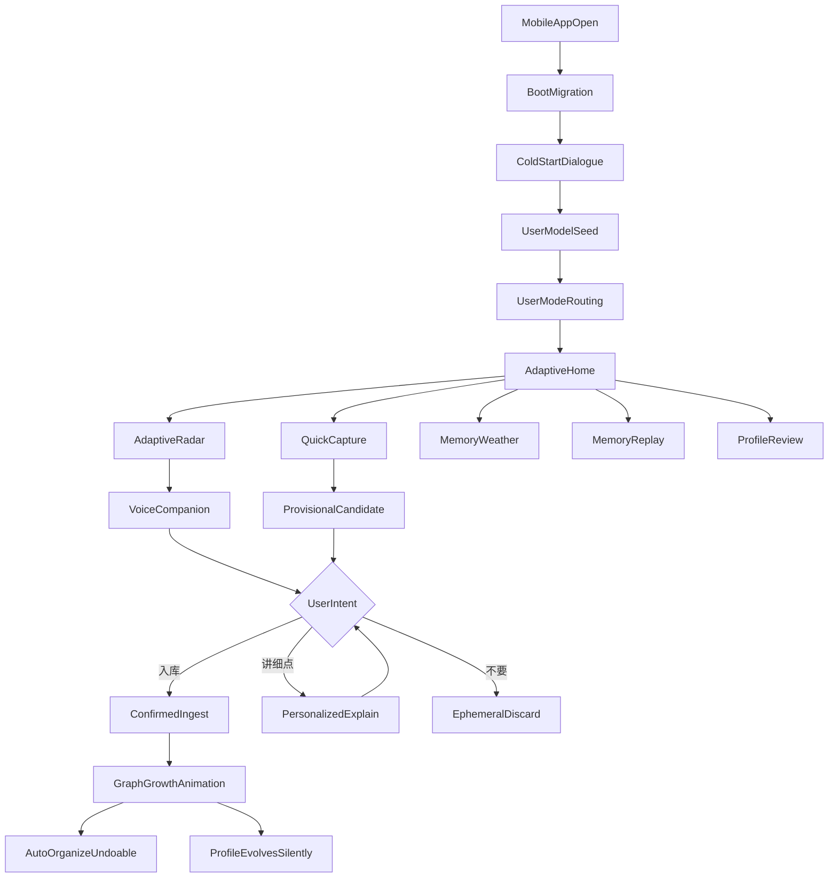
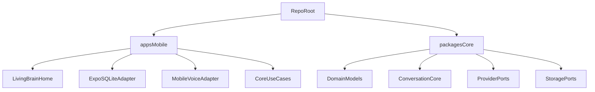

# my_brain App-Only 产品化计划

> **状态**：草案（App-only + User Evolution-first 修订版）  
> **更新时间**：2026-06-12  
> **关联文档**：[KNOWLEDGE_OS_VISION.md](./KNOWLEDGE_OS_VISION.md)、[PROJECT_STATUS.md](./PROJECT_STATUS.md)、[PRODUCT.md](../PRODUCT.md)、[ARCHITECTURE.md](./ARCHITECTURE.md)  
> **说明**：本计划废弃「桌面/Web 第一入口、移动端后续 capture」的旧假设。从现在起，`my_brain` 按 **iOS/安卓 App-only** 产品设计。  
> **审查结论**：HOLD SCOPE — 功能范围不缩水，不降级为临时 demo；**M7-GATE** = 不公开上线的完整成品验收；**M6-GATE** = 双端真机 M0–M5 主体能力 QA + 可观测性；商店发布为 optional release track，不阻塞 M6/M7 gate。

---

## 0. 当前执行约束

| 约束 | 含义 |
|---|---|
| **完整成品** | 阶段 0–7 全部功能保留：LivingBrainHome、ColdStartDialogue、AdaptiveRadar、三意图入库、真实语音、快速捕获、MemoryWeather/Replay/ReverseQuestion、双端 QA/可观测性、同步备份。**不允许少做。** |
| **先本地完整成品** | 阶段 0–5 以 Expo Dev Client + 模拟器/真机本地调试为主；**M7-GATE** 验收完整成品（含同步/备份）；**不以** TestFlight、Play Internal、EAS Submit、商店账号作为 M6/M7 gate 硬阻塞。 |
| **User Evolution-first** | 产品通过冷启动与持续使用识别用户类型与目标，越用越懂用户；AI 资讯/GitHub 趋势仅为**技术用户**内容源之一，非所有用户默认入口。 |
| **mock 是手段，不是终点** | 无 API key 时可用 mock provider 跑通闭环与测试；Settings 必须显式标识 mock/degraded，禁止静默伪装成 live。 |
| **先抽 core，后建壳** | 禁止在 `apps/mobile` 复制第二套业务逻辑；共享逻辑进 `packages/core`，移动端只做 UI 与平台适配。 |
| **双端原生适配** | 每阶段须体现 Android/iOS 差异与验收矩阵，尤其语音、存储、分享捕获、权限、真机 QA。 |
| **文档对齐** | 实施前须修订与 App-only 冲突的 `AGENTS.md`、`PRODUCT.md`、`docs/ARCHITECTURE.md`、`docs/handbook/PROJECT_HANDBOOK.md` 及 storage 三端规则。 |

**阶段验收边界（先不发布上线，完整成品不缩水）：**

| Gate | 含义 |
|------|------|
| **M6-GATE** | 双端真机 QA + 可观测性 + E2E；验证 **M0–M5 主体能力** 在 Android/iOS dev/preview build 上稳定。**不等于**完整成品验收；**不含** M7 同步/备份；**不等于**公开商店上线。 |
| **M7-GATE** | 阶段 0–7 **完整功能验收**（= **不公开上线的完整成品** gate）；= **M7A-GATE PASS** + **M7B-GATE PASS**（见 §6 阶段 7）。 |
| **M7A-GATE** | 换机恢复 + 手动/半自动加密备份（**优先交付**）。 |
| **M7B-GATE** | 双端双向 SyncProvider + 冲突合并（完整功能保留，**第二段 gate**）。 |
| **商店发布** | TestFlight / Play Internal / EAS Submit 为 **optional release track**，**不阻塞** M6/M7 本地完整成品验收。 |

**M6-GATE smoke 覆盖（M0–M5 主路径）：** Android + iOS 真机/dev build 可安装运行；离线可用；文字与语音闭环；捕获、记忆体验、本地诊断可用。

**M7-GATE 追加验收（完整成品）：** **M7A**：换机恢复、加密备份导入导出；**M7B**：SyncProvider/冲突策略。完整 M7-GATE = M7A + M7B 均 PASS。

**第一阶段不阻塞（但阶段 6 optional / 阶段 7 仍要做）**：Apple/Google 开发者账号、EAS Submit、OTA、App Store 上架材料、多设备加密同步。

**交付 Runbook（Windows 无 Mac）**：[`specs/mobile-app/runbooks/WINDOWS_EAS_SIDELOADLY_APPETIZE.md`](../specs/mobile-app/runbooks/WINDOWS_EAS_SIDELOADLY_APPETIZE.md) — Android APK 分享、EAS 云构建 `.ipa` + Sideloadly 自用 iPhone、Appetize 辅助演示；与 M6/M7 gate 真机证据边界对齐。

---

## 1. 新定位

**一句话**：`my_brain` 是一款 **自进化个人大脑伴侣** — 通过冷启动自然对话与持续使用，为不同用户动态生成今日入口，越用越懂用户。它不是 AI 资讯 App；AI 资讯/GitHub 趋势只是**技术追踪者**可选内容源之一。

`my_brain` 不再做桌面/Web 优先的个人知识 OS，而做一款 iOS/安卓优先的「口袋里的活体大脑」：用户打开它，看到一个会呼吸的知识星核；**今日入口由冷启动识别的用户模式与持续画像驱动**（`AdaptiveRadar`），而非固定「每天听 3 条 AI/世界变化」。用户用语音或文字决定「入库 / 不要 / 讲细点」，入库后星图点亮、自动整理、可撤销。

这不是普通聊天 App、RSS App、知识库 App，而是「语音伴侣 + 个人知识星图 + 快速捕获 + 记忆回顾 + 自适应个人雷达」的移动产品。炫酷来自生命感和仪式感，可用性来自少而强的主路径、文字兜底、本地存储、清晰权限与可诊断的降级状态。

核心体验闭环：



### 冷启动用户模式识别

冷启动通过 **自然对话**（非问卷表单）识别用户类型与使用目标，种子化 `UserModel` 并路由 **`UserModeProfile`**（非单一枚举固化）：

```typescript
// packages/core 契约（M0 类型层 / M1 实现）
interface UserModeProfile {
  primaryMode: UserMode;           // 主模式
  secondaryModes: UserMode[];      // 混合模式（可为空）
  confidence: number;              // 0–1，冷启动/推断置信度
  recentIntent?: string;           // 最近会话意图摘要（非敏感）
  lastCorrectionAt?: string;       // ISO8601；用户手动纠偏时间
}
```

| 用户模式（`UserMode`） | 典型目标 | AdaptiveRadar 倾向 | 第一颗星可能来自 |
|----------|----------|-------------------|-----------------|
| **技术追踪者** | 跟进 AI/GitHub/行业变化 | 资讯信号、趋势摘要 | AI 新闻、开源项目 |
| **学习者** | 系统学习某主题 | 学习路径、概念回顾 | 课程、教程、概念 |
| **创作者/研究者** | 产出与引用管理 | 素材、引用、待整理 | 文章、笔记、链接 |
| **创业/项目型** | 项目推进与决策 | 项目节点、待办关联 | 项目想法、竞品、计划 |
| **个人记忆/生活型** | 生活记录与回忆 | 捕获回顾、记忆天气 | 想法、截图、语音笔记 |

冷启动 fixture **≥3 条**，且须覆盖 **混合模式**（如 `primaryMode=学习者` + `secondaryModes=[个人记忆/生活型]`）。

**AdaptiveRadar 统一候选契约 `AdaptiveSignal`**（M0 类型 / M1 实现 / core 测试）：

| 字段 | 含义 |
|------|------|
| `sourceType` | 信号来源类型（radar / capture / learning / …） |
| `userModeFit` | 与当前 `UserModeProfile` 的匹配度 |
| `freshness` | 时效性评分或时间戳 |
| `evidenceRefs` | 可追溯 evidence 引用（nodeId / changeId / …） |
| `confidence` | 推荐置信度 |
| `privacyLevel` | 本地/可导出/禁止外传 |
| `suggestedIntent` | 建议用户动作（讲细点 / 捕获 / 入库候选） |

**纠偏机制与信任优先级**：**用户手动纠偏 > 行为信号 > LLM 推断**。画像静默生长，但用户从 M1 起即可在 **Settings / ProfileReview** 查看、修正、删除误判；被用户否定的画像项进入 **suppression list / correction history**，系统不得立即重新推回。说「我不是来学 XX 的」或手动改模式 → 立即重路由 AdaptiveRadar，不等到 M7。M2 持久化、M7 sync 须保留 **correction history**。

**第一颗星**：可来自用户目标、捕获内容、学习主题、项目想法或资讯 — **不固定为 AI 新闻**。

### 与现有代码的映射（复用，不重写）

**可直接或经薄适配迁入 `packages/core`：**

- `src/domain/**` — 图谱、radar、provisional、learning、profile 等领域模型
- `src/conversation/ConversationConductor.ts`、`nextTurn.ts`、`buildContext.ts`、`contextTiers.ts` — 状态机与话术
- `src/lib/graphMutations.ts`、`graphContextPack.ts`、`runAutoCuratePipeline.ts`（去耦后）
- `src/agent/curation/autoCurate.ts`、`src/radar/**`
- `src/storage/types.ts`、`migrations.ts`、`transaction.ts` — StorageProvider 契约
- `src/providers/**` — 接口与 mock/live 实现（env 读取须抽象）

**迁移前须依赖注入化（禁止 core 内直接 `useXxxStore.getState()`）：**

- `src/conversation/ingestActions.ts` — 当前耦合 `useBriefingStore` / `useIngestStore`
- `src/lib/runAutoCuratePipeline.ts` — 当前耦合 `useGraphStore` / `useGraphHistoryStore`

**不可复用，移动端须重写：**

- `src/components/**` — Web/Tauri UI、`react-force-graph`、DOM/CSS
- `src/providers/voice/audio/*` — Web Audio / `navigator.mediaDevices`
- `src/lib/env.ts` — `import.meta.env.VITE_*` 模式
- `src/storage/createStorageProvider.ts` — 仅 Tauri/Web 二选一，须增 `expo-sqlite` 第三轨

---

## 2. 市面调研结论

- **React Native + Expo** 更适合本项目：当前仓库已是 TypeScript/React/Zustand/Provider 架构；本地跑通用 **Expo Dev Client** 即可，不必第一天上 EAS。参考：[Expo SQLite + Drizzle](https://orm.drizzle.team/docs/connect-expo-sqlite)、[Modern SQLite for React Native](https://expo.dev/blog/modern-sqlite-for-react-native-apps)。
- **Flutter** 动效上限更高，但意味着 Dart 生态与现有 TS 复用断裂；除非 RN/Skia 明显不达标，否则不切。
- 语音优先 App：第一版只保留 3–5 个核心意图；60 秒内完成一次**个性化**成功互动。参考：[Voice User Interface Design: The 2026 Guide](https://skyryedesign.com/design/ux-ui/voice-user-interface-design/)。
- 竞品参考（local-first 移动知识伴侣）：Memex、SecondLoop 等强调本地 SQLite、BYOK、分享捕获；差异化在「用户确认入库 + 自动整理 + 星图证据链 + 自适应用户模式」，不是又一个日记 App 或 RSS 阅读器。
- **发布链路（阶段 6 optional）**：EAS Build/Submit/Update、TestFlight、Play Internal、Sentry、Fingerprint OTA — 保留在计划中，作为 **optional release track**，不阻塞 M6/M7 gate。

---

## 3. 基础条件（分阶段）

### 3.1 阶段 0–2：本地跑通所需

- Node.js + pnpm、Expo CLI、Expo Dev Client
- Android Studio（模拟器 + adb 真机）**与** iPhone 真机 + 局域网调试（双端验收从 M1 起纳入矩阵）
- 可选 Mac + Xcode（iOS 权限/音频/Share Extension 深调最终需要）
- 修订冲突文档 + `pnpm-workspace.yaml` + `apps/mobile` + `packages/core` monorepo 脚手架
- **不强制**：Apple Developer、Google Play Console、EAS 付费构建

### 3.2 阶段 6：双端 QA + 可观测性所需

- Android + iOS 各 ≥1 台真机/dev build 可运行 **M0–M5 主体能力** smoke（不含 M7 同步/备份 gate）
- **本地 ring buffer + crash/diagnostic export**（硬需）；Sentry / PostHog / Amplitude 为**可插拔适配器**（optional live observability，**默认关闭或 mock**）；移动 E2E 进 CI
- **Optional release track**（不阻塞 M6-GATE）：Apple Developer、Google Play Console、EAS、TestFlight、Play Internal
- **token exchange 服务**（阶段 3 前置）：长期 provider 密钥不得打进 APK/IPA

---

## 4. 技术路线

### 4.1 Monorepo 结构



| 路径 | 职责 |
|---|---|
| `apps/mobile` | 唯一产品 App：Expo + RN UI、权限、平台 adapter、路由 |
| `packages/core` | 纯逻辑：domain、conversation、ingest、auto-curate、radar、user mode、provider 接口 |
| `packages/mobile-ui`（可选） | 星核、MemoryWeather、ConceptSoulCard、MemoryReplay 组件 |
| `src/`（legacy） | 原 Web/Tauri 实现，降为 dev surface，不阻塞移动主线 |

### 4.2 关键技术选择

| 层 | 选型 | 说明 |
|---|---|---|
| App 壳 | Expo SDK + RN New Architecture | 本地 dev client 优先 |
| 动效 | Reanimated + Skia + Lottie | 不照搬 `react-force-graph`；第一屏聚合星核 + 局部节点 |
| 本地存储 | `expo-sqlite` + 现有 schema/migrations 对齐 | 第三 StorageProvider 适配器，与 web/tauri 共用行为夹具 |
| 配置 | 跨平台 `readAppEnv()` | 禁止 App 复制 `VITE_*`；Expo Constants / 本地 dev 配置 |
| 安全存储 | `expo-secure-store` | 仅短期 token、设备设置；**不存** volc/modelscope 长期密钥 |
| 语音 | mock → RN 录音/播放 → 豆包/火山 + **token exchange** | 阶段 3 前须 RN 原生 WS Header ADR；双端 AudioSession/AudioFocus |
| 捕获 | Share Extension / intent filters / OCR / 语音笔记 | 阶段 4；候选须 SQLite 持久化 |
| 观测 | **本地 ring buffer**（硬需）；optional Sentry 适配器 | 本地阶段即可导出诊断包（不含知识正文） |

### 4.3 代码质量边界

- `packages/core` 不含 React Native / DOM 依赖
- 共享逻辑经构造函数或 deps 注入，不从 core 读 Zustand 全局 store
- strict TypeScript；新增 `any` 须书面理由（延续 `AGENTS.md`）
- 阶段 7 前不引入重型同步 SDK；先做 GraphChange 导出/导入与冲突 fixture

### 4.4 Android / iOS 平台适配矩阵

| 维度 | Android | iOS |
|------|---------|-----|
| **麦克风权限** | `RECORD_AUDIO` runtime | `NSMicrophoneUsageDescription` |
| **语音 / 音频** | AudioFocus、蓝牙 SCO/A2DP | AVAudioSession category、蓝牙路由 |
| **系统中断** | 来电/闹钟抢焦点 | 来电/ Siri 中断 |
| **锁屏/后台** | 前台 Service 策略（若需） | 后台音频 entitlement |
| **分享捕获** | Intent filters、`ACTION_SEND` | Share Extension + App Group |
| **文件导出** | Storage Access Framework / Downloads | Files app / share sheet |
| **系统备份** | Auto Backup 默认**排除**明文 SQLite DB（`backup_rules.xml`） | 敏感 DB **默认 excluded-from-backup**（`NSURLIsExcludedFromBackupKey` 或等价）；用户主动导出/加密备份才离开设备 |
| **安全区/导航** | 返回键、edge-to-edge | Safe area、手势返回 |
| **通知/诊断** | 通知渠道（可选） | 本地通知权限文案 |
| **真机 QA** | adb dev build smoke | Xcode dev build smoke |

每阶段 spec 须引用本矩阵相关行作为验收项。

---

## 5. 工具链（分阶段）

### 5.1 阶段 0–5：本地开发与测试

- Expo Dev Client、Android emulator、iOS simulator、USB/局域网真机（**双端**）
- `pnpm check` 跑 `packages/core` Vitest（复用/迁移现有不变量测试）
- Maestro 或 Detox（移动 E2E，阶段 2 起）
- Storybook / Expo Router Preview（调 LivingBrainHome 等）
- Figma Motion Spec（星核呼吸、入库流星、MemoryReplay）
- Feature Flags（mock/live voice、live radar、招牌体验逐步开）
- Prompt/Eval Harness（冷启动分流、语音意图、入库质量、MemoryWeather 有用性 fixture）

### 5.2 阶段 6：双端 QA 与运营

- **本地 ring buffer + crash/diagnostic export**（硬需）
- Sentry / PostHog / Amplitude：**可插拔适配器**，optional，默认 off/mock；字段白名单仍适用（见 §11）
- 移动 E2E 纳入 CI（Maestro/Detox）
- **Optional**：EAS Build / Submit / Update、TestFlight、Play Internal、Fingerprint OTA

---

## 6. 分阶段实施

### 阶段 0：App-only 战略改造 + Monorepo 地基

**目标**：正式废弃桌面/Web 第一入口假设；落地 monorepo，不开始写移动 UI 前先定 core 边界。

**交付**：

- 本文件 + [`specs/mobile-app/`](../specs/mobile-app/README.md) 工作单索引（M0–M7 spec + 验收门）
- 修订 `docs/KNOWLEDGE_OS_VISION.md`、`AGENTS.md` tech stack、storage 规则（web / tauri / **mobile** 三端对齐）
- **M0 必须在以下文档顶部加醒目标注**（移动 App-only / User Evolution-first 以 **本计划 + `specs/mobile-app/`** 为准）：`PRODUCT.md`、`docs/ARCHITECTURE.md`、`AGENTS.md`、`docs/handbook/PROJECT_HANDBOOK.md`（见 README §M0 文档冲突项）
- RN/Expo vs Flutter ADR
- `pnpm-workspace.yaml`、`apps/mobile`（Expo 空壳）、`packages/core`（domain 迁移 wave 1）
- App 信息架构：LivingBrainHome、**ColdStartDialogue**、**AdaptiveRadar**、QuickCapture、MemoryWeather、**Settings/ProfileReview**

**验收**：

- 根目录 `pnpm check` 仍绿
- ADR 与文档冲突项有明确修订清单（含 User Evolution-first、not-store-release-first）

---

### 阶段 1：Local Product Foundation（本地成品地基）

**目标**：在本地/真机 dev client 跑通**完整主路径骨架** — 不是临时 demo，是成品的工程地基。含 **ColdStartDialogue + UserModeRouting + AdaptiveRadar**；无 API key 可用 mock，但 UI 须标识 degraded/mock。

**交付**：

- `LivingBrainHome`：深色星云、记忆星核、呼吸光效、语音态指示
- **ColdStartDialogue**：自然对话识别用户模式（至少 3 条 fixture 分流）
- **UserModeRouting** → **AdaptiveRadar**（按模式展示今日入口，非固定 AI 简报）
- 三意图：「入库 / 不要 / 讲细点」— 文字按钮 + mock 语音态
- `GraphGrowthAnimation` + auto-curate reason + **graph history undo**
- **ProfileReview v0**：用户可查看/纠偏/删除画像误判（静默生长 + 可见可改）
- `MemoryWeather` v0（可基于 fixture 证据；按用户模式自适应）
- 全局 **DegradedMode** 状态
- `packages/core`：ConversationConductor + ingest 去耦 wave 1

**验收**（60 秒闭环允许 **两类**，至少各 1 条 fixture 或 eval 记录）：

| 闭环类型 | 路径 | 说明 |
|----------|------|------|
| **ingest loop** | 讲细点 → 入库 → 点亮 → undo | 保留入库门控 |
| **capture loop** | 冷启动/模式 → 捕获想法/链接 → 候选 → 确认或讲细点 → 星图/候选状态变化 | M1 可用内存/mock 候选；**禁止**候选自动 permanent |

- 无 API key 可完成 **个性化** 60 秒闭环（上述任一类或组合）
- 至少覆盖 **3 条冷启动分流 fixture**（含 **混合模式** fixture；技术追踪、学习、个人捕获/项目）
- Android + iOS 各完成 smoke（模拟器或真机）
- 第一屏无 dashboard、长列表、复杂设置
- Settings 可见 provider/storage/voice/**profile** 状态，mock 时有明确标识

---

### 阶段 2：可用性 MVP（本地 SQLite + 持久化可信）

**目标**：炫酷外观下每天真能用；**所有关键状态落盘**，杀进程不丢。

**交付**：

- **`expo-sqlite` StorageProvider** — 对齐 `src/invariants/testStorage.ts` 与 `sqlitePersistence.test.ts` 行为
- 持久化：图谱、**profile seed / user mode / adaptive radar state**、learning trace、graph history、**WorldItem**、**Provisional 候选队列**
- 图谱 + history **同事务**（`coTransactGraphAndHistory` 模式）
- 文字输入兜底；无麦克风权限可完成核心闭环
- Settings：**ProfileReview**（画像修正）、provider 状态、权限、**数据导出**、隐私说明、schema version
- ConceptSoulCard；AdaptiveRadar env-gated live，失败 fixture + 用户可见降级
- 本地 **ring buffer 诊断日志**（可导出，**不含** node 正文 / transcript / 画像敏感正文）
- **iOS/Android 备份策略（默认不把明文 SQLite 放进系统云备份）**：
  - **Android**：Auto Backup **排除** app SQLite DB（`backup_rules.xml` 或等价）
  - **iOS**：敏感 DB 设置 **excluded-from-backup**（`NSURLIsExcludedFromBackupKey` 或 Expo 等价配置）
  - 用户 **主动导出 / 加密备份** 才离开设备
- 设备丢失风险说明：SQLite 明文；阶段 7 前评估加密/at-rest 方案

**验收**：

- 断网可打开旧图谱、用户模式与最近回顾
- 杀 App 后 pending 候选、history、learning trace、**profile/mode** 可恢复
- 用户可导出数据；画像修正持久化
- `persistWarning`（history/learning trace 写盘失败）须 UI 告警，禁止静默

---

### 阶段 3：真实语音主路径

**前置阻塞（须 ADR + 实现）**：

- **Token exchange** — 短期 token 经 `expo-secure-store`；禁止 `volcAccessKey` / `modelscopeApiKey` 进包
- **RN 原生语音传输 ADR** — 豆包/火山 WS 需 Header；现有 `volcRealtimeRequiresNativeTransport()` 在 JS 层会 fail-fast

**目标**：App 真正像可打断的语音伴侣；**双端语音差异验收**。

**交付**：

- 麦克风权限、RN 录音/播放、播放队列、**barge-in**
- 豆包/火山 `VoiceProvider` mobile 实现 + token exchange 客户端
- 状态机可视：listening / thinking / speaking / interrupted / error
- 错误恢复：断网、无权限、ProviderConfigError、TokenExchangeError、RealtimeVoiceTransportError
- **双端验收矩阵**：iOS AudioSession、Android AudioFocus、蓝牙耳机、系统中断、锁屏/后台切回、权限撤销、弱网、barge-in latency

**验收**：

- 插话时立即停止播放并进入聆听（双端真机或 signed-off eval）
- 语音与文字三意图行为一致
- provider 失败不污染图谱、不阻塞启动（降级文字 + DegradedMode）
- 口令二义性：第一次 reprompt，第二次仍歧义时 **UI 确认**

---

### 阶段 4：快速捕获

**目标**：手机成为世界 → 图谱的入口；候选可恢复、可审计；**双端分享验收拆分**。

**阶段依赖（审查修订）**：**M2-GATE 后**可并行 **设计/实现** M4 的 **文字/分享捕获路径**（不含语音笔记、不含 Share Extension 与主 App 原生工程整合的 FULL PASS）。**M4-GATE FULL PASS** 仍须 **M3-GATE PASS**（语音笔记、语音确认、原生工程整合）。

**交付**：

- 分享链接（https only）、**Android intent**、**iOS Share Extension**（App Group 传 payload，**不共享长期密钥**）
- 截图/**on-device OCR 优先**、语音笔记 → ProvisionalCandidate
- 候选 SQLite 表 + 「待点亮星尘」队列 UI
- 候选来源：资讯、**学习材料、项目链接、生活想法** 等（非仅新闻）
- **安全边界**：URL 大小/超时/重定向限制；禁内网 IP（SSRF）；畸形 payload 拒绝
- 入库仍只经 `applyIngestCreate` / 用户确认；确认前无 permanent 节点

**验收**：

- Android intent 与 iOS Share Extension **分别**验收通过
- 分享内容默认仅候选，不进永久图谱
- 杀进程后候选仍在；用户确认前无长期节点

---

### 阶段 5：招牌体验

**目标**：传播记忆点；**没证据就不生成**；**按用户模式自适应输出**。

**交付**：

- **MemoryWeather** — 引用 GraphChange、LearningTrace、RadarSignal；技术/学习/项目/个人记忆用户输出不同类型
- **MemoryReplay** — 20 秒回放；增量索引/缓存，禁止每次全量扫库
- **ReverseQuestion** — 基于真实图谱节点；按用户模式调整提问风格
- 无证据时：明确降级文案或隐藏入口，禁止 AI 空话

**验收**：

- 仅 SQLite 持久化数据（无 session 内存）下，fixture 验收通过
- 每条招牌输出可追溯到 evidence 表/字段
- 不同用户模式 fixture 输出类型符合预期

---

### 阶段 6：双端 QA、可观测性与可选发布轨（Dual-device QA + Observability）

**目标**：**Android + iOS 双端真机 M0–M5 主体能力 QA** + 可观测性与 E2E 就绪。**不等于**完整成品 gate（同步/备份在 M7）；**商店发布为 optional release track，不阻塞 gate。**

**交付**：

- **双端真机 smoke**：Android + iOS 各 ≥1 台 dev/preview build 完成 **M0–M5 主路径** smoke
- **本地 ring buffer + crash/diagnostic export**（硬需）；Sentry / PostHog / Amplitude 为**可插拔适配器**（optional，默认 off/mock）；崩溃可定位版本与页面
- 移动 **E2E 纳入 CI**（Maestro/Detox）
- 权限文案、诊断导出、事件分析（字段白名单）
- **Optional release track**（不阻塞 M6-GATE）：EAS profiles、TestFlight、Play Internal、EAS Submit、OTA

**验收**：

- ≥1 台 iPhone + ≥1 台 Android 可装 **dev/preview build** 并完成主路径 smoke
- 移动 E2E 在 CI 绿（或 documented quarantine 0 条）
- 崩溃可定位版本与页面；诊断导出不含敏感正文
- **缺 Apple/Google 账号 / EAS 不导致 M6-GATE FAIL**（optional track 标 BLOCKED 即可）

---

### 阶段 7：同步与长期可信

**验收拆层（功能不缩水）**：

| 子 gate | 范围 | 交付顺序 |
|---------|------|----------|
| **M7A-GATE** | 换机恢复 + 手动/半自动加密备份 | **先交付、先 PASS** |
| **M7B-GATE** | 双端双向 SyncProvider + 冲突合并 | M7A PASS 后继续 |
| **M7-GATE** | 完整成品验收 | **M7A + M7B 均 PASS** |

**交付**（优先级顺序）：

1. **M7A**：**换机恢复** + **手动/半自动加密备份**（第一优先）
2. **M7B**：**双端双向同步**（第二优先；SyncProvider 接口）
- JSON/Markdown/Graph snapshot 导入导出（对齐 `importGraphJson` 错误类）
- 加密备份：iCloud、Google Drive、WebDAV、私有中继
- 冲突：GraphChange 时间线合并；**同步不得 bypass 用户确认入库**；delete = archive
- **画像查看与修正**（与 M1/M2 ProfileReview 衔接，非首次出现）

**验收**：

**M7A-GATE：**

- 换机导出→导入可恢复完整图谱与 profile + **correction history**
- 加密备份 round-trip（或 ADR + opt-in 明文警告）

**M7B-GATE：**

- 双端冲突不硬删；用户可导出迁移
- `SyncConflictError` 有用户可见策略
- sync 合并保留 **correction history / suppression list**；不 silent 覆盖用户纠偏

**M7-GATE** = M7A + M7B 均 PASS

---

## 7. 错误与救援注册表

| 错误类 | 触发 | 用户应看到 | 是否测 |
|---|---|---|---|
| `StorageInitError` | DB 初始化/磁盘满 | 无法启动 + 重试/导出指引 | 必测 |
| `SchemaMigrationError` | 升级失败 | 阻塞启动 + 版本信息 | 必测 |
| `ProviderConfigError` | 缺 key/错误配置 | Settings 标注 mock/degraded | 必测 |
| `RealtimeVoiceTransportError` | WS/Header/原生传输失败 | 文字兜底 + voice disconnected | 必测 |
| `TokenExchangeError` | 短期 token 失败/过期 | 重试；不阻塞非语音路径 | 必测 |
| `GraphTransactionError` | 图谱与 history 半写 | 错误 + 不展示假成功 | 必测 |
| `ProvisionalPersistError` | 候选写盘失败 | 候选未保存提示 | 必测 |
| `IngestProposalError` | LLM 无 proposal/超时/畸形 JSON | pending 保留；禁止半入库 | 必测 |
| `UserModeRoutingError` | 冷启动/模式路由失败 | 默认「个人记忆」模式 + 可手动改 | M1+ |
| `SyncConflictError` | 阶段 7 合并失败 | 冲突说明 + 不 silent merge | 阶段 7 |

入库失败时：**pending 队列不得消失**。auto-curate 返回空数组时：口头/UI 说明「已入库，本次无结构整理」。

---

## 8. DegradedMode 与静默失败防护

全局 `DegradedMode` 须覆盖（Settings + 可选横幅）：

| 状态 | 含义 |
|---|---|
| `mock_llm` | 缺 key 或 ProviderConfigError，非 live LLM |
| `fixture_radar` | live 源失败，使用 fixture/demo |
| `legacy_radar` | 仅内部降级；**移动端禁止无声进入** |
| `voice_disconnected` | 语音未连接或 RealtimeVoiceTransportError |
| `history_persist_warning` | graph history 内存有、磁盘写失败 |
| `learning_trace_persist_warning` | 影响 MemoryReplay 证据链 |
| `storage_degraded` | 部分读写失败 |
| `profile_seed_degraded` | 冷启动画像种子失败，使用默认模式 |

禁止：缺 key 静默 mock 且 UI 显示 live；Radar 失败无提示；口令误 skip 无确认。

---

## 9. 测试矩阵

| 层 | 范围 | 工具 |
|---|---|---|
| Core | domain、conversation、ingest、auto-curate、user mode、transaction、不变量、provider fallback | Vitest（`packages/core`） |
| Mobile 组件 | LivingBrainHome、AdaptiveRadar、ColdStartDialogue、ConceptSoulCard、Settings、DegradedMode | RN 测试 |
| Mobile E2E | 冷启动分流、权限拒绝、文字兜底、三意图、入库、undo、断网、分享捕获 | Maestro/Detox |
| 真机（双端） | 语音权限、杀进程恢复、后台切回、分享扩展、AudioFocus/AudioSession | Dev Client 手工 + E2E |

**最小不可少**：

- 无 API key 跑通主路径且 UI 标 mock/degraded
- 至少 3 条冷启动分流 fixture 验收
- 用户确认前分享/OCR 不能 create permanent 节点
- 入库 + history 事务一致
- 杀 App 后 pending、history、learning trace、profile 可恢复
- token exchange 失败不污染图谱
- Android + iOS 各完成 smoke

---

## 10. 安全与隐私

| 风险 | 措施 |
|---|---|
| 长期密钥进 APK/IPA | 阶段 3 前 token exchange；禁止复制 `src/lib/env.ts` 长期密钥到 App |
| SSRF（分享 URL） | https only、allowlist、超时、禁内网 IP |
| telemetry 泄露 | Sentry/PostHog **字段白名单**；不上传 title/intro/source 全文/transcript/**画像敏感正文** |
| SQLite 明文 | 阶段 2 文档化风险；阶段 7 加密备份 |
| 分享扩展隔离 | App Group 结构化 payload；扩展内无长期密钥 |
| 同步 bypass 入库门控 | SyncProvider 只合并已确认节点；禁止远端 silent create |
| 系统备份泄露 | Android Auto Backup 排除明文 DB；iOS **excluded-from-backup**；仅用户主动导出/加密备份离设备 |
| EverMemOS sidecar | 手机默认 mock memory；不假设 localhost Docker |

---

## 11. 可观测性（含本地阶段）

- **本地 ring buffer + crash/diagnostic export**（硬需；无知识正文、无画像敏感正文）
- Sentry / PostHog / Amplitude：**可插拔 optional 适配器**；默认 off/mock；不强制真实云端
- 关键动作：`{ intent, outcome, reasonCode, userMode? }`
- Provider 面板：mock / live / degraded / connected / disconnected
- Storage：schema version、last migration、export、persist warning
- Voice：listening / thinking / speaking / interrupted / error
- Profile：user mode、seed confidence、last correction
- 阶段 6 可叠加 optional Sentry Release Health（非 gate 硬需）

---

## 12. UI 状态设计（LivingBrainHome）

| 状态 | 要求 |
|---|---|
| Loading | DB、provider、AdaptiveRadar 分步展示 |
| Empty / ColdStart | 冷启动对话引导；第一颗星来自用户目标而非固定新闻 |
| Error | 麦克风/DB/provider/token 分因展示 |
| Success | 入库点亮、连线、auto-curate reason |
| Partial | 已入库无整理、live→mock、语音不可用文字可用 |
| ProfileReview | 画像可见、可纠偏、可删除误判 |

建议后续单独跑 `/plan-design-review` 做视觉与动效深审。

---

## 13. 自我批评与修正（CEO Review 后）

| 批评 | 修正 |
|---|---|
| 只做 App 失去大屏星图 | 聚合星核 + ConceptSoulCard + MemoryWeather/Replay，不做移动版全图编辑 |
| 太炫牺牲可用性 | 一个主场景、三意图、文字兜底；动效服务状态理解 |
| 计划把 EAS/上架放太早 | 发布链路后置阶段 6 **optional track**；0–5 只要求 dev client 本地跑通 |
| 「Wow Demo」易被理解成临时 demo | 改名为 **Local Product Foundation**；mock 是测试手段 |
| 双写业务逻辑 | 先 `packages/core` + 依赖注入，再 `apps/mobile` UI |
| RN 动效上限 | Reanimated/Skia 先 80 分；局部 native 优化，不先 Flutter 重写 |
| 招牌体验变 AI 空话 | 绑定 GraphChange/LearningTrace/RadarSignal；无证据降级 |
| 静默失败 | DegradedMode + 错误注册表 + persistWarning UI |
| AI News-first 窄化用户 | 改为 User Evolution-first + AdaptiveRadar + 冷启动分流 |
| 画像只到 M7 才可见 | M1 起 ProfileReview 可见可纠偏 |
| M6 等同公开上线 | M6 = 双端 QA + 可观测性；商店发布 optional |

---

## 14. 推荐执行顺序

1. 阶段 0：文档修订、monorepo、`packages/core` domain wave 1、ADR
2. 阶段 1：LivingBrainHome + ColdStart + AdaptiveRadar + mock 闭环 + ProfileReview v0
3. 阶段 2：`expo-sqlite` adapter + 全量持久化 + 导出 + 诊断日志
4. 阶段 3：token exchange ADR + RN 语音 + 双端语音矩阵
5. 阶段 4：分享捕获 + 候选 SQLite + 双端验收 + 安全边界（**M2 后可并行文字/分享路径**；FULL PASS 仍须 M3）
6. 阶段 5：MemoryWeather / MemoryReplay / ReverseQuestion + 用户模式自适应
7. 阶段 6：双端真机 QA + **本地 ring buffer/diagnostic** + 移动 E2E CI（optional：Sentry/EAS/TestFlight/Play）
8. 阶段 7：**M7A** 换机/加密备份 → **M7B** SyncProvider/冲突合并（M7-GATE = M7A + M7B）

---

## 15. 成功标准

- 30 秒内用户明白：这是会**随我进化**的个人大脑，不是聊天工具或资讯 App
- **60 秒内**完成**个性化价值闭环**（冷启动/模式识别 → AdaptiveRadar → 互动 → 入库或捕获 → 星图变化）
- **Android + iOS 真机**各完成 dev build smoke；离线可查看旧图谱与 profile
- 一周后 MemoryWeather / MemoryReplay 反映**持久化**的真实变化，且与用户模式匹配
- 用户可随时查看、纠偏画像；不等到 M7
- 不破坏底线：**本地优先、用户确认入库、自动整理可撤销、Provider 可替换**
- mock/degraded 永远对用户可见，不 silent
- **M7-GATE 完整成品验收**不要求公开商店发布

---

## 16. 暂不阻塞 M6/M7 gate（阶段 6 optional / 阶段 7 仍交付）

- TestFlight / Play Internal / EAS Submit / OTA rollout（**optional release track**）
- Apple/Google 付费开发者账号（本地 dev client 可先不办）
- App Store 上架材料与商店审核
- 多设备加密同步与 SyncProvider 完整双向实现（M7 第一优先为换机/备份）

---

## 附录 A：实施待办清单

- [x] 编写 `specs/mobile-app/` 索引与 M0–M7 工作单（见 §17.7）
- [x] 编写无人干预执行护栏 [`specs/mobile-app/EXECUTION_GUARDRAILS.md`](../specs/mobile-app/EXECUTION_GUARDRAILS.md)（见 §17.0）
- [ ] **M0 前先读并遵守** [`EXECUTION_GUARDRAILS.md`](../specs/mobile-app/EXECUTION_GUARDRAILS.md)；M0 必须落地 `EXECUTION_STATE.json`、`pnpm mobile:gate M{n}`、固定阶段派发模板；M0–M7 各阶段验收报告落到 [`specs/mobile-app/reports/`](../specs/mobile-app/reports/)（`M{n}-GATE-report.md`；M7 须附录 M0–M6 全部 PASS）
- [ ] 修订 App-only 冲突文档（`AGENTS.md`、`PRODUCT.md`、`ARCHITECTURE.md`、handbook、storage 三端规则）
- [ ] 建立 monorepo：`pnpm-workspace.yaml`、`apps/mobile`、`packages/core`
- [ ] RN/Expo ADR；token exchange + RN 原生语音传输 ADR（阶段 3 前）
- [ ] Core 抽取：domain、ingest/auto-curate 依赖注入、跨平台 `readAppEnv()`、user mode routing
- [ ] `expo-sqlite` StorageProvider + 三端 storage 行为夹具
- [ ] 阶段 1 Local Product Foundation：LivingBrainHome、ColdStart、AdaptiveRadar、三意图、ProfileReview、undo、DegradedMode
- [ ] 阶段 2 持久化：profile/mode/radar state、WorldItem、Provisional、learning trace、诊断日志、导出、双端备份策略
- [ ] 阶段 3 真实语音 + token exchange + 双端语音矩阵
- [ ] 阶段 4 分享捕获 + 双端验收 + 候选恢复 + SSRF 边界
- [ ] 阶段 5 招牌体验 + 用户模式自适应 + 证据链
- [ ] 阶段 6 双端真机 QA + **ring buffer/diagnostic export** + 移动 E2E CI（optional：Sentry/EAS/TestFlight/Play）
- [ ] 阶段 7 换机/备份优先 → SyncProvider + 加密备份 + 冲突策略

---

## 附录 B：CEO Review 摘要（2026-06-12）

- **模式**：HOLD SCOPE，完整功能不裁剪
- **关键调整**：User Evolution-first；AdaptiveRadar 替代 DailyRadarTop3；M6 改为双端 QA gate（商店 optional）；M1 起 ProfileReview；冷启动分流
- **P0 缺口**：token exchange、expo-sqlite 事务持久化、文档/技术栈与 App-only 对齐、双端验收矩阵
- **后续建议**：`/plan-design-review` 深审 LivingBrainHome 视觉与动效

---

## 17. 工程评审补强（plan-eng-review · 2026-06-12）

> 本节吸收 `/plan-eng-review` 结论，写入实施硬约束。详细工作单见 [`specs/mobile-app/README.md`](../specs/mobile-app/README.md) 与各 `M*.md`。
>
> **实施入口（M0 代码前必读）**：[`specs/mobile-app/EXECUTION_GUARDRAILS.md`](../specs/mobile-app/EXECUTION_GUARDRAILS.md) — 无人干预执行护栏（父 agent 监督、子 agent 按 M0→M7 顺序、不得跳 gate、阶段验收报告模板）。**开始 M0 实施前必须先读**；与 README 中的 guardrails 章节一致。

### 17.0 无人干预执行护栏（M0 前必读）

单窗口、用户不干预地从 M0 执行到 M7 时，父 agent 与子 agent **必须先读** [`specs/mobile-app/EXECUTION_GUARDRAILS.md`](../specs/mobile-app/EXECUTION_GUARDRAILS.md)，再读对应 `M*.md`。

| 要点 | 说明 |
|------|------|
| **顺序** | `M(n)-GATE` 未 PASS → 禁止进入 M(n+1) |
| **报告** | 每阶段产出 `specs/mobile-app/reports/M{n}-GATE-report.md`；M7 完整验收须附录 M0–M6 全部 PASS 报告 |
| **状态锁** | M0 起创建 `EXECUTION_STATE.json`，父 agent 只能执行 `allowedNextAction` 指定阶段 |
| **机器验收** | M0 起实现 `pnpm mobile:gate M{n}` 或等价 verifier；状态、报告、命令三者 PASS 才能推进 |
| **派发模板** | 父 agent 使用 `STAGE_PROMPT_TEMPLATE.md`，一次只派发一个 M 阶段给 composer2.5 |
| **降级** | DEGRADED 仅记录同阶段继续，**不得**解锁下一阶段 |
| **M6 ≠ 完整成品 / ≠ 公开上线** | M6-GATE = 双端真机 **M0–M5 主体能力 QA** + 可观测性 + E2E；**不含** M7 同步/备份；商店发布 optional，缺账号不 FAIL gate |
| **M7-GATE = 完整验收** | 阶段 0–7 完整功能验收（= **不公开上线的完整成品**）；含换机/备份/SyncProvider |

### 17.1 `packages/core` public API 边界

**目标**：`packages/core` 是纯 TypeScript 业务内核，可被 `apps/mobile`、legacy web、未来其他壳消费。

**允许 export：**

- domain 类型、conversation FSM、ingest/auto-curate use-case（deps 注入）
- `UserModeProfile`、`AdaptiveSignal` 类型、`userModeProfile` routing、AdaptiveRadar 逻辑
- Provider **接口** + mock factory
- storage **端口**类型、`readAppEnv()` 抽象
- 错误类（`StorageInitError`、`SchemaMigrationError` 等）

**禁止泄漏进 `packages/core`（CI/ESLint 建议护栏）：**

| 禁止项 | 原因 |
|--------|------|
| React / React Native / JSX | UI 只属于 `apps/mobile` |
| Zustand / `useXxxStore.getState()` | 全局 store 破坏可测试性与壳无关性 |
| `import.meta.env` / `VITE_*` / 裸 `process.env` | 须经 `readAppEnv()` 跨平台抽象 |
| DOM / `window` / `document` | 非 isomorphic |
| Web Audio / `navigator.mediaDevices` | 语音适配器在 mobile native 层 |
| `?showcase=1` 等 runtime query flag | showcase 是 legacy web 演示轨，不得污染 core 分支 |
| `react-force-graph`、Tailwind、任何 UI/CSS 库 | 图谱渲染移动侧 Skia/Reanimated 重做 |

**迁移门禁**：`ingestActions.ts`、`runAutoCuratePipeline.ts` 在消除 store 耦合前 **不得** 迁入 core；M0-GATE 须验证 barrel export 无禁止依赖。

### 17.2 `expo-sqlite` MigrationGate（启动硬门）

DB migration 成功之前：

- **只渲染** boot / migration 状态屏（`MigrationScreen`：schema 版本、进度、重试、导出指引）
- **禁止挂载** `LivingBrainHome` 及任何会读写 SQLite 的业务组件
- `SchemaMigrationError` → 阻塞主 UI，不得 fallback 到内存图谱冒充已持久化

Migration 成功后方可 hydrate store 并进入主场景。详见 [`specs/mobile-app/M2-local-storage-and-diagnostics.md`](../specs/mobile-app/M2-local-storage-and-diagnostics.md)。

### 17.3 Expo Go / Dev Client / EAS 边界

| 阶段 | 推荐运行时 | 说明 |
|------|------------|------|
| **0–1** | Expo Go **或** Expo Dev Client | 无自定义原生模块；快速验证 LivingBrainHome 骨架 |
| **2** | **Dev Client**（推荐） | `expo-sqlite` 原生依赖；MigrationGate 需稳定 |
| **3–4** | **Dev Client / native build**（**必须**） | 原生语音 WS Header、麦克风、Share Extension / intent filters |
| **5** | Dev Client / native build | Skia 动效与真机性能 |
| **6** | **Dev Client / native build**（**必须**，双端真机） | 双端 QA gate；**EAS/TestFlight/Play 为 optional** |
| **7** | Dev Client / native build | 换机/备份/同步验收 |

**禁止误解**：Expo Go 不能作为 M3+ 验收环境；M6 不以 EAS/TestFlight 作为 gate 硬依赖。

### 17.4 测试文件落点建议

| 层 | 路径 | 工具 | 从阶段 |
|----|------|------|--------|
| Core 单元 / 不变量 | `packages/core/**/*.test.ts` | Vitest | M0 |
| Storage 三端夹具 | `packages/core/storage/` + 对齐 `src/invariants/testStorage.ts` | Vitest | M2 |
| Mobile 组件 | `apps/mobile/**/*.test.tsx` | RN Testing Library | M1 |
| Mobile E2E | `apps/mobile/e2e/*.yaml` | Maestro（首选）或 Detox | M2 本地；M6 CI |
| Eval harness | `docs/evals/` + 冷启动分流 / 语音意图 / 入库质量 fixture | 人工 + 半自动 | M1 / M3 / M5 |
| 性能冒烟 | `apps/mobile/perf/` | 节点预算断言 | M1 / M5 |

**验收规则**：各 spec 声明的测试文件须真实存在且含断言；`passWithNoTests: false` 或等价约束。

### 17.5 移动性能阈值

| 指标 | 阈值 | 阶段 |
|------|------|------|
| 首页可见节点 | **30–80**（聚合星核 + 邻域） | M1 起 |
| 万级节点库 | 仅 **聚合 / 搜索 / Replay**；禁止全量 force graph 渲染 | M5 |
| MemoryReplay | **增量读取** `graph history`（cursor / `last_change_id`）；禁止每次全表扫 `nodes` | M5 |
| Replay 冷启动 | 真机 P50 首批 change <500ms（fixture 基准） | M5 |
| 主路径耗时 | 60 秒内完成**个性化**闭环（冷启动分流 → AdaptiveRadar → 入库 → undo） | M1 |
| 双端 smoke | Android + iOS 各完成主路径 smoke | M1 起；M6 强化 |

### 17.6 与现有文档的冲突处理

不在本计划正文中大规模改写 `AGENTS.md` / `docs/ARCHITECTURE.md` 正文；**M0 必须**在 `PRODUCT.md`、`docs/ARCHITECTURE.md`、`AGENTS.md`、`docs/handbook/PROJECT_HANDBOOK.md` **顶部**加醒目标注：**移动 App-only / User Evolution-first 以 `docs/MOBILE_PRODUCT_PLAN.md` + `specs/mobile-app/` 为准**。其余修订项登记于 [`specs/mobile-app/README.md`](../specs/mobile-app/README.md) §「M0 必须修订的文档冲突项」，由 M0-GATE 验收。

**Gate 与真机证据**：机器 gate（`pnpm mobile:gate`）与真机/人工证据 gate 分离。缺真机证据时 verdict 为 **`NEEDS_DEVICE_EVIDENCE`**（非普通 FAIL，亦不可 PASS），停在当前阶段等待设备证据。适用于 M3 barge-in、M4 分享扩展/intent 真机、M6 双端 smoke。详见 [`GATE_VERIFIER_SPEC.md`](../specs/mobile-app/GATE_VERIFIER_SPEC.md)。

### 17.7 工作单索引

阶段 0–7 实施 spec：

- [`specs/mobile-app/M0-app-only-foundation.md`](../specs/mobile-app/M0-app-only-foundation.md)
- [`specs/mobile-app/M1-local-product-foundation.md`](../specs/mobile-app/M1-local-product-foundation.md)
- [`specs/mobile-app/M2-local-storage-and-diagnostics.md`](../specs/mobile-app/M2-local-storage-and-diagnostics.md)
- [`specs/mobile-app/M3-realtime-voice-and-token-exchange.md`](../specs/mobile-app/M3-realtime-voice-and-token-exchange.md)
- [`specs/mobile-app/M4-quick-capture-and-provisional-queue.md`](../specs/mobile-app/M4-quick-capture-and-provisional-queue.md)
- [`specs/mobile-app/M5-signature-memory-experiences.md`](../specs/mobile-app/M5-signature-memory-experiences.md)
- [`specs/mobile-app/M6-release-observability-and-mobile-e2e.md`](../specs/mobile-app/M6-release-observability-and-mobile-e2e.md)
- [`specs/mobile-app/M7-sync-backup-and-long-term-trust.md`](../specs/mobile-app/M7-sync-backup-and-long-term-trust.md)
