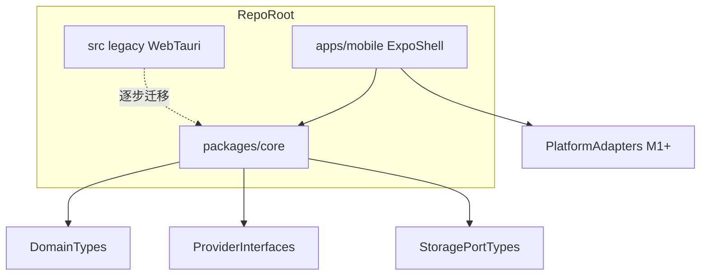

# M0 — App-only 战略改造 + Monorepo 地基（`app-only-foundation`）

- **阶段：** Mobile Phase 0 · **状态：** planned
- **上游：** [`docs/MOBILE_PRODUCT_PLAN.md`](../../docs/MOBILE_PRODUCT_PLAN.md) · **下游：** M1–M7
- **依赖 / 前置里程碑：** 无（移动系列起点）
- **验收门：** **M0-GATE**

## 0. 范围声明与进入条件

### 0.1 HOLD SCOPE（功能不裁剪）

M0 **不删除、不改写** M1–M7 spec 中已定义的交付范围；仅将 LivingBrainHome 业务 UI、`expo-sqlite`、Realtime 语音、QuickCapture、MemoryWeather、双端 E2E、同步/备份等**延后至对应 M 阶段实现**。若 M0 实施中发现需调整 M1–M7 范围，须回写对应 `M{n}-*.md` 并获父 agent 签核，**不得**在 M0 内静默缩减后续 gate 验收项。

### 0.2 Definition of Ready（DoR）

**实施 M0 代码或脚手架前**，父 agent 与子 agent **必须**完成以下只读检查；任一未完成 → **hard stop**，不得创建/修改 `apps/mobile` 或 `packages/core` 的 `package.json`、不得启动 domain wave 1 迁移：

| # | 必读 / 必须确认 | 验收方式 |
|---|----------------|----------|
| D1 | [`EXECUTION_GUARDRAILS.md`](./EXECUTION_GUARDRAILS.md) 全文 | 子 agent 返回中声明已读；父 agent spot-check §1–§4、§7 命令矩阵 |
| D2 | [`GATE_VERIFIER_SPEC.md`](./GATE_VERIFIER_SPEC.md) 全文 | 同上；须理解 verifier 四种结果（§1）与 M0 输入文件（§2） |
| D3 | [`docs/MOBILE_PRODUCT_PLAN.md`](../../docs/MOBILE_PRODUCT_PLAN.md) §0、§6 阶段 0、§17 | 确认 App-only 前提与文档修订义务 |
| D4 | 骨架 ≠ 完成 | 对照 guardrails §11 P0-1；现有 README-only 目录不算 monorepo 落地 |

**缺 guardrails / 缺 gate spec 时的判定与停止：**

| 缺失项 | 判定 | 恢复动作 |
|--------|------|----------|
| `EXECUTION_GUARDRAILS.md` 不存在或不可读 | **HARD_STOP** | 停止 M0 代码；先恢复 guardrails 文件后再读 DoR |
| `GATE_VERIFIER_SPEC.md` 不存在或不可读 | **HARD_STOP** | 停止 M0 代码；先恢复 gate spec；M0-GATE 前仍须实现 verifier |
| 子 agent 未声明已读 D1/D2 | **FAIL（DoR 未满足）** | 父 agent 拒绝下发脚手架任务；补读后再 enter M0 |
| `EXECUTION_STATE.schema.json` 缺失 | **HARD_STOP** | 停止；M0 不得创建不合 schema 的状态锁 |

### 0.3 Definition of Done（DoD）与 Gate 契约

| 层级 | 条件 |
|------|------|
| **DoD** | 本节 §8 全部 checkbox 勾选；文档修订登记表 100% 有 owner/状态 |
| **机器 gate** | `pnpm mobile:gate M0` → **`PASS`**（M0 不接受 `NEEDS_DEVICE_EVIDENCE` 作为 FULL PASS） |
| **人工 gate** | 父 agent 签核 `specs/mobile-app/reports/M0-GATE-report.md` |
| **状态锁** | `EXECUTION_STATE.json` 更新为 `lastPassedPhase=M0`、`allowedNextAction=run_M1_only` |

**M0-GATE 输入 / 输出（action space）：**

| 方向 | 内容 |
|------|------|
| **输入** | 本节 §8 清单；§0.5 文档修订登记表；monorepo workspace + manifests；`EXECUTION_STATE.json`；guardrails + gate spec 可读 |
| **命令** | `pnpm check`；`pnpm --filter @my-brain/core run lint:boundaries`（或等价）；`pnpm mobile:gate M0` |
| **输出（PASS）** | `M0-GATE-report.md`（verdict=PASS）；`EXECUTION_STATE` 推进至 M1 enter；解锁 M1 spec |
| **输出（FAIL）** | 留在 M0；报告记录失败项 + 命令 exit code；**禁止**修改 `allowedNextAction` 为 `run_M1_only` |
| **输出（HARD_STOP）** | blocker 报告；流水线停止；不进入 M1 |

### 0.4 平台适配矩阵（§4.4）

[`docs/MOBILE_PRODUCT_PLAN.md`](../../docs/MOBILE_PRODUCT_PLAN.md) **§4.4 Android / iOS 平台适配矩阵** 对 M0 为 **N/A**：不要求麦克风权限、AudioFocus/AVAudioSession、Share Extension、系统备份排除等**运行时**平台实现。自 **M1** 起，各 M spec 须在验收标准中**显式引用** §4.4 相关行（M1：安全区/导航 smoke；M2：备份排除；M3：麦克风/音频中断；M4：分享捕获；M6：真机 QA）。

### 0.5 文档修订登记表（M0-GATE 必查）

实施时在本 spec 或 `M0-GATE-report.md` 附表维护；**每项须有 owner + 状态**（`merged` / `PR-open` / `waiver` + 理由）：

| 文档 | 冲突点 / M0 动作 | 计划来源 |
|------|------------------|----------|
| [`docs/KNOWLEDGE_OS_VISION.md`](../../docs/KNOWLEDGE_OS_VISION.md) | 愿景叙述仍以 desktop/Web 为主；须增补 **App-only 第一入口**、User Evolution-first、与 LivingBrainHome 移动主场景对齐 | plan §6 阶段 0 |
| [`AGENTS.md`](../../AGENTS.md) | Tech stack 写死 Tauri 2 + Web；无 monorepo 移动路径 | README §M0 |
| [`PRODUCT.md`](../../PRODUCT.md) | 桌面沉浸式伴侣为主；AI News-first 叙述 | README §M0 + **顶部醒目标注** |
| [`docs/ARCHITECTURE.md`](../../docs/ARCHITECTURE.md) | 默认 Web companion 中心 | README §M0 + **顶部醒目标注** |
| [`docs/handbook/PROJECT_HANDBOOK.md`](../../docs/handbook/PROJECT_HANDBOOK.md) | 目录地图无 `apps/mobile` | README §M0 + **顶部醒目标注** |
| Storage 三端规则 | 仅 web / tauri | 增补 **mobile**（`expo-sqlite`，实现留 M2）轨说明 |
| 产品定位 / 发布策略 | Radar-first；M6=公开上线 | 增补 User Evolution-first、**not-store-release-first** |

**缺 `KNOWLEDGE_OS_VISION.md` 修订时的判定：** 登记表中该项既非 `merged` 亦非带签核 `waiver` → **M0-GATE FAIL**；`pnpm mobile:gate M0` 须 FAIL 并列出文档 ID。恢复：合并修订 PR 或写入 waiver（含 owner、理由、跟进里程碑）后复验。

## 1. 目标

正式确立 **iOS/Android App-only** 为第一产品入口；落地 monorepo 脚手架与 `packages/core` 公共 API 边界；输出文档修订清单与 ADR，**在写移动 UI 之前**冻结架构契约。对齐 **User Evolution-first** 与 **not-store-release-first** 产品前提。

## 2. 范围内

- 本计划 + `specs/mobile-app/` 索引（本目录 README）
- `pnpm-workspace.yaml`：`apps/mobile`、`packages/core`（及可选 `packages/mobile-ui`）
- `apps/mobile`：Expo 空壳（Expo Router 或等价）、无业务 UI
- `packages/core`：**wave 1** 迁移 — `src/domain/**`、provider 接口、storage 端口类型
- **执行控制面**：`EXECUTION_STATE.json`、`tools/mobile-execution/verify-stage.ts`（或等价）、`pnpm mobile:gate M{n}`、`specs/mobile-app/reports/`
- RN/Expo vs Flutter **ADR**（结论：维持 TS/React 复用）
- App 信息架构文档：**LivingBrainHome**、**ColdStartDialogue**、**AdaptiveRadar**、**QuickCapture**、**MemoryWeather**、**Settings/ProfileReview**
- `packages/core` **public API** 导出清单 + 禁止项 ESLint/dependency 护栏草案
- **文档修订登记表**（见 §0.5；权威冲突项见 [`README.md`](./README.md) §M0 必须修订的文档冲突项），含 **`docs/KNOWLEDGE_OS_VISION.md`**（[`MOBILE_PRODUCT_PLAN.md`](../../docs/MOBILE_PRODUCT_PLAN.md) §6 阶段 0 明确要求）、**User Evolution-first**、**not-store-release-first**、**四文档顶部醒目标注**、storage 三端（web / tauri / **mobile**）规则对齐

## 3. 范围外

- LivingBrainHome 等业务 UI（M1）
- `expo-sqlite` 适配器实现（M2）
- Token exchange、真实语音（M3）
- EAS / TestFlight（M6 optional release track）
- 删除或大规模改写 legacy `src/` Web/Tauri 代码
- **§4.4 平台适配矩阵**运行时项（麦克风、Share Extension、备份排除等；见 §0.4 **N/A**）

## 4. 现有代码复用点

| 来源 | 迁入 `packages/core` | 备注 |
|------|----------------------|------|
| `src/domain/**` | wave 1 原样迁移 | 无 UI 依赖 |
| `src/storage/types.ts`、`migrations.ts` 类型 | 端口 + schema 版本常量 | 实现留 M2 |
| `src/providers/**` 接口与 mock | 接口 + mock impl | env 读取须改为 `readAppEnv()` |
| `src/conversation/*.ts`（无 store 耦合部分） | wave 2 计划 | M1 前完成 ingest 去耦 |
| `src/radar/**` | wave 2 计划 | 演进为 AdaptiveRadar 逻辑（M1） |

**M0 禁止迁入 core（须依赖注入后再迁）：**

- `src/conversation/ingestActions.ts`（耦合 Zustand）
- `src/lib/runAutoCuratePipeline.ts`（耦合 graph stores）
- `src/components/**`、`src/providers/voice/audio/*`、`src/lib/env.ts`

## 5. 数据流 / 架构



**App 信息架构（IA）**：

```text
LivingBrainHome（主场景）
  ├── ColdStartDialogue（首次/重路由）
  ├── AdaptiveRadar（按 UserModeProfile 动态今日入口；AdaptiveSignal 契约）
  ├── QuickCapture（M4）
  ├── MemoryWeather / MemoryReplay（M5）
  └── Settings / ProfileReview（画像可见可纠偏，M1 v0）
```

**`packages/core` public API 边界（硬约束）：**

```text
ALLOWED exports:
  - domain types, conversation FSM types
  - use-case functions with injected deps (no global store)
  - user mode routing types → **`UserModeProfile`**、`AdaptiveSignal`（接口层，实现 M1）
  - Provider interfaces + mock factories
  - readAppEnv(): AppEnv (abstracted config)
  - error classes (StorageInitError, etc.)
FORBIDDEN in packages/core:
  - react, react-native, zustand
  - import.meta.env, VITE_*, direct process.env
  - window, document, Web Audio, navigator.mediaDevices
  - ?showcase=1 or runtime URL flag branching
  - react-force-graph, tailwind, any UI/CSS
```

## 6. 错误 / 降级路径

| 场景 | 行为 |
|------|------|
| `pnpm check` 因 monorepo 结构调整失败 | 阻塞 M0-GATE；须修复 workspace 脚本 |
| core 迁移引入循环依赖 | 回滚 wave；拆分 barrel export |
| 文档修订未完成 | 见下方「有条件 PASS」；**无人干预执行**须写入 `M0-GATE-report.md` 且父 agent 签核 |
| **仅存在 README 骨架**（无 `package.json` / workspace） | **M0-GATE FAIL**；不得视为 monorepo 已落地 |
| 缺少 `EXECUTION_STATE.json` 或 `pnpm mobile:gate` | **M0-GATE FAIL**；后续阶段无机器刹车 |
| **`pnpm mobile:gate M0` 脚本不存在** | **FAIL**（控制面未落地）；恢复：按 [`GATE_VERIFIER_SPEC.md`](./GATE_VERIFIER_SPEC.md) §5 M0 检查项实现 `tools/mobile-execution/verify-stage.ts` 后复验 |
| **verifier 存在但缺 guardrails / gate spec 输入** | verifier 应 **FAIL**（见 gate spec §2）；恢复：恢复 spec 文件，禁止用 stub verifier 冒充 PASS |
| **DoR 未满足**（未读 guardrails / gate spec） | 父 agent **不得 enter** M0 代码；子 agent 返回视为越界 |
| **`KNOWLEDGE_OS_VISION.md` 未登记或未 merged/waiver** | **M0-GATE FAIL**；见 §0.5 |

**观察与恢复（父 agent 巡检）：**

```text
enter M0 代码前：
  EXECUTION_GUARDRAILS.md 可读? 否 → HARD_STOP
  GATE_VERIFIER_SPEC.md 可读? 否 → HARD_STOP
  子 agent 声明 D1/D2? 否 → 拒绝任务包

M0 实施中：
  pnpm mobile:gate M0 不存在 → FAIL，实现 verifier 后再 claim PASS
  文档登记表缺 KNOWLEDGE_OS_VISION → FAIL，补修订或 waiver

M0-GATE 前：
  pnpm check 红 → FAIL，修 workspace 后再 gate
  verifier=PASS 但报告未签核 → 不得改 EXECUTION_STATE 为 run_M1_only
```

**骨架 ≠ 完成：** 当前 [`apps/mobile`](../../apps/mobile/README.md) / [`packages/core`](../../packages/core/README.md) 若仅有 README，**不算** M0 交付；须补齐 workspace、manifests、tsconfig、边界护栏与 `expo start` 占位屏（见 [`EXECUTION_GUARDRAILS.md`](./EXECUTION_GUARDRAILS.md) §11 P0-1）。

**有条件 PASS（文档修订）：** 仅当 (1) `pnpm check` 与 core 边界测试全绿；(2) 修订清单 100% 登记且每项有 owner/状态；(3) 未合并项均有已开 PR 或明确 waiver。无人干预流水线 **不得** 在无 waiver 记录的情况下 PASS。

## 7. 测试计划

| 测试 | 路径 | 断言 |
|------|------|------|
| core 包可独立 typecheck | `packages/core/tsconfig.json` | `tsc --noEmit` 绿 |
| domain 不变量（迁移后） | `packages/core/src/invariants/*.test.ts` | 与 legacy 行为一致 |
| 禁止 import 护栏 | `packages/core/eslint` 或 `dependency-cruiser` | core 无 react/zustand |
| workspace 脚本 | 根 `package.json` | `pnpm check` 绿 |
| gate verifier | `tools/mobile-execution/verify-stage.ts` 或等价 | `pnpm mobile:gate M0` 绿 |
| execution state | `specs/mobile-app/EXECUTION_STATE.json` | 符合 `EXECUTION_STATE.schema.json`，且 `allowedNextAction = run_M0_only` 或 M0 PASS 后推进到 M1 |

## 8. 验收标准（M0-GATE）

- [ ] 根目录 `pnpm check` 仍全绿
- [ ] `pnpm-workspace.yaml` 含 `apps/mobile`、`packages/core`；两 package 均有 **真实** `package.json` + `tsconfig.json`（非仅 README 骨架）
- [ ] `apps/mobile` 可 `expo start`（Expo Go 或 Dev Client）看到占位屏
- [ ] `pnpm --filter @my-brain/core run lint:boundaries`（或等价 dependency-cruiser）**已创建且绿**（见 guardrails §7）
- [ ] `specs/mobile-app/EXECUTION_STATE.json` 已创建并符合 [`EXECUTION_STATE.schema.json`](./EXECUTION_STATE.schema.json)
- [ ] `pnpm mobile:gate M0`（或等价 verifier）已创建且绿；行为符合 [`GATE_VERIFIER_SPEC.md`](./GATE_VERIFIER_SPEC.md)
- [ ] `specs/mobile-app/reports/M0-GATE-report.md` 已生成并由父 agent 签核
- [ ] `packages/core` public `index.ts` 导出清单文档化；无禁止依赖
- [ ] RN/Expo ADR 落盘（`docs/adr/` 或 plan 附录）
- [ ] **§0.5 文档修订登记表** 100% 有 owner/状态；含 **`docs/KNOWLEDGE_OS_VISION.md`**（merged 或签核 waiver）
- [ ] 四文档（`PRODUCT.md`、`ARCHITECTURE.md`、`AGENTS.md`、`PROJECT_HANDBOOK.md`）**顶部醒目标注**已合并或 waiver
- [ ] User Evolution-first、not-store-release-first、storage 三端（含 mobile 轨说明）已登记
- [ ] DoR 证据：子 agent / 父 agent 记录已读 `EXECUTION_GUARDRAILS.md` + `GATE_VERIFIER_SPEC.md`
- [ ] App 信息架构含 ColdStartDialogue、AdaptiveRadar、ProfileReview（非 DailyRadar）
- [ ] `specs/mobile-app/README.md` 索引完整

## 9. 依赖 / 解锁

| 关系 | 说明 |
|------|------|
| **解锁 M1** | M0-GATE PASS |
| **阻塞** | 无上游 |
| **并行** | 文档修订可与脚手架并行 |

## 10. 实施注意事项

- **先 core 后壳**：M1 开始前 `ingestActions` / `runAutoCuratePipeline` 须完成 deps 注入设计（可在 M0 末尾开 wave 2 PR）
- **不删 legacy**：`src/` 继续 `pnpm dev` / `pnpm tauri dev`，避免阻塞现有贡献者
- **命名空间**：建议 `@my-brain/core`、`@my-brain/mobile`（与现有 package 命名对齐后定稿）
- **readAppEnv()**：统一 mobile（Expo Constants）、web（Vite）、tauri（env）三端；禁止在 core 内分支 `import.meta`
- **控制面先落地**：M0 结束前，父 agent 必须能用 `pnpm mobile:gate M0` 验证状态锁、报告、命令与禁止项；否则后续无人干预执行没有刹车
- **DoR 先于代码**：未满足 §0.2 不得开工；gate verifier 行为以 [`GATE_VERIFIER_SPEC.md`](./GATE_VERIFIER_SPEC.md) 为准，与本 spec §0.3 输出契约一致
- **§4.4  defer**：M0 不验收平台矩阵运行时项；M1 spec enter 时须引用 plan §4.4 对应行
- M0 结束时父 agent 应审查：core barrel 是否泄漏 React、文档修订 PR 是否已开、IA 是否已脱离 DailyRadar 命名
