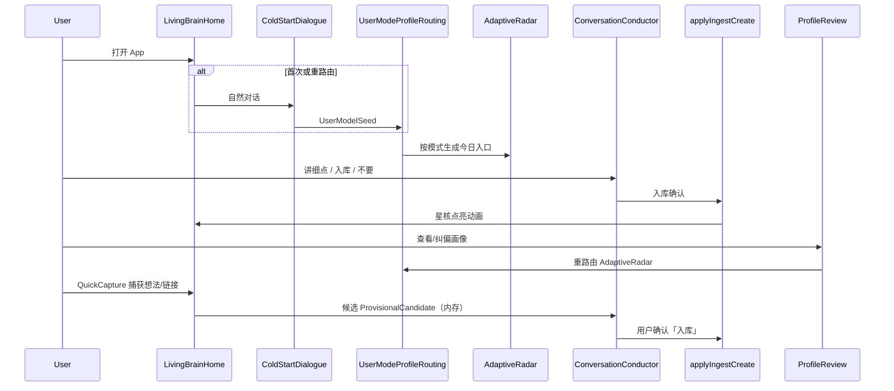

# M1 — Local Product Foundation（`local-product-foundation`）

- **阶段：** Mobile Phase 1 · **状态：** planned
- **上游：** M0-GATE · **下游：** M2–M7
- **依赖 / 前置里程碑：** [M0-app-only-foundation](./M0-app-only-foundation.md) PASS
- **验收门：** **M1-GATE**

## 1. 目标

在 **Expo Go 或 Dev Client** 上跑通**完整主路径骨架**（非临时 demo）：**ColdStartDialogue + UserModeProfile routing + AdaptiveRadar（`AdaptiveSignal` 契约）** + 三意图 + 入库点亮 + auto-curate undo + **ProfileReview v0（含 correction history / suppression）**。无 API key 时用 mock，但 **DegradedMode 必须对用户可见**。不固定 AI 简报；第一颗星可来自用户目标、学习主题、项目想法或资讯。

## 2. 范围内

- **LivingBrainHome**：深色星云、记忆星核（聚合视图）、呼吸光效、语音态指示
- **ColdStartDialogue**：自然对话识别用户模式（非问卷表单）；输出 **`UserModeProfile`**（`primaryMode` + `secondaryModes` + `confidence` + `recentIntent` + `lastCorrectionAt`），**非单一枚举固化**
- **UserModeRouting** → **AdaptiveRadar**：按 `UserModeProfile` 动态生成今日入口；候选统一为 **`AdaptiveSignal`**（`sourceType`、`userModeFit`、`freshness`、`evidenceRefs`、`confidence`、`privacyLevel`、`suggestedIntent`）
- 三意图 UI：「入库 / 不要 / 讲细点」— 文字按钮 + mock 语音态
- **GraphGrowthAnimation** + auto-curate reason + **graph history undo**
- **ProfileReview v0**：用户可查看、纠偏、删除画像误判；**信任优先级：用户手动纠偏 > 行为信号 > LLM 推断**；被否定项进入 **suppression list / correction history**，不得立即重新推回
- **MemoryWeather v0**（可基于 fixture 证据；按用户模式初步自适应）
- **QuickCapture v0 + ProvisionalCandidate 队列（内存/mock）**：文字/链接/想法捕获 → 候选 → 三意图确认；**M1 仅内存 store + mock/fixture**，**M2 起 SQLite 持久化**（见 §5 capture loop 落点）
- 全局 **DegradedMode**（mock_llm、fixture_radar、voice_disconnected、profile_seed_degraded 等）；**持久化相关降级码见 §6 M2 硬验收表**
- **Settings**：provider / storage / voice / **profile & user mode** 状态；mock 时明确标识
- `packages/core`：ConversationConductor + ingest **去耦 wave 1**；**`UserModeProfile`** + **`AdaptiveSignal`** 类型与 routing 接口
- 首页性能：**可见节点 30–80**（聚合星核 + 邻域），不全量渲染图谱
- **双端 smoke**：Android + iOS 各完成主路径 smoke（模拟器或真机）

## 3. 范围外

- `expo-sqlite` 持久化（M2）；M1 可用内存 store + 可选 AsyncStorage 原型（**禁止**把 M2 的 MigrationGate / SQLite 持久化 **提前塞进 M1 验收**）
- **ProvisionalCandidate SQLite 表 / 杀进程恢复**（M2）；M1 候选队列仅内存/mock，重启可丢
- 真实麦克风 / Realtime 语音（M3）
- Share Extension / OCR / 原生 intent 捕获（M4）；M1 QuickCapture 为 **App 内 FAB + 文字/mock 链接**
- EAS 构建（M6 optional）
- 全量 `react-force-graph` 移植

## 4. 现有代码复用点

| 模块 | 复用方式 |
|------|----------|
| `ConversationConductor`、`nextTurn`、`buildContext` | `packages/core` + mobile hook 包装 |
| `applyIngestCreate`（去耦后） | core use-case + mobile 注入 graph/history repos |
| `runAutoCurateAfterIngest` / `autoCurate` | 同上 |
| `src/radar/**` ranking/briefing | core 演进为 **AdaptiveRadar**（按 UserMode 选源与排序） |
| `src/invariants/*` | 行为契约；M1 内存路径也须满足门控 |
| `KP-14-provisional-ai-ingest` / Provisional 领域语义 | M1 内存 queue；M2 SQLite；M4 原生捕获 |
| Legacy `ImmersiveScene` / `VoiceOrb` | **仅参考**视觉与 IA，RN 重写 |

## 5. 数据流 / 架构



### Capture loop 落点（M1 内存/mock；M2 SQLite）

| 责任 | 路径 | M1 行为 |
|------|------|---------|
| 捕获入口 UI | `apps/mobile/components/QuickCaptureFab.tsx` | FAB / 快捷入口；文字或 mock 链接 |
| 候选队列 UI | `apps/mobile/components/ProvisionalQueueSheet.tsx` | 「待点亮星尘」列表；展示来源/摘要 |
| 候选内存 store | `apps/mobile/stores/provisionalStore.ts` | Zustand；**仅进程内**；重启可丢 |
| 候选类型契约 | `packages/core/provisional/types.ts` | `ProvisionalCandidate` 字段（id、sourceType、summary、evidenceRefs、createdAt、status） |
| 队列用例 | `packages/core/provisional/queue.ts` | add / list / confirm / reject / explain；**confirm 唯一出口** → `applyIngestCreate` |
| FSM 挂接 | `hooks/useConversationSession.ts` | 候选态 `provisional_pending`；三意图与 ingest loop 共用 Conductor |
| 测试 | `packages/core/provisional/queue.test.ts` | 确认前无 permanent；reject 清候选 |
| 测试 | `apps/mobile/components/ProvisionalQueueSheet.test.tsx` | 渲染候选；确认/不要/讲细点 |

**状态机（capture loop，M1）：**

```text
idle
  → capturing（QuickCapture 输入 / mock fixture）
  → provisional_pending（写入 provisionalStore；图谱无 permanent 变化）
  → user_intent（入库 | 不要 | 讲细点）
      入库 → applyIngestCreate → graph_lit + auto-curate + history undo 可用
      不要 → discard candidate（内存删除）
      讲细点 → explain（mock LLM）；仍保持 provisional_pending
```

**M1 vs M2 边界：**

| 能力 | M1 | M2 起 |
|------|-----|-------|
| 候选存储 | 内存 store / mock fixture | `expo-sqlite` provisional 表 |
| 杀进程恢复 | **不要求**；可丢 | 硬验收 |
| SSRF / Share Extension | 不在 M1 | M4 |
| 确认前 permanent | **禁止**（core invariant + test） | 同左 |

```text
apps/mobile/
  screens/LivingBrainHome.tsx
  screens/ColdStartDialogue.tsx
  components/MemoryCore.tsx           # 30-80 可见节点聚合
  components/AdaptiveRadar.tsx        # 替代 DailyRadarTop3
  components/ProfileReview.tsx        # v0 可见可纠偏
  components/QuickCaptureFab.tsx      # capture loop 入口
  components/ProvisionalQueueSheet.tsx
  components/DegradedModeBanner.tsx
  hooks/useConversationSession.ts     # 接 core FSM（含 provisional_pending）
  hooks/useUserModeProfile.ts
  stores/mobileAppStore.ts            # UI-only Zustand；业务状态经 core
  stores/provisionalStore.ts          # M1 内存候选；M2 换 repo 注入
packages/core/
  provisional/types.ts
  provisional/queue.ts
```

### 冷启动分流 fixture（验收至少 3 条）

| Fixture ID | UserModeProfile | 对话种子 | AdaptiveRadar 预期 | 第一颗星来源 |
|------------|-----------------|----------|------------------|-------------|
| `cold-tech-tracker` | primary=技术追踪者 | 「我想跟进 AI 和开源」 | 资讯/趋势 AdaptiveSignal | AI 新闻或 GitHub |
| `cold-learner` | primary=学习者 | 「我在学 Rust 所有权」 | 学习路径/概念 | 学习主题 |
| `cold-personal-capture` | primary=个人记忆/生活型 | 「记下这个创业想法」 | 捕获回顾/项目 | 用户想法或链接 |
| `cold-mixed-learner-life` | primary=学习者；secondary=[个人记忆/生活型] | 「学 Rust 也想记生活灵感」 | 混合模式入口 | 学习+捕获混合 |

## 6. 错误 / 降级路径

| 错误 / 状态 | 用户可见 | 图谱污染 |
|-------------|----------|----------|
| `ProviderConfigError` | Settings + DegradedMode `mock_llm` | 否 |
| AdaptiveRadar live 失败 | `fixture_radar` 横幅 | 否 |
| `UserModeRoutingError` | 默认「个人记忆」模式 + ProfileReview 可改 | 否 |
| `IngestProposalError` | pending 保留；重试 | 禁止半入库 |
| 语音未连接 | `voice_disconnected`；文字三意图可用 | 否 |
| auto-curate 空结果 | 「已入库，本次无结构整理」 | 否 |
| `profile_seed_degraded` | Settings 标注；可手动选模式 | 否 |

### DegradedMode：M1 交付 vs M2 起硬验收

M1 **必须对用户可见**的降级码：`mock_llm`、`fixture_radar`、`voice_disconnected`、`profile_seed_degraded`、`legacy_radar`（若有）。

下列 **持久化 / 存储相关** 降级码 **不在 M1 交付**；自 **M2-GATE 起硬验收**（缺 UI/测试 → M2 FAIL，非 waiver）：

| 降级码 | 含义 | M1 | M2 起 |
|--------|------|-----|-------|
| `history_persist_warning` | 变更历史写盘失败 | 不出现 / 不要求 | DegradedMode + Settings + 测试 |
| `learning_trace_persist_warning` | 学习轨迹证据未持久化 | 不出现 / 不要求 | DegradedMode + MemoryWeather 联动 |
| `storage_degraded` | 部分读写失败 | 不出现 / 不要求 | DegradedMode + 诊断导出 |

M1 若误实现上述码但无 M2 持久化层，verifier 记 **scope creep 风险**；M1-GATE **不得**用 waiver 替代 M2 硬验收。

### capture loop fixture（gate 至少 1 条）

| Fixture ID | 输入 | 预期 |
|------------|------|------|
| `capture-idea-mock` | QuickCapture 文字「记下创业想法：语音笔记 App」 | provisional_pending；确认前图谱无新 permanent |
| `capture-link-fixture` | mock https 链接 fixture | 队列可见；「入库」→ 星核点亮；「不要」→ 候选消失 |

## 7. 测试计划

| 层 | 路径 | 场景 |
|----|------|------|
| Core | `packages/core/conversation/*.test.ts` | 三意图 FSM、ingest 门控 |
| Core | `packages/core/provisional/queue.test.ts` | 候选 add/confirm/reject；**确认前无 permanent** |
| Core | `packages/core/userMode/profile.test.ts` | `UserModeProfile` 混合模式、confidence |
| Core | `packages/core/radar/adaptiveSignal.test.ts` | `AdaptiveSignal` 契约字段、排序 |
| Core | `packages/core/userMode/routing.test.ts` | 冷启动分流 → UserModeProfile |
| Core | `packages/core/radar/adaptiveRadar.test.ts` | 按 profile 选源与排序 |
| Core | `packages/core/profile/correctionHistory.test.ts` | suppression；纠偏 > 推断 |
| Core | `packages/core/invariants/*.test.ts` | **无 raw audio/全文落盘**；确认前 permanent 门控 |
| Mobile 组件 | `apps/mobile/screens/LivingBrainHome.test.tsx` | 渲染星核、AdaptiveRadar、DegradedMode |
| Mobile 组件 | `apps/mobile/components/AdaptiveRadar.test.tsx` | 三模式 fixture 入口不同 |
| Mobile 组件 | `apps/mobile/components/ProfileReview.test.tsx` | 纠偏后重路由 |
| Mobile 组件 | `apps/mobile/components/ProvisionalQueueSheet.test.tsx` | capture loop UI；三意图 |
| Mobile 组件 | `apps/mobile/components/QuickCaptureFab.test.tsx` | 捕获 → 队列入列 |
| Eval | `docs/evals/mobile-m1-ingest-loop.md` | **ingest loop** 60s 闭环记录（**gate 硬需**） |
| Eval | `docs/evals/mobile-m1-capture-loop.md` | **capture loop** 60s 闭环记录（**gate 硬需**） |
| Eval | `docs/evals/cold-start-fixtures.json` | ≥4 条分流 fixture（含混合模式） |
| Eval | `docs/evals/capture-loop-fixtures.json` | ≥1 条 capture fixture（与上表 ID 对齐） |

**Eval 双闭环规则（不可二选一）：**

- **演示录像**可只拍 ingest **或** capture 其一；但 **M1-GATE 证据必须双闭环**。
- 缺 `mobile-m1-ingest-loop.md` **或** `mobile-m1-capture-loop.md`（或等价 eval 记录）→ **`pnpm mobile:gate M1` = FAIL**；**禁止 waiver**。
- capture loop 组件/用例未实现 → 同上 **FAIL**（非「M4 再做」）。

## 8. 验收标准（M1-GATE）

### 8.1 Verifier 命令与报告（对齐 [`GATE_VERIFIER_SPEC.md`](./GATE_VERIFIER_SPEC.md)）

| 项 | 要求 |
|----|------|
| **Gate 命令** | `pnpm mobile:gate M1` **必须存在且绿**；行为符合 GATE_VERIFIER_SPEC §3 |
| **报告路径** | `specs/mobile-app/reports/M1-GATE-report.md` **必须存在**；verdict = **PASS** 方可推进 M2 |
| **上游** | `specs/mobile-app/reports/M0-GATE-report.md` verdict = PASS |
| **状态锁** | `EXECUTION_STATE.json`：`currentPhase == M1`、`allowedNextAction == run_M1_only`（PASS 后 → `run_M2_only`） |

Verifier 输出须可被父 agent 直接解析（`M1-GATE: PASS | FAIL | …` + `CHECKS` + `EVIDENCE` + `NEXT`）。  
报告须含 GATE_VERIFIER_SPEC §3.2 字段：Enter/Exit checklist、**命令证据**、测试/E2E/真机证据、Commit/Diff、风险与 waivers、下一阶段许可、父 agent 签核。

**必跑命令证据（写入 report + verifier 确认）：**

| 命令 / 检查 | 用途 |
|-------------|------|
| `pnpm check` | 全仓 lint + test |
| mobile unit（`apps/mobile` + `packages/core` M1 路径） | 组件与 provisional 用例 |
| 60s 主路径 eval **双记录** | ingest + capture 各 ≥1（见 §7） |
| 节点预算 | 首页 ≤80 可见节点 |
| 双端 smoke | Android + iOS 各 1 次主路径 |

缺命令、命令失败、或报告 verdict 与命令不一致 → **FAIL**；伪通过 → **HARD_STOP**。

### 8.2 60 秒双闭环（gate 硬需；演示可二选一）

| 类型 | 路径 | Gate |
|------|------|------|
| **ingest loop** | 讲细点 → 入库 → 星图点亮 → **undo 可验证** | **硬需** |
| **capture loop** | QuickCapture → ProvisionalCandidate（内存）→ 确认/讲细点/不要 → 星图或候选状态变化 | **硬需** |

- [ ] 无 API key 完成 **ingest loop** 60s 闭环（eval：`docs/evals/mobile-m1-ingest-loop.md`）
- [ ] 无 API key 完成 **capture loop** 60s 闭环（eval：`docs/evals/mobile-m1-capture-loop.md`）
- [ ] **两条 eval 均存在**；缺一 → M1-GATE **FAIL**（**禁止 waiver**）
- [ ] capture loop：**QuickCaptureFab + ProvisionalQueueSheet + provisionalStore + core/provisional** 已落地（非仅验收表文字）
- [ ] **至少 3 条冷启动分流 fixture** + **1 条混合模式** fixture 验收通过
- [ ] **至少 1 条 capture fixture**（`capture-loop-fixtures.json`）验收通过
- [ ] **`UserModeProfile`** 非单一枚举；AdaptiveRadar 使用 **`AdaptiveSignal`** 契约
- [ ] AdaptiveRadar **非**固定 AI 简报；不同 profile 展示不同今日入口
- [ ] **ProfileReview v0**：纠偏遵循 **手动 > 行为 > LLM**；suppression / **correction history** 生效；纠偏后 AdaptiveRadar 重路由
- [ ] capture / ingest 候选 **不得** 自动 permanent（须用户确认门控）
- [ ] 第一屏无 dashboard、长列表、复杂设置
- [ ] Settings 可见 mock/degraded/**profile/mode** 标识
- [ ] 首页渲染节点数 ≤ 80（性能日志或 testId 断言）
- [ ] `legacy_radar` 降级在移动端 **必须有 UI 提示**
- [ ] **Android + iOS** 各完成主路径 smoke
- [ ] `pnpm check` 绿
- [ ] **`pnpm mobile:gate M1` 绿**
- [ ] **`specs/mobile-app/reports/M1-GATE-report.md` 已签核 PASS**

### 8.3 不变量 spot-check（M1-GATE 硬需）

Verifier / 父 agent 须抽检下列不变量；任一失败 → **FAIL**（非 waiver）：

| 不变量 | 检查方式 | 预期 |
|--------|----------|------|
| **无 raw audio / 全文落盘** | `packages/core/invariants/*` test + schema/artifact grep | M1 内存路径也不写入磁盘敏感正文 |
| **确认前无 permanent** | `provisional/queue.test.ts` + ingest 门控 test | ProvisionalCandidate 未确认时图谱无新 permanent 节点 |
| **undo 可验证** | ingest loop eval + graph history test | 入库后 auto-curate 变更可 **一键撤销** 且 eval 有前后截图/日志 |

### 8.4 Harness：action space 与可观测证据

| 产物 | 路径 | 责任 |
|------|------|------|
| Gate verifier | `tools/mobile-execution/verify-stage.ts` | M0 创建；M1 扩展 M1 检查项 |
| Gate 报告 | `specs/mobile-app/reports/M1-GATE-report.md` | 父 agent 撰写；verifier 读 verdict |
| Ingest eval | `docs/evals/mobile-m1-ingest-loop.md` | 实施 agent + 父 agent 签核 |
| Capture eval | `docs/evals/mobile-m1-capture-loop.md` | 实施 agent + 父 agent 签核 |
| Cold-start fixtures | `docs/evals/cold-start-fixtures.json` | ≥4 条 |
| Capture fixtures | `docs/evals/capture-loop-fixtures.json` | ≥1 条 |
| 执行状态 | `specs/mobile-app/EXECUTION_STATE.json` | PASS 后更新 `lastPassedPhase: M1` |

**错误恢复（FAIL 条件，非 waiver）：**

```text
capture loop 未实现（缺组件/store/core provisional）     → M1-GATE FAIL
eval 仅 ingest 或仅 capture（缺另一类记录）            → M1-GATE FAIL
pnpm mobile:gate M1 失败                                → M1-GATE FAIL
M1-GATE-report.md 缺失或 verdict ≠ PASS                 → M1-GATE FAIL
不变量 spot-check 任一失败                               → M1-GATE FAIL
用 waiver 跳过双闭环或 capture 落点                      → 禁止；视为 HARD_STOP 风险
```

## 9. 依赖 / 解锁

| 关系 | 说明 |
|------|------|
| **依赖** | M0-GATE |
| **解锁 M2** | M1-GATE PASS |
| **运行时** | Expo Go 或 Dev Client（无自定义原生模块） |

## 10. 实施注意事项

- Zustand **仅存在于 `apps/mobile`**；core 通过构造函数接收 `GraphRepository`、`HistoryRepository`、`ProfileRepository` 接口
- 动效：Reanimated + Skia 优先；不阻塞闭环可先静态光效
- 冷启动 empty 态：引导通过对话点亮第一颗星（**不固定**为 AI 新闻节点）
- 口令二义性：第一次 reprompt；第二次 UI 确认（为 M3 语音预埋）
- 画像纠偏：说「我不是来学 XX 的」→ 更新 `UserModeProfile` + **correction history** → 刷新 AdaptiveRadar；被 suppression 项不得立即重现
- **Capture v0**：QuickCapture 仅 App 内入口；候选走 `provisionalStore` + `ProvisionalQueueSheet`；**禁止** M1 依赖 SQLite 或 Share Extension
- **Gate 前自检**：`pnpm mobile:gate M1` + 双 eval 文件 + 报告模板齐；缺一即 FAIL，勿提交 waiver
- 建议 M1 末期跑 `/plan-design-review` 审 LivingBrainHome + ColdStart 视觉
