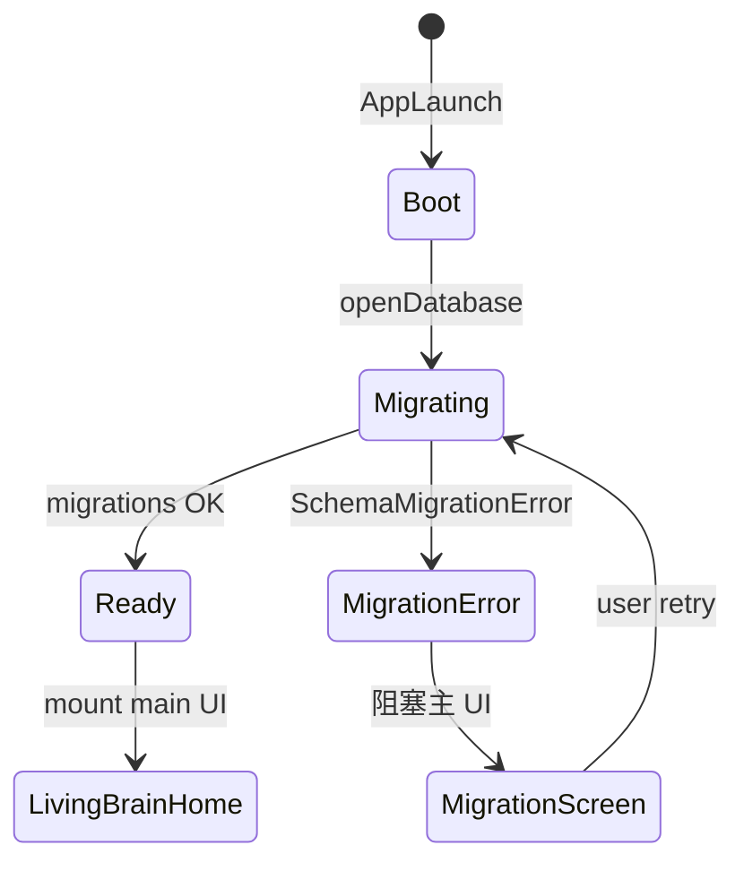
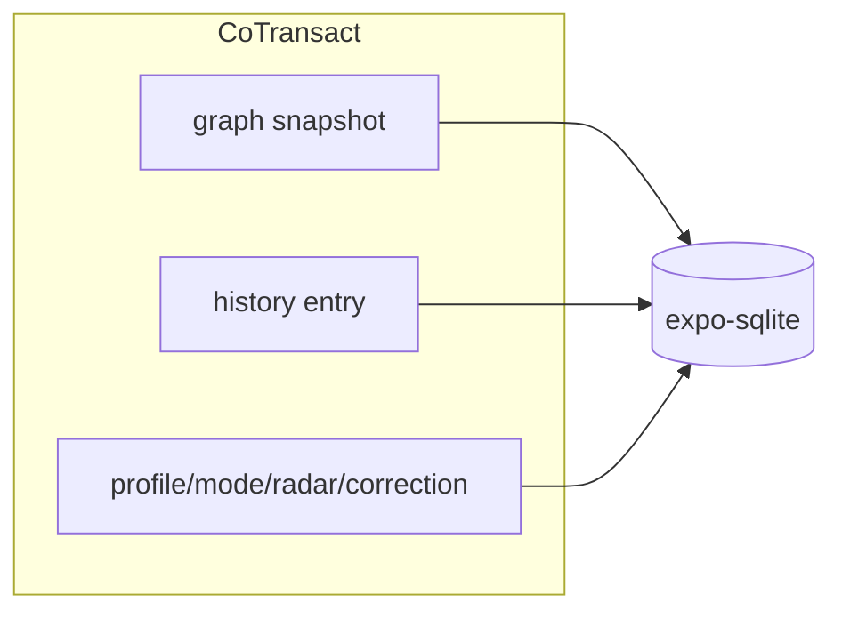

# M2 — 本地 SQLite + 持久化可信（`local-storage`）

- **阶段：** Mobile Phase 2 · **状态：** planned
- **上游：** M1-GATE · **下游：** M3–M7
- **依赖 / 前置里程碑：** [M1-local-product-foundation](./M1-local-product-foundation.md) PASS
- **验收门：** **M2-GATE**

## 1. 目标

所有关键状态 **落盘**；杀进程不丢。引入 **`expo-sqlite` StorageProvider** 与 **MigrationGate**：DB migration 成功前只显示 boot/migration 状态，**不挂载 LivingBrainHome**。含 **profile seed / UserModeProfile / adaptive radar state** 持久化；**ProfileReview correction history / suppression list** 首次 SQLite 持久化（M1 仅会话/内存有效）；诊断/导出不含敏感正文。**默认不把明文 SQLite DB 放进系统云备份。**

### M1 → M2 持久化边界（correction history）

| 层 | M1（内存/会话） | M2（SQLite） |
|----|-----------------|--------------|
| **correction history / suppression** | Zustand 或 in-memory repo；**同会话**纠偏与 suppression 生效；**杀进程丢失** | 写入 `profile_correction_history` / `profile_suppression_list`；**杀进程后仍生效** |
| **UserModeProfile / profile seed** | 可 mock 或内存 hydrate | 落盘 + hydrate |
| **pending 候选 / graph history** | M1 可内存/mock | 落盘 + 杀进程恢复 |

**M2-GATE 须显式验收**：M1 会话内纠偏 → 杀 App → 重启后 correction / suppression **仍**生效（证明首次 SQLite 持久化，而非继续依赖 M1 内存）。

## 2. 范围内

- **`expo-sqlite` StorageProvider** — 对齐 `src/invariants/testStorage.ts`、`sqlitePersistence.test.ts` 行为
- **MigrationGate** 启动链：`boot` → `migrating` → `ready` | `migration_error`
- 持久化：图谱、**UserModeProfile / profile seed / adaptive radar state**、**profile_correction_history / suppression_list**、learning trace、graph history、**WorldItem**、**Provisional 候选队列**
- 图谱 + history **同事务**（`coTransactGraphAndHistory` 模式）
- **ProfileReview** 纠偏持久化（**correction history**；信任优先级：手动 > 行为 > LLM；与 M1 v0 衔接；**M2 为首次落盘**）
- 文字输入兜底；无麦克风权限可完成核心闭环
- **Settings**（对齐 [MOBILE_PRODUCT_PLAN §11](../../docs/MOBILE_PRODUCT_PLAN.md)）：
  - schema version、导出、隐私说明、权限状态、**ProfileReview**
  - **Provider 状态面板**（只读、可审计；**非** M3 真实语音实现）：
    | 维度 | 展示值（示例） | 说明 |
    |------|----------------|------|
    | LLM | `mock` \| `live` \| `degraded` | 缺 key / `ProviderConfigError` → `mock` 或 `degraded`；须与 DegradedMode `mock_llm` 一致 |
    | Radar | `live` \| `fixture` \| `degraded` | live 失败 → fixture + 横幅 |
    | Voice | `disconnected` \| `connected` \| `mock` | M2 **无** Realtime；默认 `disconnected` 或 `mock`；M3 前不得标 `connected` 为 live |
    | Storage | `ready` \| `migrating` \| `degraded` | 与 MigrationGate / `storage_degraded` 联动 |
    - 面板须 **testId** 可断言；禁止 silent mock 显示为 live
- **ConceptSoulCard**；AdaptiveRadar env-gated live，失败 fixture + 降级
- 本地 **ring buffer 诊断日志**（可导出；字段白名单见 §2.1）
- **`persistWarning` UI**（DegradedMode 旗标，**非**错误类）：`history_persist_warning`、`learning_trace_persist_warning`
- **iOS/Android 存储/备份差异（默认排除系统云备份中的明文 DB）**：
  - **Android**：`android:allowBackup` / Auto Backup **排除** app SQLite DB（`backup_rules.xml` 或等价）
  - **iOS**：敏感 DB **默认 excluded-from-backup**（`NSURLIsExcludedFromBackupKey` 或 Expo 等价配置）；**禁止**依赖 iCloud 默认备份携带明文 SQLite；验收证据见 §8.1
  - 用户 **主动导出 / 加密备份（M7A）** 才离开设备
- 设备丢失风险说明：SQLite 明文（阶段 7 前评估加密）

### 2.1 Ring buffer 字段白名单（硬需）

对齐 [MOBILE_PRODUCT_PLAN §11](../../docs/MOBILE_PRODUCT_PLAN.md) 与 M6 本地诊断硬需。

**允许写入 ring buffer / diagnostic export 的单条事件字段（仅此集合）：**

```typescript
type DiagnosticEvent = {
  intent: string;       // 动作意图码，如 ingest_confirm / export / migration_retry
  outcome: 'ok' | 'fail' | 'degraded' | 'skipped';
  reasonCode: string;   // 错误注册表码或 persistWarning 码；非自由文本堆栈
  userMode?: string;    // 非敏感模式标签，如 primary UserModeProfile slug
  // 实现层可追加非敏感 metadata：ts, schemaVersion, appVersion, platform
};
```

**禁止**（单元测试 + export 扫描须 FAIL）：

- node **title / intro / 正文**、图谱片段
- **transcript**、STT/TTS 原文
- **画像敏感正文**（correction 原文、suppression 理由长文、LLM 推断段落）
- API key、token、设备标识符
- 任意 **PII 自由文本** 字段

## 3. 范围外

- 真实 Realtime 语音（M3）
- Share Extension（M4）
- SQLCipher / 全库加密（M7 评估）
- EAS 发布（M6 optional）
- Settings Provider 面板中的 **live connected 语音**（M3 才验收）

## 4. 现有代码复用点

| 模块 | 复用方式 |
|------|----------|
| `src/storage/types.ts`、`migrations.ts`、`transaction.ts` | core 端口 + mobile `ExpoSqliteStorageProvider` |
| `src/invariants/testStorage.ts` | 三端共享行为夹具（web / tauri / **mobile**） |
| `createStorageProvider.ts` | 扩展第三轨 `platform: 'mobile'` |
| `graphRepository` / persist 层 | 移植或 core 抽象 + mobile impl |
| KP-07 事务语义 | 对齐 graph+history 原子性 |
| Profile / user mode 领域类型 | M2 schema 新增表或 JSON 列 |
| M1 错误注册表 | `ProviderConfigError`、`IngestProposalError` 等；M2 SQLite 路径下 **行为回归** |

## 5. 数据流 / 架构



```text
App 启动
  → MigrationGate.check()
  → 若 migrating：仅渲染 MigrationScreen（版本号、进度、重试）
  → 成功：hydrate stores from SQLite（含 profile/mode/radar state + correction history）
  → LivingBrainHome mount
```



### 双端备份策略（须文档化 + 配置）

| 平台 | 默认风险 | M2 动作 |
|------|----------|---------|
| Android Auto Backup | 可能备份明文 DB 到 Google 账户 | **默认排除** `databases/`；`backup_rules.xml` 验收 |
| iOS iCloud Backup | 可能备份 app 容器含明文 DB | **默认 excluded-from-backup**；配置 + 结构化验收证据（§8.1） |
| 用户导出 | 用户主动操作 | JSON 导出不含 raw audio；画像导出须 opt-in 说明 |

### M2 schema 前瞻字段（M7 sync 铺垫）

须在 migration 中落盘或预留列（可为 NULL，M2 写入默认值即可）：

| 字段 | 表 / 实体 | M2 用途 |
|------|-----------|---------|
| `confirmedAt` | graph node / provisional → permanent 边界 | 用户确认入库时间戳；M7 sync 门控「已确认节点」 |
| `ingestSource` | node 或 history metadata | `voice` \| `text` \| `share` \| `sync`（M2 仅 voice/text）；M4/M7 扩展 |
| `profile_version` | `user_mode_profile` | 换机/合并版本号（M7A） |

## 6. 错误类 vs DegradedMode 分层

**分层规则：**

- **错误类（ErrorClass）**：抛错 / 阻塞 / toast 的 **异常类型**；可触发重试 UI；**不含** persist 部分失败警告码
- **DegradedMode 旗标（Flag）**：用户可见降级状态；Settings + 可选横幅；**可叠加**；不替代 MigrationGate 硬门

### 6.1 错误类注册表

| 错误类 | 用户可见 | 挂载 LBH | root cause hint（Settings/日志） | 安全重试 | 停止条件 |
|--------|----------|----------|-----------------------------------|----------|----------|
| `StorageInitError` | 全屏错误 + 重试/导出指引 | 否 | 磁盘满 / 权限 / DB 路径不可写 | 用户点重试；指数退避 ≤3 次 | 3 次失败 → 仅保留「导出指引」 |
| `SchemaMigrationError` | MigrationScreen + 版本信息 | 否 | migration 版本冲突 / SQL 失败 | 用户确认后备份导出后重试 | 禁止跳过 migration 挂 LBH |
| `GraphTransactionError` | toast/横幅；不展示假成功 | 是（若 DB 可读） | coTransact 中途失败 | 单操作重试 | 连续失败 → 建议导出 + `storage_degraded` |
| `ProvisionalPersistError` | 「候选未保存」 | 是 | provisional 表写失败 | 重试保存 | pending 仍在内存时禁止 silent drop |
| `IngestProposalError` | pending **保留**；重试 ingest | 是 | LLM/网络/mock 失败 | 重试 proposal | **禁止半入库**；杀进程后 pending 仍须在 SQLite |
| `ProviderConfigError` | Settings Provider 面板 + DegradedMode `mock_llm` | 是 | 缺 API key / 无效配置 | 用户配置 key 后重启或 refresh | 不得标 live |

### 6.2 DegradedMode 旗标（非错误类）

| 旗标 | 含义 | Settings 展示 |
|------|------|---------------|
| `mock_llm` | 缺 key 或 `ProviderConfigError` | Provider 面板 LLM = mock/degraded |
| `fixture_radar` | live 源失败 | Radar = fixture/degraded |
| `voice_disconnected` | M2 默认；语音未连接 | Voice = disconnected/mock |
| `history_persist_warning` | graph history **内存有、磁盘写失败** | Storage persist warning；**非** ErrorClass |
| `learning_trace_persist_warning` | learning trace 写盘失败 | 同上 |
| `storage_degraded` | **部分**读写失败（非全库 init 失败） | Storage = degraded；与 `StorageInitError` 区分 |
| `profile_seed_degraded` | profile 写盘失败 | Profile 区标注 |

**禁止**：把 `history_persist_warning` / `learning_trace_persist_warning` 登记为 **错误类** 或 MigrationGate 阻塞条件；须 DegradedMode + Settings persist warning + ring buffer `reasonCode` 可审计。

### 6.3 错误恢复路径（Harness 硬需）

每条 **错误类** 恢复路径须包含：

1. **root cause hint** — 面向用户的短码 + Settings 详情（非堆栈）
2. **安全重试** — 幂等、不半写图谱、不丢 pending
3. **停止条件** — 重试上限或须用户导出/联系支持

`persistWarning` 旗标：**不重试 migration**；允许继续只读或内存态 history；须促用户导出备份。

## 7. 测试计划

| 层 | 路径 | 场景 |
|----|------|------|
| Storage 夹具 | `packages/core/storage/mobileStorage.test.ts` | 对齐 testStorage 全用例 |
| Profile 持久化 | `packages/core/storage/profilePersist.test.ts` | UserModeProfile、**correction history**、suppression **杀进程恢复**（非仅同会话） |
| MigrationGate | `apps/mobile/boot/MigrationGate.test.tsx` | 迁移中不渲染 LBH |
| 事务 | `packages/core/storage/coTransact.test.ts` | ingest+history 原子 |
| M1 错误回归 | `apps/mobile/errors/m1RegistryOnSqlite.test.ts` | SQLite 路径：`IngestProposalError` 后 pending **不丢**；`ProviderConfigError` → Settings Provider 面板标识 |
| Settings | `apps/mobile/screens/Settings.test.tsx` | Provider 状态面板 mock/degraded/live/connected/disconnected 映射 |
| 杀进程 E2E | `apps/mobile/e2e/persistence.yaml` | 杀 App 后 pending、profile、**correction history** 仍在 |
| 导出 | `apps/mobile/e2e/export-settings.yaml` | 用户可导出 JSON；无敏感正文 |
| 诊断 | `apps/mobile/diagnostics/export.test.ts` | ring buffer **仅**白名单字段；禁止 node 正文/画像敏感字段 |
| Ring buffer | `apps/mobile/diagnostics/ringBufferWhitelist.test.ts` | 拒绝 transcript / intro / correction 长文 |
| 备份配置 | `apps/mobile/android/backup_rules.test.ts` + iOS excluded-from-backup 审查 | Android 排除 DB；iOS 证据清单（§8.1） |

## 8. 验收标准（M2-GATE）

- [ ] MigrationGate：migration 完成前 **无** `LivingBrainHome` testId
- [ ] 断网可打开旧图谱、**user mode** 与最近回顾
- [ ] 杀 App 后 pending 候选、history、learning trace、**UserModeProfile / correction history / suppression** 可恢复
- [ ] **M1→M2 边界**：M1 仅会话有效的 correction history，在 M2 **首次 SQLite 落盘**后经杀进程仍生效
- [ ] **ProfileReview** 纠偏与 **suppression** 杀进程后仍生效
- [ ] 用户可导出数据（Settings）；导出不含 raw audio / 画像敏感正文
- [ ] 诊断包导出符合 §2.1 白名单；**不含** node 正文 / transcript / 画像敏感正文
- [ ] Settings **Provider 状态面板**可见且与 DegradedMode 一致（对齐 §11：mock/degraded/live/connected/disconnected）
- [ ] **M1 错误注册表 SQLite 回归**：`IngestProposalError` 后 pending **不丢**（杀进程后仍在）；`ProviderConfigError` → Settings **UI 标识**（非 silent mock）
- [ ] `history_persist_warning` / `learning_trace_persist_warning` 为 **DegradedMode 旗标**，触发时 UI 告警，**不**当作 MigrationGate 错误类
- [ ] `storage_degraded` 与 `StorageInitError` **分层**可见（部分失败 vs 全库不可开）
- [ ] Android Auto Backup **排除**明文 SQLite DB（配置可验证）
- [ ] iOS 敏感 DB **excluded-from-backup**（§8.1 结构化证据）
- [ ] schema 含 **`confirmedAt` / `ingestSource`**（可为 NULL；migration 可验证）
- [ ] 三端 storage 行为夹具 mobile 轨 PASS
- [ ] `pnpm check` 绿

### 8.1 Gate 结构化证据（可审计）

`M2-GATE-report.md` 须含（见 [EXECUTION_GUARDRAILS §8](./EXECUTION_GUARDRAILS.md) 模板 + 下列 **M2 专用**表）：

| 证据 ID | 类型 | 必填内容 |  verifier 键 |
|---------|------|----------|--------------|
| E2-MIG | 自动化 | MigrationGate test 输出；migration 中无 LBH testId | `migration_gate` |
| E2-PERSIST | E2E / 真机 | 杀进程前后 pending + correction history 快照 hash 或 testId 断言 | `kill_process_recovery` |
| E2-RING | 单元 | `ringBufferWhitelist.test.ts` + export 扫描 PASS | `diagnostic_whitelist` |
| E2-PROVIDER | 组件 | Settings Provider 面板截图或 testId；`ProviderConfigError` fixture | `provider_status_panel` |
| E2-INGEST | 单元/E2E | `IngestProposalError` → pending 仍在 SQLite | `ingest_proposal_persist` |
| E2-ANDROID-BU | 配置 | `backup_rules.xml` 片段 + 测试 PASS | `android_backup_exclude` |
| E2-IOS-BU | 配置 + 审查 | 见下表 **iOS excluded-from-backup 证据** | `ios_backup_exclude` |
| E2-DEGRADED | 组件 | persistWarning 旗标 UI；**非** migration 阻塞 | `degraded_mode_layering` |

**iOS excluded-from-backup 证据（三选一组合，前两项必填）：**

| 层级 | 证据 | 说明 |
|------|------|------|
| **配置片段** | `app.json` / `app.config.ts` / 原生 `Info.plist` 或 Expo plugin 配置中 `NSURLIsExcludedFromBackupKey`（或官方等价）指向 DB 目录的 **diff 摘录** | 可静态 review |
| **审查 checklist** | 签核表：DB 路径、排除 API、是否覆盖所有 SQLite 文件、是否误排除用户主动导出目录 | 人工或 PR checklist |
| **可选真机抽查** | 安装 dev build → 写入标记数据 → 触发 iCloud 备份（或 Xcode Devices 备份）→ 还原后 **标记数据不应** 随 iCloud 恢复（或 `NSURLIsExcludedFromBackupKey` 文件属性为 true） | 缺则 `NEEDS_DEVICE_EVIDENCE`，**不**替代配置+审查 |

## 9. 依赖 / 解锁

| 关系 | 说明 |
|------|------|
| **依赖** | M1-GATE |
| **解锁 M3** | M2-GATE PASS |
| **解锁 M4 文字/分享并行** | M2-GATE PASS 后可开始非语音捕获设计与实现（FULL PASS 仍须 M3-GATE） |
| **运行时** | **Expo Dev Client**（推荐）；`expo-sqlite` 原生模块 |

## 10. 实施注意事项

- **MigrationGate 是硬门**：禁止「先渲染 UI 再后台迁移」— 避免半初始化读写
- schema 版本与 legacy `migrations.ts` 对齐；mobile 独立 DB 文件路径文档化
- M2 schema 落盘表/列：`user_mode_profile`、`profile_correction_history`、`profile_suppression_list`、`adaptive_radar_cursor`、**`confirmedAt`、`ingestSource`**（为 M5/M7 sync 铺垫）
- **correction history**：M1 内存实现须通过 M2 `ProfileRepository` 接 SQLite；禁止 M2 仍只写 Zustand
- 导出格式对齐 `importGraphJson` 错误类（为 M7 铺垫）
- 诊断包：仅 §2.1 白名单 + schema version + error/reason codes + user mode slug（非敏感），**禁止**图谱正文
- Provider 状态面板：**读** provider/registry 状态，M2 不实现 M3 token exchange 或 Realtime 连接
- 性能：启动 hydrate 时只加载首页所需子图（30–80 节点），非全表 scan
