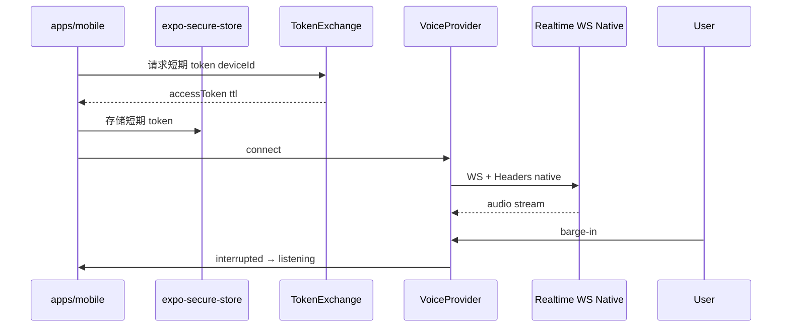

# M3 — 真实语音主路径 + Token Exchange（`realtime-voice`）

- **阶段：** Mobile Phase 3 · **状态：** planned
- **上游：** M2-GATE · **下游：** M4–M7（M4 文字/分享路径可在 M2-GATE 后并行；FULL PASS 须 M3-GATE）
- **依赖 / 前置里程碑：** [M2-local-storage-and-diagnostics](./M2-local-storage-and-diagnostics.md) PASS；**token exchange ADR** + **RN 原生语音传输 ADR**
- **验收门：** **M3-GATE**

## 1. 目标

App 成为 **可打断的语音伴侣**：麦克风权限、RN 录音/播放、barge-in、豆包/火山 Realtime；长期密钥 **不得进包**，经 **token exchange** 换短期 token 存 `expo-secure-store`。须通过 **Android/iOS 双端语音差异验收矩阵**。

## 2. 范围内

- 麦克风权限流；RN 录音/播放队列
- **barge-in**：用户插话 → 立即停止 TTS → 进入 listening
- 豆包/火山 `VoiceProvider` mobile 实现
- **Token exchange 客户端** + 服务端契约（自建或 BFF）；**安全边界不变**
- 状态机可视：listening / thinking / speaking / interrupted / error
- 语音与 **文字三意图行为一致**
- 错误类：`RealtimeVoiceTransportError`、`TokenExchangeError`、`ProviderConfigError`
- Eval：语音意图解析、二义性 reprompt + UI 确认
- **双端语音验收矩阵**（见 §5.1；对齐 `MOBILE_PRODUCT_PLAN` §4.4）
- **DegradedMode**：`voice_disconnected` 等在 Settings Provider/Voice 可见（继承 M1，见 §6.1）
- **Secret scan + 包内 artifact grep**（M3-GATE 必交产物，见 §5.2、§8.2）

## 3. 范围外

- Share Extension（M4）
- OpenAI Realtime 作为 mobile 默认（可保留接口，非 M3 必交付）
- 长期密钥写入 APK/IPA
- EAS 生产发布（M6 optional）

## 4. 现有代码复用点

| 模块 | 复用方式 |
|------|----------|
| `VoiceProvider` 接口 | `packages/core` |
| `src/providers/voice/mock*` | mock 降级路径 |
| `volcRealtimeRequiresNativeTransport()` 语义 | mobile native 模块或 ADR 替代方案 |
| `parseIngestCommand` / conversation FSM | core；语音 transcript 与文字同入口 |
| Legacy Web Audio adapters | **不可复用**；RN 重写 |

## 5. 数据流 / 架构



```text
降级链：
  TokenExchangeError → voice_disconnected + 文字可用
  RealtimeVoiceTransportError → 同上；不阻塞 App 启动
  ProviderConfigError → mock voice + Settings 标识
```

### 5.1 Android / iOS 语音差异验收矩阵

> **产品矩阵对齐**：本表须与 [`docs/MOBILE_PRODUCT_PLAN.md`](../../docs/MOBILE_PRODUCT_PLAN.md) **§4.4 Android / iOS 平台适配矩阵** 中下列行逐项交叉引用；M3-GATE 报告 **Exit checklist** 须列出对应 §4.4 行号与验收结果：

| MOBILE_PRODUCT_PLAN §4.4 维度 | M3 本表行 | M3 覆盖说明 |
|-------------------------------|-----------|-------------|
| **麦克风权限** | 权限撤销、权限文案 | runtime 请求 + 撤销后文字兜底 |
| **语音 / 音频** | 音频会话、蓝牙耳机 | AudioFocus / AVAudioSession + 蓝牙路由 |
| **系统中断** | 系统中断 | 来电 / Siri / 闹钟抢焦点 |
| **锁屏/后台** | 锁屏/后台 | ADR 定义暂停/恢复；切回状态一致 |
| **真机 QA** | 全表 | 双端 dev build smoke + 矩阵证据 |

| 场景 | Android 验收 | iOS 验收 | 共同要求 |
|------|-------------|----------|----------|
| **音频会话** | AudioFocus `AUDIOFOCUS_GAIN` / 丢失回调 | AVAudioSession `playAndRecord` / `voiceChat` | 抢焦点时 TTS 暂停 |
| **蓝牙耳机** | A2DP / SCO 路由切换 | Bluetooth HFP/A2DP 路由 | 插话仍可 barge-in |
| **系统中断** | 来电/闹钟抢焦点 | 来电 / Siri 中断 | 恢复后可继续或文字兜底 |
| **锁屏/后台** | 锁屏暂停或前台服务策略（ADR 定） | 后台音频 entitlement（若需） | 切回 App 状态一致 |
| **权限撤销** | 设置中撤销麦克风 | 设置中撤销麦克风 | 文字三意图仍可用 |
| **弱网** | 高延迟 / 断连 | 高延迟 / 断连 | 不污染图谱；DegradedMode |
| **barge-in 延迟** | 真机 P50 <300ms 停播 | 真机 P50 <300ms 停播 | 与文字 FSM 一致 |
| **权限文案** | `RECORD_AUDIO` runtime 说明 | `NSMicrophoneUsageDescription` | 中英文商店文案草案 |

每项须在 M3-GATE 报告中有 **设备型号 + 时间戳 + 结果** 证据（真机或 signed-off eval）。

### 5.2 配置与安全横切（M3-GATE 可查）

> M0 已定义 `readAppEnv()` 三端契约；M3 **不重复 M0 脚手架细节**，但 gate 须能机器/人工核查下列项（对齐 [`GATE_VERIFIER_SPEC.md`](./GATE_VERIFIER_SPEC.md) §3.3 M3 命令与 §3.4 禁止项）：

| 检查项 | 要求 | M3-GATE 证据 |
|--------|------|--------------|
| **配置读取** | mobile / core 仅经 `readAppEnv()`；禁止 `import.meta.env`、`VITE_*`、裸 `process.env` 直读 provider 密钥 | `lint:boundaries` 或 import scan 输出；报告附 grep 摘要 |
| **包内密钥** | APK/IPA / dev build **bundle** 不得含 `volcAccessKey`、`modelscopeApiKey` 或等价长期 provider key 字面量 | **包内 artifact grep** 输出路径（见 §8） |
| **仓内密钥** | 仓库不得提交长期密钥 | **`pnpm run scan:secrets`** 输出路径（见 §8） |
| **短期 token** | 仅 `expo-secure-store` 存 exchange 后的短期 token | Settings / 代码审查摘要 |

**Stop condition（secret / bundle 扫描）**：

| 命中 | Verifier 结果 | 父 agent 动作 |
|------|---------------|---------------|
| `scan:secrets` 命令失败（脚本缺失、exit ≠ 0） | **M3-GATE FAIL** | 修复脚本或清除命中；**不得**签核 PASS |
| 仓内或 **bundle artifact** 检出长期 provider key / 禁止 env 泄漏 | **M3-GATE HARD_STOP** | 写 blocker；移除密钥并轮换；**不得**推进 M4 |
| 报告声称 PASS 但 scan / bundle grep 实际失败 | **HARD_STOP**（伪通过） | 按 [`GATE_VERIFIER_SPEC.md`](./GATE_VERIFIER_SPEC.md) §3.3 处理 |

## 6. 错误 / 降级路径

| 错误 | 用户可见 | 图谱 |
|------|----------|------|
| `TokenExchangeError` | 重试；语音不可用 | 不污染 |
| `RealtimeVoiceTransportError` | DegradedMode + 文字 | 不污染 |
| 无麦克风权限 | 权限引导 + 文字 | 不污染 |
| 断网 | voice_disconnected | 不污染 |
| AudioFocus/AudioSession 丢失 | 暂停 TTS + 状态指示 | 不污染 |
| 口令二义性 | 第一次 reprompt；第二次 UI 三按钮 | 禁止 silent skip |

### 6.1 DegradedMode UI 义务（继承 M1）

> 继承 [`M1-local-product-foundation.md`](./M1-local-product-foundation.md) 与 [`docs/MOBILE_PRODUCT_PLAN.md`](../../docs/MOBILE_PRODUCT_PLAN.md) **§8 DegradedMode**；M3 不得 silent mock 或无声断连。

| 触发 | DegradedMode 枚举 | **Settings（必须）** | **横幅（可选）** |
|------|-------------------|----------------------|------------------|
| TokenExchangeError / RealtimeVoiceTransportError / 断网 / 无麦克风 | `voice_disconnected` | **Settings → Provider / Voice 面板**须可见：`voice_disconnected` 文案 + 重试/文字兜底说明 | `DegradedModeBanner` **可**展示；若未展示横幅，报告须说明理由且 Settings 证据仍必填 |
| ProviderConfigError | `mock_llm`（+ 语音 mock 若适用） | Settings provider 面板标识 mock/degraded | 同 M1 |

**M3-GATE 可读证据（语音降级）** — 父 agent 须能在报告中直接核对，无需回放实现：

```text
degradedVoiceEvidence:
  scenario: TokenExchangeError | RealtimeVoiceTransportError | permission_denied | offline
  settingsPanel: screenshot 或 testId 断言（须含 voice_disconnected 或等价 copy）
  banner: shown | omitted_with_reason
  textIntentsStillWork: pass | fail
  timestamp: ISO-8601
  deviceOrSimulator: { platform, model }
```

至少 **2 个** 降级场景（含 `voice_disconnected`）须有上述结构化记录或等价截图+标注。

## 7. 测试计划

| 层 | 路径 | 场景 |
|----|------|------|
| Core | `packages/core/voice/ingestIntent.test.ts` | 三意图与文字一致 |
| Mobile | `apps/mobile/voice/VoiceSession.test.tsx` | 状态机转换 |
| Mobile | `apps/mobile/voice/audioFocus.test.ts` | Android AudioFocus 模拟 |
| Mobile | `apps/mobile/voice/audioSession.test.ts` | iOS session category |
| Mock transport | `apps/mobile/voice/mockRealtime.test.ts` | barge-in 逻辑 |
| Eval | `docs/evals/voice-intent-fixtures.json` | 二义性、方言口令 |
| Eval | `docs/evals/m3-voice-degraded.md` | §6.1 降级场景 + `degradedVoiceEvidence` 记录 |
| 真机 | `docs/evals/m3-voice-matrix.md` | 双端矩阵逐项记录 |
| Security | `pnpm run scan:secrets` | 仓内 secret scan；输出写入 gate 报告 |
| Security | bundle artifact grep | dev/preview build 产物 grep（见 §8） |

## 8. 验收标准（M3-GATE）

> Verifier 行为以 [`GATE_VERIFIER_SPEC.md`](./GATE_VERIFIER_SPEC.md) 为准：M3 必跑 `pnpm check`、voice tests、**secret scan**、**bundle artifact grep**；barge-in 缺真机 → **NEEDS_DEVICE_EVIDENCE**（非 FAIL 非 PASS，**不得**推进 M4）。

### 8.1 功能与双端

- [ ] 插话时立即停止播放并进入聆听（**双端**真机或 signed-off eval）
- [ ] 语音与文字三意图行为一致（同一 FSM）
- [ ] Provider 失败不污染图谱、不阻塞启动
- [ ] Token 过期可刷新；失败可文字闭环
- [ ] **§5.1 语音矩阵** 全部有证据；且 **§4.4 对齐表**（§5.1 引用的麦克风/语音·音频/系统中断/锁屏·后台/真机 QA 行）在 gate 报告中有行号+结果
- [ ] ADR：RN 原生 WS Header 方案已落盘
- [ ] `pnpm check` 绿

### 8.2 Secret scan 与包内长期密钥（对齐 GATE_VERIFIER）

- [ ] **`pnpm run scan:secrets`**（或 [`EXECUTION_GUARDRAILS.md`](./EXECUTION_GUARDRAILS.md) §7 等价脚本）exit 0；报告 **命令证据** 附输出文件路径，例如 `specs/mobile-app/reports/artifacts/M3-scan-secrets.log`
- [ ] **包内长期密钥扫描**：对 M3 dev/preview **build artifact**（APK/AAB/IPA 或等价 `dist`/bundle 输出）执行 artifact grep，确认无 `volcAccessKey`、`modelscopeApiKey`、`sk-` 形态 OpenAI 长期 key、`VITE_*` provider 配置泄漏；报告附路径，例如 `specs/mobile-app/reports/artifacts/M3-bundle-secret-grep.log`
- [ ] **配置横切**：mobile/core 无新增 `import.meta.env` / `VITE_*` / 裸 `process.env` 直读 provider 密钥（`readAppEnv()` 唯一入口）；附 lint/import scan 摘要
- [ ] 上列任一项失败 → **M3-GATE FAIL**；检出长期密钥入仓或入包 → **M3-GATE HARD_STOP**（见 §5.2）

### 8.3 DegradedMode 与语音降级证据

- [ ] 触发 `voice_disconnected` 时，**Settings → Provider / Voice 面板**可见状态（继承 M1 §8 Settings 可见性）；非仅 console
- [ ] §6.1 **至少 2 个**降级场景具备 `degradedVoiceEvidence`（或等价截图+字段标注）
- [ ] 可选 `DegradedModeBanner`：若启用须在报告中标注；若省略须 `omitted_with_reason` 且 Settings 证据仍 PASS

### 8.4 历史 checklist（合并）

- [ ] APK/IPA 无 `volcAccessKey` / `modelscopeApiKey` 长期密钥（由 §8.2 bundle grep 覆盖；保留人工 sign-off）

## 9. 依赖 / 解锁

| 关系 | 说明 |
|------|------|
| **依赖** | M2-GATE；token exchange **ADR 已落盘**；Dev Client / native build |
| **解锁 M4 FULL PASS** | **M3-GATE PASS 为硬前置**（M4 文字/分享可在 M2 后并行，但 **FULL PASS / 语音笔记 / 原生语音整合** 须 M3-GATE PASS；verifier 见 [`GATE_VERIFIER_SPEC.md`](./GATE_VERIFIER_SPEC.md) §3.4「M4-GATE FULL PASS 绕过 M3」→ **HARD_STOP**） |
| **运行时** | **Expo Dev Client / native build**（必须）；**非 Expo Go** |

**Token exchange 不可用时的边界（无人干预）：**

- **仅 M3 内继续修复与验证**：mock token exchange + mock transport + 文字三意图；**不得 M4-GATE FULL PASS**。
- **M3-GATE FULL PASS 仍须**：本 spec §8（含 §8.2 secret/bundle scan、§8.3 DegradedMode 证据）；barge-in 双端真机或 signed-off eval；缺真机 → **`NEEDS_DEVICE_EVIDENCE`**（非 FAIL 非 PASS）
- **secret / bundle 扫描失败**：不得用 DEGRADED 冒充 PASS；见 §5.2 stop condition
- **hard stop**：仅 Expo Go、无 native 录音/WS 模块 → 不得 PASS gate（见 [`EXECUTION_GUARDRAILS.md`](./EXECUTION_GUARDRAILS.md) §5.1）；长期密钥入包/入仓 → **HARD_STOP**

## 10. 实施注意事项

- M3 开始前完成 **token exchange ADR** 与安全评审
- `expo-secure-store` 仅存短期 token；刷新策略文档化
- 后台/锁屏：双端分别 ADR 定义语音暂停/恢复行为
- 与 M2 MigrationGate 独立：语音失败不得阻止 DB ready
- 成本：Realtime 会话时长监控（ring buffer 记 duration，不上传正文）
- Android `AudioManager` / iOS `AVAudioSession` 须在 native 层或成熟 RN 库封装，禁止 Web Audio 路径
- Gate 报告须按 [`GATE_VERIFIER_SPEC.md`](./GATE_VERIFIER_SPEC.md) §5 输出 `CHECKS` / `EVIDENCE` / `NEXT`；`deviceEvidence` 与 `forbidden`（secret scan）分行列出
- `readAppEnv()`：voice provider 配置仅读取非密钥字段（endpoint、model id）；密钥交换 exclusively 经 token exchange + secure-store
