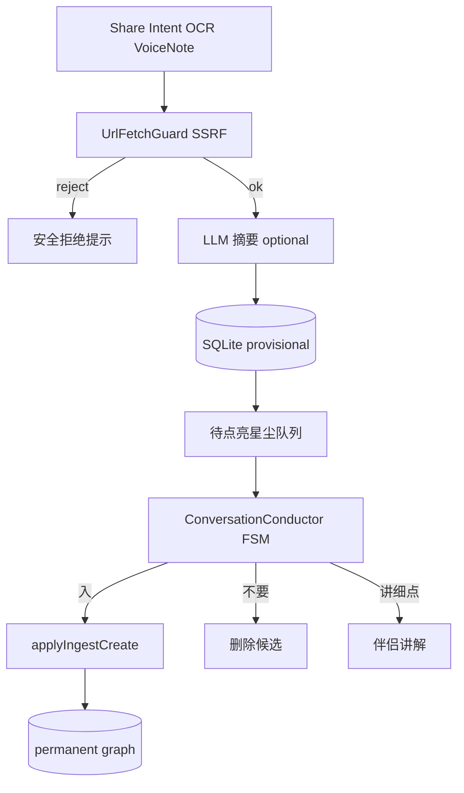

# M4 — 快速捕获 + 候选队列（`quick-capture`）

- **阶段：** Mobile Phase 4 · **状态：** planned
- **上游：** M3-GATE（**FULL PASS**）；**M2-GATE 后可并行**文字/分享捕获设计与实现
- **依赖 / 前置里程碑：** [M2-local-storage-and-diagnostics](./M2-local-storage-and-diagnostics.md) PASS（并行路径）；[M3-realtime-voice-and-token-exchange](./M3-realtime-voice-and-token-exchange.md) PASS（**M4-GATE FULL PASS 硬需**）
- **验收门：** **M4-GATE**

## 1. 目标

手机成为 **世界 → 图谱** 的入口：分享链接、截图/OCR、语音笔记进入 **ProvisionalCandidate** 队列；**入库仍只经用户确认**；候选可恢复、可审计。**Android intent 与 iOS Share Extension 分别验收**；候选来源不限于资讯。

**产品不变量（硬约束，须与 [`AGENTS.md`](../../AGENTS.md) Core invariants #2 及 [`README.md`](./README.md) 产品不变量 #2 一致）：**

| 规则 | M4 落地 |
|------|---------|
| **新建概念节点 = 用户确认** | 分享 / OCR / 语音笔记 / 同步导入 **均不得 bypass**「入 / 不要 / 讲细点」三意图门控 |
| **确认前无 permanent 节点** | 仅写入 `provisional` 表；**唯一晋升出口** = `applyIngestCreate`（用户显式「入」） |
| **禁止 silent create** | 无高置信自动晋升、无后台静默入库、无 sync 直写 permanent（M7 亦同门控，**M4 不实现 M7**） |

**阶段依赖（审查修订）：**

| 能力 | 最早开始 | M4-GATE FULL PASS |
|------|----------|-------------------|
| 文字/分享捕获、SSRF、provisional 队列 UI | **M2-GATE 后**可并行 | 须 M3-GATE（若含语音笔记/原生工程整合） |
| 语音笔记、Share Extension + 主 App 原生整合 | M3 工程就绪 | **必须 M3-GATE PASS** |

## 2. 范围内

- 分享链接（**https only**）
- **Android intent filters**（`ACTION_SEND` text/url/image）— **独立验收**
- **iOS Share Extension** + App Group 传 payload — **独立验收**（**不共享长期密钥**）
- 截图/**on-device OCR 优先**（云端 OCR 须 opt-in）
- 语音笔记 → ProvisionalCandidate
- SQLite **provisional** 表 + 「待点亮星尘」队列 UI
- 安全边界：**SSRF allowlist**（scheme / 域名 / 端口 / 重定向终态 / 超时 / 禁内网 IP，见 **§2.1**）；URL 大小限制；畸形 payload 拒绝
- 候选含来源、摘要、推荐理由
- **候选来源多样化**：资讯、**学习材料、项目链接、生活想法** 等（非仅 AI 新闻）
- 确认入库走 `applyIngestCreate`；**确认前无 permanent 节点**
- 拒绝即丢弃或归档候选
- **队列三意图**「入 / 不要 / 讲细点」**必须复用** M1/M3 同一 **`ConversationConductor` FSM**（文字按钮为默认兜底；语音路径 **M3-GATE PASS 后**启用，见 **§5.2**）

### 2.1 SSRF allowlist 规则（M4 锁死）

所有 **出站 URL 抓取**（分享链接 metadata / 正文摘要 / 可选 LLM 输入）须经 **`UrlFetchGuard`**（`packages/core/provisional/urlFetchGuard.ts`）统一校验；**禁止**在 mobile / Extension 层各自实现 fetch 逻辑。

| 维度 | 允许 | 拒绝（原因码示例） |
|------|------|-------------------|
| **Scheme** | 仅 `https:` | `http:`、`file:`、`data:`、`javascript:`、`ftp:`、`ws:`/`wss:` → `SSRF_SCHEME_DENIED` |
| **Host** | 公网 FQDN / 合法 punycode；**无 IP literal 直连**（含 IPv4/IPv6） | 裸 IP、`localhost`、`.local`、`.internal`、metadata 主机名 → `SSRF_HOST_DENIED` |
| **Port** | **443**（默认）；显式 `:443` 可接受 | 非 443 端口（含 `:80`、`:8080`、高位端口）→ `SSRF_PORT_DENIED` |
| **内网 / 链路本地** | — | RFC1918、`127.0.0.0/8`、`::1/128`、`169.254.0.0/16`、`fc00::/7`、CGNAT `100.64.0.0/10` → `SSRF_PRIVATE_IP` |
| **DNS 解析后** | 解析结果 **全部**须为公网 | 任一 A/AAAA 命中内网 → `SSRF_DNS_PRIVATE`（**解析失败** → `SSRF_DNS_FAILED`，**不 fetch**） |
| **重定向** | 最多 **3** 跳；**每一跳**重新跑完整 allowlist；**最终 URL** 须仍 PASS | 超限 → `SSRF_REDIRECT_LIMIT`；终态 FAIL → `SSRF_REDIRECT_FINAL_DENIED` |
| **超时 / 体积** | 连接 + 读取各 **≤5s**（可配置常量）；响应体 **≤512 KiB** | 超时 → `SSRF_FETCH_TIMEOUT`；超大 → `SSRF_RESPONSE_TOO_LARGE` |

**Harness 契约（确定输入 → 确定输出 → 失败判定）：**

```text
输入：rawUrl: string, opts?: { followRedirects?: boolean; maxRedirects?: number }
输出：{ ok: true, finalUrl: string, body: Uint8Array } | { ok: false, code: SsrfRejectCode, hint: string }

失败判定：ok === false 时 MUST NOT 发起/继续 fetch；MUST NOT 写入 permanent graph；
          provisional 候选 MAY 保存用户原始链接 + reject code（不含抓取正文）。
```

**测试 fixture 最低覆盖（缺任一项 → M4-GATE FAIL，不可 waiver）：**

| Fixture ID | 输入 | 期望 code |
|------------|------|-----------|
| `ssrf-http-scheme` | `http://example.com/a` | `SSRF_SCHEME_DENIED` |
| `ssrf-port-80` | `https://example.com:80/a` | `SSRF_PORT_DENIED` |
| `ssrf-ipv4-literal` | `https://203.0.113.1/a` | `SSRF_HOST_DENIED` |
| `ssrf-localhost` | `https://localhost/a` | `SSRF_HOST_DENIED` |
| `ssrf-dns-rebind` | mock DNS → `10.0.0.1` | `SSRF_DNS_PRIVATE` |
| `ssrf-redirect-private` | `https://public.test/302→http://10.0.0.1/` | `SSRF_REDIRECT_FINAL_DENIED` |
| `ssrf-redirect-limit` | 4 跳公网链 | `SSRF_REDIRECT_LIMIT` |
| `ssrf-ok-public` | `https://example.com/`（mock 200） | `ok: true` |

## 3. 范围外

- 高置信自动晋升 permanent 节点（**禁止**）
- MemoryWeather / Replay 完整版（**M5** — 不在 M4 验收）
- 多设备同步候选（**M7** — 不在 M4 实现或 gate 验收）
- 任意 scheme 分享（仅 https，见 **§2.1**）
- 为 provisional 队列 **单独 fork** ingest FSM 或 bypass `ConversationConductor`

## 4. 现有代码复用点

| 模块 | 复用方式 |
|------|----------|
| `KP-14-provisional-ai-ingest` 隔离语义 | 候选区 ≠ 永久图谱 |
| Provisional 领域类型 | `packages/core` |
| `applyIngestCreate` | 唯一晋升 permanent 出口 |
| `ConversationConductor`、`parseIngestCommand`、ingest FSM | **M1/M3 同一 FSM**；队列 UI 经 `useConversationSession` 接入，**禁止** parallel ingest 状态机 |
| `src/agent/` 摘要逻辑 | core LLM + mobile 触发（**仅 allowlist PASS 后**） |
| AdaptiveRadar | 捕获候选可成为非技术用户的第一颗星来源 |

## 5. 数据流 / 架构



### 双端分享验收（须分别通过）

```text
Android（独立验收）：
  其他 App → ACTION_SEND → intent filter → 主 App
  验收：Chrome 分享链接、相册分享图片、杀进程后候选仍在
iOS（独立验收）：
  Share Extension → App Group JSON payload → 主 App 冷/热启动消费
  Extension 内：无 API key、无长期 token
  验收：Safari 分享、备忘录分享、Extension 崩溃不影响主 App
```

| 平台 | 关键配置 | 验收项 |
|------|----------|--------|
| Android | `AndroidManifest.xml` intent filters | text/plain、image/*、https url |
| iOS | Share Extension target + App Group | payload schema、无密钥、主 App 消费 |
| 共用 | provisional SQLite 表 | 杀进程恢复、确认前门控 |
| 共用 | `ConversationConductor` | 队列三意图与 M1 主路径 **同一 FSM** |

### 5.2 队列三意图与 ConversationConductor（M4 锁死）

候选队列 **不是** 独立确认 UI；每条 `ProvisionalCandidate` 进入 **与 M1/M3 相同的 `ConversationConductor` FSM**：

| 路径 | 触发 | 要求 |
|------|------|------|
| **文字（默认兜底）** | 队列项三按钮 / 文字口令 | M2 后可实现；**M4-GATE 硬需** |
| **语音** | M3 `VoiceProvider` transcript → `parseIngestCommand` | **仅 M3-GATE PASS 后**启用；与 M3 §「语音与文字三意图行为一致」同断言 |
| **二义性** | 第一次 reprompt；第二次 UI 三按钮 | 与 M3 一致；**禁止 silent skip / 默认入库** |

```text
packages/core/conversation/     # ConversationConductor、parseIngestCommand（M1 已有）
apps/mobile/hooks/useConversationSession.ts   # 队列与主屏共用 hook
apps/mobile/capture/ProvisionalQueueScreen.tsx  # 渲染候选 + 委托 Conductor，不自建 ingest 分支
```

**禁止：** 为 provisional 队列单独实现 `confirmIngest` / `rejectCandidate` 绕过 FSM；Share/OCR/语音笔记 **不得** 直接调用 `applyIngestCreate`。

## 6. 错误 / 降级路径

### 6.1 SSRF / URL 抓取错误路径

| 场景 | 用户可见 | 系统行为 | Root cause hint | 安全重试 | 停止条件 |
|------|----------|----------|-----------------|----------|----------|
| 非 https / 非法 scheme | 「仅支持安全链接」+ code | 不 fetch；候选可留 raw url | Extension 传入 `http:` 或畸形 scheme | 用户改链或仅本地保存标题 | 同 URL 连续 3 次同 code → 停止自动重试，仅手动编辑 |
| 内网 / 私网 IP / DNS 私网 | 「无法访问该地址」+ code | 不 fetch | DNS rebinding / 分享本地调试链接 | **禁止**换端口或 follow 私网重试 | 任一 `SSRF_*` → **永不**降级为「尝试抓取」 |
| 重定向终态 FAIL | 「链接跳转不安全」 | 丢弃已拉取部分；不摘要 | 302 → `10.x` / `127.x` | 不重试 redirect 链 | redirect 计数达上限即停 |
| 下载超时 / 超大 | ProvisionalPersistError 式提示 | 候选仍保存 raw link | 慢源 / 巨型页面 | 单次手动「重试抓取」；仍须过 allowlist | 超时累计 2 次 → 仅离线候选 |
| LLM 摘要失败 | （无 SSRF 关联） | 见下行 | — | — | — |

| 场景 | 行为 |
|------|------|
| LLM 摘要失败 | 候选仍保存原始链接/标题 |
| OCR 失败（on-device） | 保存图片引用 + 用户可手动编辑 |
| `ProvisionalPersistError` | 明确未保存 |
| Android intent 畸形 payload | 拒绝 + 日志（不含正文） |
| iOS Extension 崩溃 | 主 App 不受影响；扩展日志隔离 |
| M3 未 PASS 时语音笔记 | **文字三意图**处理队列；`voice_disconnected` 横幅；**不得**因 M4 进度启用语音 bypass |

## 7. 测试计划

| 层 | 路径 | 场景 |
|----|------|------|
| Core | `packages/core/provisional/ssrf.test.ts` | **§2.1 全 fixture**；scheme/port/IP/DNS/redirect 终态 |
| Core | `packages/core/provisional/urlFetchGuard.test.ts` | 确定 I/O 契约；超时/体积；redirect 每跳重验 |
| Core | `packages/core/provisional/ingestGate.test.ts` | 无 bypass create；Share/OCR/sync fixture **不得** `applyIngestCreate` |
| Core | `packages/core/provisional/provisionalQueueFsm.test.ts` | 队列「入/不要/讲细点」走 **同一** `ConversationConductor`；与 M1 conversation tests 对齐 |
| Core | `packages/core/provisional/sourceTypes.test.ts` | 学习/项目/生活来源元数据 |
| Core | `packages/core/conversation/*.test.ts` | **回归**：M4 不得 fork FSM 语义 |
| Mobile | `apps/mobile/capture/provisionalQueue.test.tsx` | 队列渲染；三按钮委托 Conductor |
| Mobile | `apps/mobile/capture/provisionalQueueFsm.test.tsx` | 文字三意图 E2E（mock Conductor）；语音路径 gated on M3 fixture |
| E2E Android | `apps/mobile/e2e/share-capture-android.yaml` | intent → 候选 → **Conductor 确认**入库 |
| E2E iOS | `apps/mobile/e2e/share-capture-ios.yaml` | Extension → 候选 → **Conductor 确认**入库 |
| E2E | `apps/mobile/e2e/share-no-permanent.yaml` | 确认前无 permanent 节点 |
| E2E | `apps/mobile/e2e/share-ssrf-deny.yaml` | 私网/非 https 分享 → 拒绝 + 无 permanent |
| Security | Extension/App Group 审查清单 | 无长期密钥 |

**Gate 硬需（缺测试文件或 case → M4-GATE FAIL，禁止 waiver）：**

- `ssrf.test.ts` + `urlFetchGuard.test.ts` 覆盖 **§2.1 fixture 表全部 ID**
- `provisionalQueueFsm.test.ts`（或等价路径）覆盖三意图 + ingest gate
- `ingestGate.test.ts` 含 share/OCR **bypass 否定**用例

## 8. 验收标准（M4-GATE）

**FAIL 条件（不可 waiver）：** 缺少 **§2.1 SSRF fixture** 或 **§5.2 队列 FSM** 对应测试；`pnpm mobile:gate M4` 检测到上述文件/case 缺失 → **FAIL**（见 [`GATE_VERIFIER_SPEC.md`](./GATE_VERIFIER_SPEC.md) §3.3）。

- [ ] **Android intent** 分享路径独立验收通过
- [ ] **iOS Share Extension** 路径独立验收通过
- [ ] 分享内容默认 **仅候选**，不进永久图谱
- [ ] **产品不变量 #2**（[`AGENTS.md`](../../AGENTS.md) / [`README.md`](./README.md)）：分享 / OCR / 语音笔记 **不得 bypass**「入 / 不要 / 讲细点」；仅 `applyIngestCreate` 可晋升 permanent
- [ ] 队列三意图 **复用 M1/M3 `ConversationConductor` FSM**；文字兜底 PASS；语音路径 **M3-GATE PASS 后**验收
- [ ] 候选含来源、摘要、推荐理由；支持非资讯来源（学习/项目/生活 fixture）
- [ ] 杀进程后候选仍在；**用户确认前无长期节点**
- [ ] on-device OCR 为默认路径（或 documented fallback）
- [ ] **§2.1 SSRF allowlist** 全 fixture PASS（scheme / port / IP / DNS / redirect 终态 / 超时）
- [ ] Share Extension / intent handler 无长期密钥
- [ ] **M4-GATE FULL PASS 须 M3-GATE PASS**（语音笔记、原生整合；**禁止** M4 FULL PASS 绕过 M3）
- [ ] **不提前验收 M5/M7**（无 MemoryWeather/Replay 完整版；无多设备 sync 候选）
- [ ] `pnpm check` 绿

## 9. 依赖 / 解锁

| 关系 | 说明 |
|------|------|
| **并行（M2 后）** | 文字/分享路径、SSRF、provisional UI 可在 M3 前设计与实现 |
| **FULL PASS 依赖** | **M3-GATE PASS**（语音笔记、语音确认、Share Extension/intent 原生整合） |
| **解锁 M5** | M4-GATE **FULL PASS** |
| **运行时** | Dev Client / native build（Share Extension、intent filters） |
| **NEEDS_DEVICE_EVIDENCE** | Android intent / iOS Share Extension 真机验收缺证据时 |

## 10. 实施注意事项

- App Group 仅传结构化 payload（url、title、mime、timestamp、sourceApp）
- OCR 走 on-device 优先（降隐私风险）；云端 OCR 须 opt-in
- 候选队列与 AdaptiveRadar 入口分离，避免用户混淆「已入库」
- **所有出站 fetch 经 `UrlFetchGuard`**；禁止 Extension / intent handler 内嵌裸 `fetch(url)`
- 同步（M7）导入的外来节点也须进 provisional 或带 `confirmedAt` 标记 — **M4 仅文档预留，不实现 M7**
- 个人记忆/生活型用户：捕获队列可能是第一颗星来源，须在 UX 上突出「待点亮星尘」
- 队列 UI **必须**经 `useConversationSession` → `ConversationConductor`；与 LivingBrainHome  ingest 路径共用 core 测试夹具
