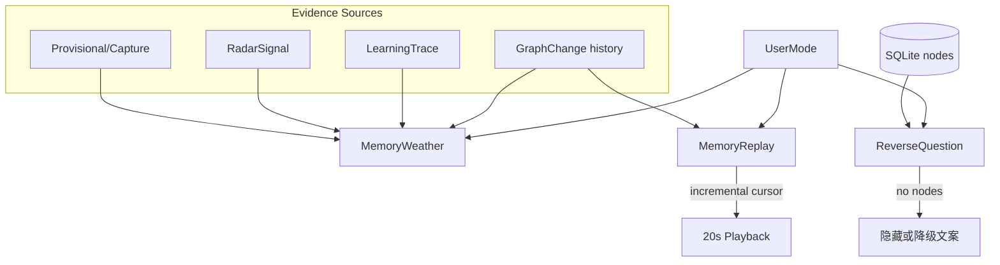

# M5 — 招牌记忆体验（`signature-memory`）

- **阶段：** Mobile Phase 5 · **状态：** planned
- **上游：** M4-GATE · **下游：** M6–M7
- **依赖 / 前置里程碑：** [M4-quick-capture-and-provisional-queue](./M4-quick-capture-and-provisional-queue.md) PASS
- **验收门：** **M5-GATE**

## 1. 目标

打造传播级记忆点：**MemoryWeather**、**MemoryReplay**、**ReverseQuestion** — **没证据就不生成**；**按用户模式自适应输出**不同类型；性能上支持大库（1 万节点）通过聚合/搜索/增量回放，**不全量渲染**。

## 2. 范围内

- **MemoryWeather** — 引用 GraphChange、LearningTrace、RadarSignal；**按 UserMode 输出不同类型**
- **MemoryReplay** — ~20 秒回放；**增量索引/缓存**；禁止每次全量扫库
- **ReverseQuestion** — 基于真实图谱节点；**按 UserMode 调整提问风格**
- 无证据时：明确降级文案或 **隐藏入口**
- 大库策略：首页 30–80 可见节点；万级节点走聚合星核 + 搜索 + Replay 时间线
- ConceptSoulCard 深化（与 M2 衔接）

### Feature Flags（逐步开/降级；不缩水 M5 全量交付）

招牌体验可通过 **本地 Feature Flags**（`apps/mobile` env / persisted dev toggles，**非**云同步）逐步开启或降级动效/LLM 润色，但 **M5-GATE 默认配置（flags 全开或 spec 定义的 production default）下须交付 §2 三大招牌体验全量能力**：

| Flag（示例键） | 允许降级 | **禁止**（M5 仍须交付） |
|----------------|----------|-------------------------|
| `memory_weather_llm_polish` | 无 LLM 时仅展示 evidence 卡片 | 隐藏 Weather 入口（有 evidence 时） |
| `memory_replay_animations` | 低端机静态卡片替代 20s 动效 | 跳过增量 cursor / 全表 scan |
| `reverse_question_enabled` | 图库为空时隐藏（§6 已有） | 无节点时生成空话提问 |
| `signature_experiences_master` | — | **不得**用 master flag 整体关闭 M5 验收范围 |

**硬约束**：Feature Flag 仅影响**呈现层/非核心路径**；evidence 链、UserMode 自适应、Replay 增量读、万节点聚合策略 **不受 flag 豁免**。Gate 验收在 **default-on** 配置下执行；降级路径须有 DegradedMode 可见提示（与 M1 一致）。

### 用户模式自适应输出（证据链不变）

| UserMode | MemoryWeather 倾向 | MemoryReplay 倾向 | ReverseQuestion 倾向 |
|----------|-------------------|-------------------|---------------------|
| 技术追踪者 | 趋势变化、新信号 | 近期入库/整理时间线 | 「XX 和 YY 为何相关？」 |
| 学习者 | 概念巩固、学习轨迹 | 学习 trace 回放 | 「你还想深聊哪个概念？」 |
| 创作者/研究者 | 素材聚合、引用链 | 捕获→入库路径 | 「这组素材如何成体系？」 |
| 创业/项目型 | 项目节点变化 | 项目相关变更 | 「下一步该推进哪条？」 |
| 个人记忆/生活型 | 回忆天气、情绪脉络 | 生活捕获回顾 | 「那天你记下了什么？」 |

**硬约束**：无论模式如何，每条输出仍须追溯到 GraphChange / LearningTrace / RadarSignal / 捕获记录等 **evidence** 字段；无 evidence → 不调用 LLM 空话。三大招牌体验 **均** 适用：MemoryWeather、MemoryReplay、ReverseQuestion **各自** 须有可断言的 evidence 字段或隐藏/降级路径，**禁止** 仅 Weather 有 evidence 而其他两项空话占位。

### UserMode fixture 矩阵（M5-GATE 硬需）

M5-GATE 要求 **5 种 primary UserMode 各至少 1 组 fixture**；**可另含** 1 组混合模式（`primary` + `secondaryModes`）。每组 fixture 须覆盖 **MemoryWeather + MemoryReplay + ReverseQuestion** 三类预期输出（见 §8.2 manifest）。

| Fixture ID | primary UserMode | SQLite 种子要点 | 三类招牌预期（摘要） |
|------------|------------------|-----------------|----------------------|
| `m5-tech-tracker` | 技术追踪者 | GraphChange + RadarSignal | 趋势 Weather；近期入库 Replay；关联概念 Question |
| `m5-learner` | 学习者 | LearningTrace + 概念节点 | 巩固 Weather；学习 trace Replay；深聊概念 Question |
| `m5-creator-researcher` | 创作者/研究者 | 捕获链 + 引用边 | 素材聚合 Weather；捕获→入库 Replay；成体系 Question |
| `m5-entrepreneur-project` | 创业/项目型 | 项目节点 + GraphChange | 项目变化 Weather；项目变更 Replay；推进 Question |
| `m5-personal-life` | 个人记忆/生活型 | 生活捕获 + 低 Radar | 回忆 Weather；生活回顾 Replay；那天记下 Question |
| `m5-mixed-learner-life`（可选） | 学习者 + secondary 个人记忆 | 混合 evidence | 混合风格三类输出；验证 routing 非单一枚举 |

## 3. 范围外

- 云同步驱动的「跨设备记忆」（M7）
- AI 空话模板（无 evidence 禁止）
- 全图 force-directed 编辑（移动不做桌面级全图）
- PostHog 全量埋点（M6 白名单）

## 4. 现有代码复用点

| 模块 | 复用方式 |
|------|----------|
| `KOS-C1-learning-trace` | SQLite learning trace 表 |
| `graphHistoryStore` / GraphChange | Replay 时间线源 |
| `RadarSignal` | Weather 输入（技术追踪者） |
| `src/lib/graphContextPack.ts` | 邻域摘要 |
| M2 `user_mode` 持久化 | Weather/Replay/Question 路由 |
| Legacy graph viz | **不移植**；Skia 星核 + 卡片 |

## 5. 数据流 / 架构



```text
MemoryReplay 增量读取（硬约束）：
  replay_cursor = last_seen_change_id | timestamp
  每次打开：SELECT changes WHERE id > cursor ORDER BY id LIMIT N
  禁止：SELECT * FROM nodes 全表扫描用于动画
```

**性能阈值：**

| 指标 | 阈值 |
|------|------|
| 首页可见节点 | 30–80 |
| 1 万节点库 | 仅聚合/搜索/Replay；禁止全量 mount |
| Replay 冷启动 | **P50 <500ms** 读到首批 change（真机；与 gate 硬需一致） |
| MemoryWeather 生成 | 无 evidence → 不调用 LLM 空话 |
| ReverseQuestion 采样 | 无图谱节点 → 隐藏；有节点须 evidenceRefs 非空 |

**性能 gate 验收入口（须写入 M5-GATE checklist）：**

| 层 | 路径 | 断言 |
|----|------|------|
| Perf 单测 | `apps/mobile/perf/replayColdStart.test.ts` | mock/fixture DB 上首批 change 读取 P50 <500ms（CI 可跑；真机复验见 §8.3） |
| Perf 冒烟 | `pnpm --filter @my-brain/mobile test -- perf` | 含 replay cold start + `nodeBudget.test.ts` |
| Eval 记录 | `docs/evals/m5-replay-perf.md` | 真机型号、批次、P50/P95、命令与原始计时 artifact 路径 |

## 6. 错误 / 降级路径

| 场景 | 行为 |
|------|------|
| 无 GraphChange | Replay 入口隐藏或「还没有可回放的变化」 |
| `learning_trace_persist_warning` | Weather 标注证据不全 |
| LLM 生成失败 | 展示已有 evidence 卡片，不生成新文案 |
| 图库为空 | ReverseQuestion 隐藏 |
| 节点 >80 请求渲染 | 自动聚合；日志记 `perf_aggregate` |
| UserMode 未知 | 回退「个人记忆」风格 + ProfileReview 可改 |

## 7. 测试计划

| 层 | 路径 | 场景 |
|----|------|------|
| Core | `packages/core/memory/replayIncremental.test.ts` | cursor 增量、无全表 scan |
| Core | `packages/core/memory/weatherEvidence.test.ts` | Weather：无 evidence 不输出 |
| Core | `packages/core/memory/replayEvidence.test.ts` | Replay：每条 timeline 项绑定 GraphChange id |
| Core | `packages/core/memory/reverseQuestionEvidence.test.ts` | Question：无节点隐藏；有节点须 evidenceRefs |
| Core | `packages/core/memory/modeAdaptive.test.ts` | **五** primary UserMode + 可选混合；三类输出类型不同 |
| Mobile | `apps/mobile/memory/MemoryReplay.test.tsx` | 20s 流程 mock |
| Mobile | `apps/mobile/memory/MemoryWeather.test.tsx` | evidence 卡片 / 无 evidence 隐藏 |
| Mobile | `apps/mobile/memory/ReverseQuestion.test.tsx` | 按 UserMode 提问风格 + 空图隐藏 |
| Fixture | `apps/mobile/fixtures/m5-evidence.sqlite` | 仅 SQLite 验收入口（无 session 假数据） |
| Fixture | `apps/mobile/fixtures/m5-modes/` | 每 UserMode 一组；含 **verifier 可读** manifest（§8.2） |
| Fixture | `docs/evals/m5-signature-fixtures.json` | 五模式 + 可选混合；三类招牌 expected 摘要 |
| Perf | `apps/mobile/perf/nodeBudget.test.ts` | 可见节点 ≤80 |
| Perf | `apps/mobile/perf/replayColdStart.test.ts` | Replay 冷启动首批 change **P50 <500ms** |
| Eval | `docs/evals/memory-weather-usefulness.md` | Weather 有用性 rubric |
| Eval | `docs/evals/m5-replay-perf.md` | 真机 Replay 冷启动 perf 证据 |

## 8. 验收标准（M5-GATE）

### 8.1 Exit checklist

- [ ] 仅 SQLite 持久化数据（`m5-evidence.sqlite` + 各 mode 种子；**无** session 内存假数据）下 fixture 验收通过
- [ ] **`docs/evals/m5-signature-fixtures.json`** 与 **`apps/mobile/fixtures/m5-modes/manifest.json`** 存在且被 `pnpm mobile:gate M5` / verifier **可读**（见 §8.2）
- [ ] **5 种 primary UserMode**（技术追踪者、学习者、创作者/研究者、创业/项目型、个人记忆/生活型）**各至少 1 组 fixture**；**可另含** 1 组混合模式；每组验证 **MemoryWeather + MemoryReplay + ReverseQuestion** 输出类型符合 §2 表
- [ ] **MemoryWeather**：每条输出 `evidenceRefs[]` 非空且可解析到 GraphChange / LearningTrace / RadarSignal / 捕获记录；无 evidence → 隐藏或降级文案，**禁止** LLM 空话
- [ ] **MemoryReplay**：timeline 项绑定 GraphChange（或等价 history）id；增量读 history；测试断言无 `SELECT * FROM nodes` 全表路径
- [ ] **ReverseQuestion**：基于真实图谱节点；`evidenceRefs` 含节点 id；图库为空 → 隐藏（§6）；**禁止** 无节点空话提问
- [ ] **Replay 冷启动 / 首批 change**：真机 **P50 <500ms**（阈值同 §5）；CI 跑 `replayColdStart.test.ts`；真机证据写入 `docs/evals/m5-replay-perf.md` 并链入 gate report
- [ ] 1 万节点 fixture 下首页仍可交互（聚合模式）
- [ ] Feature Flags：**default-on** 下三大招牌体验全量可验收；flag 降级不豁免 evidence / 增量 / 万节点策略（§2 Feature Flags）
- [ ] `pnpm check` 绿；`pnpm --filter @my-brain/mobile test -- perf` 绿

### 8.2 Verifier 可读 fixture 输出（harness engineering）

Verifier（`pnpm mobile:gate M5` / `tools/mobile-execution/verify-stage.ts`）须能 **无需人工口述** 判定 evidence 与 UserMode 覆盖：

**`docs/evals/m5-signature-fixtures.json`**（JSON Schema 概念字段）：

```json
{
  "version": 1,
  "fixtures": [
    {
      "id": "m5-tech-tracker",
      "primaryMode": "技术追踪者",
      "sqliteSeed": "apps/mobile/fixtures/m5-modes/m5-tech-tracker/seed.sql",
      "expected": {
        "memoryWeather": { "outputKind": "trend", "evidenceRefsMin": 1 },
        "memoryReplay": { "outputKind": "ingest_timeline", "evidenceRefsMin": 1 },
        "reverseQuestion": { "outputKind": "relation_why", "evidenceRefsMin": 1 }
      }
    }
  ]
}
```

**`apps/mobile/fixtures/m5-modes/manifest.json`**：列出全部 fixture id、对应 `UserModeProfile` 快照路径、以及跑完集成测试后的 **`actual-output.json`** 相对路径（测试写入，供 diff）。

**Gate report `artifacts`** 须引用：`manifest.json`、各 `actual-output.json`、`m5-replay-perf.md`（若跑真机 perf）、相关测试 stdout。

### 8.3 性能 gate 失败 — stop condition

| 条件 | Verifier 判定 | 流水线行为 |
|------|---------------|------------|
| Replay 冷启动真机 **P50 ≥500ms**（§5 阈值） | **FAIL** | 留在 **M5** 修复；**禁止** 签核 M5-GATE PASS；**禁止** 进入 M6 |
| `replayColdStart.test.ts` 或 `pnpm … test -- perf` 失败 | **FAIL** | 同上 |
| 缺 `docs/evals/m5-replay-perf.md` 且 gate report 声称真机 perf PASS | **HARD_STOP** | 伪通过；须补 artifact 或改 report 为 NEEDS_DEVICE_EVIDENCE |
| 五模式中任一缺 fixture 或三类招牌任一缺 evidence 断言 | **FAIL** | 留在 M5；**禁止** M6 |
| 仅 Weather 有 evidence 测试，Replay/Question 无对应 evidence 测试 | **FAIL** | 留在 M5 补测试与 fixture |
| Feature Flag 默认配置下任一招牌体验未交付 | **FAIL** | 不得用 flag 缩水 M5 范围 |
| 报告 PASS 但 `pnpm check` / perf / evidence fixture 命令失败 | **HARD_STOP** | 同 [`GATE_VERIFIER_SPEC.md`](./GATE_VERIFIER_SPEC.md) §3.3 |

**不含 M7**：本阶段 perf / fixture 验收 **不得** 引入云同步、跨设备记忆或 M7 备份/迁移能力作为 gate 依赖或 PASS 条件。

## 9. 依赖 / 解锁

| 关系 | 说明 |
|------|------|
| **依赖** | M4-GATE；M2 learning trace + user_mode 持久化可靠 |
| **解锁 M6** | M5-GATE PASS |
| **运行时** | Dev Client / native build；真机性能验证 |

## 10. 实施注意事项

- Replay 索引表或 materialized cursor 在 M2 schema 预留
- ReverseQuestion 节点采样须确定性（seed + user id hash + user mode）便于测试
- 动效预算：Replay 20s 内 GPU 占用可测；低端 Android 降级静态卡片（`memory_replay_animations` flag，§2）
- 与 DegradedMode 联动：`learning_trace_persist_warning` 降低 Weather 置信文案
- 技术追踪者以外模式：RadarSignal 可能为空，Weather 应改用 LearningTrace / 捕获 evidence
- 实现 `m5-signature-fixtures.json` + `manifest.json` 时与 M1 `cold-start-fixtures.json` 模式对齐，便于 verifier 复用 JSON 读取逻辑
- 三大招牌 experience 的 **evidence 单测** 须分文件（或分 describe），避免 gate 仅覆盖 Weather
- Replay perf：先在 fixture SQLite 上跑 `replayColdStart.test.ts`，再补真机 `m5-replay-perf.md`；P50 不达标按 §8.3 **FAIL**，不得 waiver 进 M6
