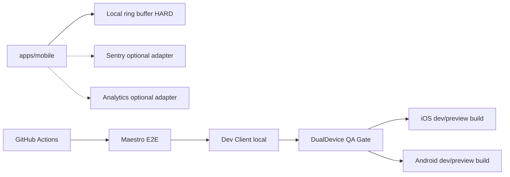
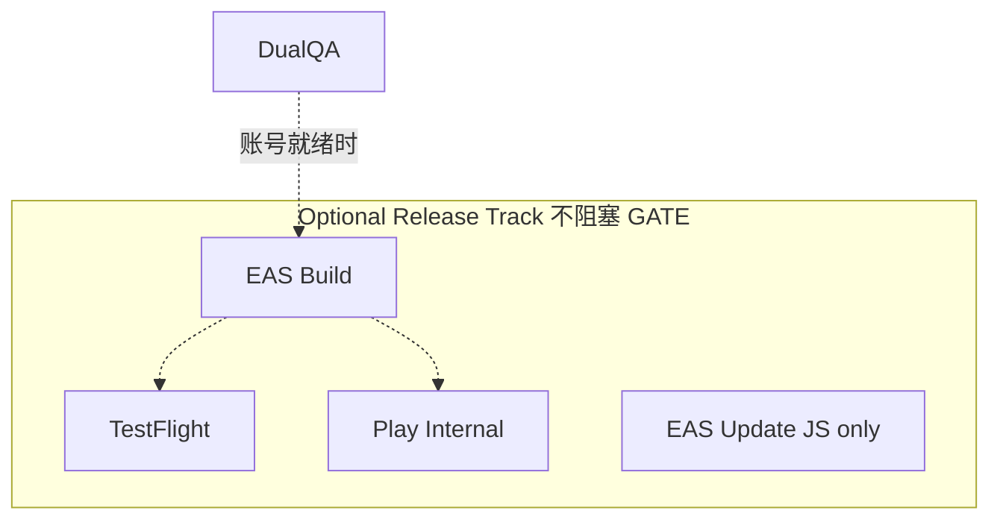

# M6 — 双端 QA、可观测性与可选发布轨（`dual-device-qa`）

- **阶段：** Mobile Phase 6 · **状态：** planned
- **上游：** M5-GATE · **下游：** M7
- **依赖 / 前置里程碑：** [M5-signature-memory-experiences](./M5-signature-memory-experiences.md) PASS
- **验收门：** **M6-GATE**

> **命名说明**：文件名保留 `release-observability-and-mobile-e2e` 以维持链接稳定；阶段代号改为 `dual-device-qa`；**M6-GATE ≠ 公开商店上线**。

## 1. 目标

**Android + iOS 双端真机 M0–M5 主体能力 QA**可验收：双端 dev/preview build 可运行 M0–M5 主路径；**本地 ring buffer + crash/diagnostic export**（硬需）；Sentry / PostHog / Amplitude 为**可插拔 optional 适配器**（默认 off/mock）；**移动 E2E 进 CI**。**不等于**完整成品 gate（同步/备份在 M7）。**TestFlight / Play Internal / EAS Submit 作为 optional release track，不阻塞 gate。**

## 2. 范围内（M6-GATE 硬需）

- **双端真机 smoke**：≥1 iPhone + ≥1 Android **dev/preview build** 完成 **M0–M5 主路径** smoke，**显式含** M3 语音闭环/三意图、M4 分享捕获候选、M5 MemoryWeather/MemoryReplay 证据体验（**不含** M7 同步/备份）；证据须 §8.1.1 结构化记录
- **本地 ring buffer + crash/diagnostic export**（硬需；M2 对接；可导出不含敏感正文）
- **Optional 可插拔适配器**（**不阻塞 M6-GATE**；默认 off/mock）：Sentry Release Health、PostHog/Amplitude 或自建事件
- 事件分析字段 **白名单**（**禁止** title/intro/transcript/**画像敏感正文**）
- 移动 **E2E 纳入 CI**（Maestro 或 Detox）
- 权限文案合规（麦克风等）；隐私政策 URL、服务条款
- App 图标、启动图、版本号策略
- 诊断导出验证（不含知识正文）
- 崩溃可定位 **版本 + 页面/路由**

## 3. 范围外（optional release track — 不阻塞 M6-GATE）

- **EAS profiles**：development、preview、production
- **EAS Update** channels + Fingerprint
- **TestFlight**、**Play Internal Testing**、**EAS Submit**
- 公开 App Store / Play Store 全球上架
- 多设备加密同步（M7）
- 服务端业务后端（除 token exchange BFF）
- 重写 core 业务逻辑

## 4. 现有代码复用点

| 模块 | 复用方式 |
|------|----------|
| M2 ring buffer 诊断 | **硬需**；optional Sentry breadcrumb 对接（脱敏） |
| M1/M2 ProfileReview | 诊断不含画像敏感正文 |
| `pnpm check` | CI 必跑；加 mobile E2E job |
| `docs/evals/` | 成熟度标签同步 |
| Legacy CI | 扩展 workflow，不破坏 web check |

## 5. 数据流 / 架构





```text
验收阶梯：
  M0-M5: 本地 Dev Client（无 EAS 阻塞）
  M6 GATE: 双端真机 M0–M5 主体能力 QA + 可观测性 + E2E CI
  M6 OPTIONAL: EAS preview → TestFlight + Play Internal（有账号时）
```

**Expo 边界（M6）：**

| 渠道 | 用途 | Gate 关系 |
|------|------|-----------|
| Expo Go | **不再**作为 M3+ 验收路径 | — |
| Dev Client / native build | **M6-GATE 主路径** | **硬需** |
| EAS Build | optional 内测二进制 | optional |
| EAS Submit | TestFlight / Play | optional |

## 6. 错误 / 降级路径

| 场景 | 行为 |
|------|------|
| OTA 与 native 指纹不匹配 | 提示用户安装新 build（optional track） |
| Sentry 上传失败 | 本地 ring buffer 保留（**不 FAIL gate**） |
| 无 Sentry/Analytics 配置 | **默认**；M6-GATE 仍可 PASS（ring buffer 硬需满足） |
| E2E flaky | CI retry 上限 2；失败阻塞 M6-GATE |
| 无 Apple/Google 账号 | **optional track 标 BLOCKED 或 WAIVED**；**M6-GATE 仍可 PASS**（若 §8.1 硬需 + 双端 smoke 证据满足） |
| 仅单端真机 smoke 证据 | verdict **`NEEDS_DEVICE_EVIDENCE`**；**不得标 PASS** |
| TestFlight 审核延迟 | 不影响 gate；仅影响 optional track |
| 崩溃 | Sentry 带 release + route；无 PII 正文 |

## 7. 测试计划

| 层 | 路径 | 场景 |
|----|------|------|
| E2E CI | `.github/workflows/mobile-e2e.yml` | Maestro 主路径 |
| E2E | `apps/mobile/e2e/mainpath.yaml` | 冷启动分流→AdaptiveRadar→入库→undo |
| E2E | `apps/mobile/e2e/offline.yaml` | 断网图谱可读 |
| E2E | `apps/mobile/e2e/degraded.yaml` | mock 标识可见 |
| E2E | `apps/mobile/e2e/profile-review.yaml` | 画像纠偏持久化 |
| E2E / Smoke **M3** | `apps/mobile/e2e/voice-intent.yaml`（或等价） | 三意图语音/文字闭环；可引用 [`M3-realtime-voice-and-token-exchange.md`](./M3-realtime-voice-and-token-exchange.md) §7 `voice-intent-fixtures.json` |
| Eval **M3** | `docs/evals/m3-voice-matrix.md` | 双端语音矩阵；M6 smoke 可复用已 PASS 的 barge-in/三意图证据 |
| E2E **M4** | `apps/mobile/e2e/share-capture-android.yaml` | Android intent → 候选 → 确认入库（见 [`M4-quick-capture-and-provisional-queue.md`](./M4-quick-capture-and-provisional-queue.md) §7） |
| E2E **M4** | `apps/mobile/e2e/share-capture-ios.yaml` | iOS Share Extension → 候选 → 确认入库 |
| E2E **M4** | `apps/mobile/e2e/share-no-permanent.yaml` | 确认前无 permanent 节点 |
| Smoke **M4** | `docs/evals/m6-capture-smoke.md` | 双端分享/捕获候选主路径（真机；结构化证据见 §8.1.1） |
| E2E / Smoke **M5** | `apps/mobile/e2e/memory-experience.yaml`（或等价） | MemoryWeather 或 MemoryReplay 证据体验（有 evidence 才展示） |
| Eval **M5** | `docs/evals/memory-weather-usefulness.md` | 有用性 rubric；见 [`M5-signature-memory-experiences.md`](./M5-signature-memory-experiences.md) §7 |
| Smoke **M5** | `docs/evals/m6-memory-experience-smoke.md` | ≥1 种 UserMode 下 Weather/Replay 可追溯到 evidence |
| Smoke iOS | `docs/evals/m6-ios-smoke.md` | 真机清单；**M0–M5 主路径**含 M3/M4/M5 项（§8.1） |
| Smoke Android | `docs/evals/m6-android-smoke.md` | 真机清单；**M0–M5 主路径**含 M3/M4/M5 项（§8.1） |
| Telemetry | `apps/mobile/telemetry/whitelist.test.ts` | 字段白名单 |
| Diagnostic | `apps/mobile/diagnostics/export.test.ts` | 无敏感正文 |

## 8. 验收标准（M6-GATE）

### 8.1 Gate 硬需（全部满足才可 PASS）

- [ ] ≥1 台 iPhone + ≥1 台 Android 可装 **dev/preview build** 并完成 **M0–M5 主路径** smoke（**不含** M7 同步/备份）
- [ ] **双端真机 smoke 证据齐全**（§8.1.1 结构化记录）；缺 iOS **或** Android 任一端 → verdict **`NEEDS_DEVICE_EVIDENCE`**（**非 PASS、非 FAIL**）
- [ ] smoke 覆盖 **M0–M2 基础**：冷启动/AdaptiveRadar、入库、undo、ProfileReview、断网可读、诊断导出
- [ ] smoke 覆盖 **M3 语音主路径**（二选一或组合，须有 §8.1.1 证据）：
  - [ ] **语音闭环**：聆听→助手播报→用户可打断（barge-in）→继续或文字兜底；**或**
  - [ ] **三意图语音路径**：入 / 不要 / 讲细点 与文字 FSM 行为一致（可 mock transport；须 dev/preview build）
- [ ] smoke 覆盖 **M4 捕获主路径**（双端分别验收或引用 M4-GATE 已 PASS 真机证据）：
  - [ ] **分享/捕获 → 候选队列**（Android intent **或** iOS Share Extension 至少各平台 1 条路径）
  - [ ] 确认前 **无 permanent** 节点；用户确认后才入库
- [ ] smoke 覆盖 **M5 记忆体验主路径**（至少 1 项须有 evidence 可追溯）：
  - [ ] **MemoryWeather** 或 **MemoryReplay** 在 fixture/真机数据下可完成体验（无 evidence 不展示空话）
  - [ ] 输出可追溯到 evidence 表/字段（见 M5 §8）
- [ ] 移动 E2E 在 CI 绿（或 documented quarantine 0 条）；§7 中 M3/M4/M5 相关 E2E 已纳入或等效 smoke 已记录
- [ ] 崩溃可定位 **版本 + 页面**（**ring buffer / diagnostic export** 硬需；**Sentry optional，未配置不 FAIL**）
- [ ] **本地 ring buffer + diagnostic export** verified（不含敏感正文）
- [ ] 隐私政策 URL 可访问；权限文案合规
- [ ] Analytics/Sentry（若启用）**无**图谱正文/transcript/画像敏感字段；**未启用不 FAIL**
- [ ] `pnpm check` 绿

#### 8.1.1 Smoke 证据结构化记录（Harness 硬需）

每条 smoke 路径须在 `docs/evals/m6-*-smoke.md` 或 M6-GATE 报告中以**可机器/人工复核**的结构记录（表格或 JSON 行）：

| 字段 | 说明 |
|------|------|
| `device` | 设备型号 + OS 版本（如 `iPhone 15 / iOS 18.2`、`Pixel 8 / Android 14`） |
| `build` | dev/preview build 标识（`version` + `buildNumber` + commit hash 或 EAS build ID） |
| `path` | smoke 路径 ID（如 `m3-voice-barge-in`、`m4-share-android-intent`、`m5-memory-replay`） |
| `result` | `PASS` \| `FAIL` \| `DEGRADED`（单路径失败不自动等同 gate FAIL，须汇总判定） |
| `artifact` | 截图/录屏/导出文件路径或 artifact ID + 时间戳 |

**Gate verdict 与证据关系：**

| 条件 | M6-GATE verdict |
|------|-----------------|
| §8.1 全部勾选 + 双端 §8.1.1 记录齐全 | **PASS** |
| 机器检查/E2E 绿，但缺 iOS **或** Android 任一端真机 smoke 记录 | **`NEEDS_DEVICE_EVIDENCE`**（**不得标 PASS**） |
| §8.1 硬需功能失败且无法 waiver | **FAIL** |
| 无 Apple/Google 账号 / EAS / TestFlight / Play | **不影响** §8.1；仅 optional track 标 **`BLOCKED`** 或 **`WAIVED`**（**不得标 FAIL**） |

### 8.2 Optional release track（不阻塞 PASS）

- [ ] EAS preview build 产出（有 EAS 时）
- [ ] TestFlight / Play Internal 安装（有开发者账号时）
- [ ] main 可触发 preview build 或合规 OTA（有 CI 配置时）

**缺 Apple/Google 账号 / EAS / TestFlight / Play 时**：optional track 在报告中标 **`BLOCKED`**（缺资源）或 **`WAIVED`**（已知放弃 + 原因）；**不得**因此判 M6-GATE **FAIL**；**不得**将 Sentry Release Health / EAS Submit 设为 gate 硬需。

## 9. 依赖 / 解锁

| 关系 | 说明 |
|------|------|
| **依赖** | M5-GATE |
| **解锁 M7** | M6-GATE PASS |
| **optional** | Apple/Google 开发者账号 + EAS 项目（仅 release track） |
| **NEEDS_DEVICE_EVIDENCE** | 双端 smoke 缺 iOS 或 Android 真机记录时；**非 PASS、非 FAIL**；补 §8.1.1 证据后复验 |
| **optional BLOCKED / WAIVED** | 无 EAS / Apple / Google 账号时仅阻塞 §8.2；**不 FAIL** M6-GATE |

## 10. 实施注意事项

- **M6-GATE smoke 范围**（见产品计划 §0）：双端真机可安装运行、离线可用、文字与语音闭环、捕获、记忆体验、本地诊断 — **不含** M7 同步/备份导入导出；**不要求**公开商店发布
- **完整成品验收**在 **M7-GATE**（换机恢复、加密备份、SyncProvider/冲突策略）；见 [`M7-sync-backup-and-long-term-trust.md`](./M7-sync-backup-and-long-term-trust.md)
- Fingerprint 文档：哪些 native 变更必须新 build（sqlite、语音、Share Extension）
- preview channel 与 production 严格隔离 API key / token exchange（optional track）
- CI Maestro 用模拟器；**双端真机 smoke** 为 gate 硬需；M3 语音 / M4 捕获 / M5 记忆体验须各有 §8.1 路径 + §8.1.1 结构化证据
- M6-GATE 报告须引用 §7 中 capture / memory-experience 相关 E2E 或 smoke 文档路径；缺双端真机 → **`NEEDS_DEVICE_EVIDENCE`**；optional track 缺账号 → **`BLOCKED`/`WAIVED`**，**非 FAIL**
- 版本号与 `packages/core` schema version 独立标注
- **M6-GATE ≠ 完整产品验收**（完整成品 = **M7-GATE**）；**M7 仍必须交付**
- **M6-GATE ≠ 公开上线**
