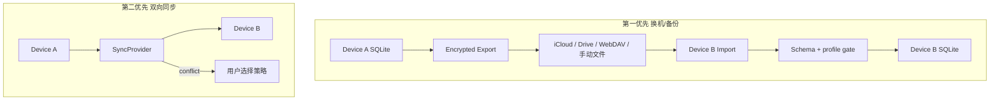

# M7 — 同步、备份与长期可信（`sync-backup`）

- **阶段：** Mobile Phase 7 · **状态：** planned
- **上游：** M6-GATE · **下游：** **M7-GATE = 不公开上线的完整成品验收**
- **依赖 / 前置里程碑：** [M6-release-observability-and-mobile-e2e](./M6-release-observability-and-mobile-e2e.md) PASS
- **验收门：** **M7-GATE**（= **M7A-GATE** + **M7B-GATE**；= 阶段 0–7 **完整功能验收**）

## 1. 目标

多设备与长期信任，按 **两段 gate** 交付（功能不缩水）：

| 子 gate | 范围 | 顺序 |
|---------|------|------|
| **M7A-GATE** | 换机恢复 + 手动/半自动加密备份 + **correction history** | **先 PASS** |
| **M7B-GATE** | 双端双向 SyncProvider + 冲突合并（保留 correction history） | M7A 后继续 |
| **M7-GATE** | 完整成品验收 | M7A + M7B 均 PASS |

**同步不得 bypass 用户确认入库**；delete = archive。**ProfileReview** 与 M1/M2 衔接；**correction history / suppression** 须纳入备份与 sync。

## 2. 范围内

### 2.1 M7A — 换机与备份（第一优先）

- **换机恢复**：按 **§2.1.1 备份实体清单** 导出 → 新设备导入；**不得**仅导出图谱子集而静默丢弃 M2 关键持久化
- **手动/半自动加密备份**：用户触发或定期提醒；加密密钥用户持有
- 导入导出：JSON / Markdown / Graph snapshot（对齐 `importGraphJson` 错误类）
- 加密备份：iCloud Drive、Google Drive、WebDAV、私有中继（**非**系统 iCloud **自动**备份明文 DB）
- 设备丢失：备份恢复流程文档

#### 2.1.1 备份 / snapshot 实体范围（对齐 [M2](./M2-local-storage-and-diagnostics.md) 持久化）

M7A 导出包 **必须** 声明 `backup_manifest_version` 与 `included_entities[]`；verifier 与 `importGraphJson` 校验须能对照此清单。下表为权威范围；**未列入「导出」且未写明排除理由的 M2 实体，视为 M7A 缺口 → FAIL**。

| M2 持久化实体 | schema / 表键（M2 §10） | M7A 导出 | M7B sync | 不导出 / 不同步时的理由 |
|---------------|-------------------------|----------|----------|-------------------------|
| **知识图谱 snapshot**（nodes + edges，含 archive 标记） | `graph` 相关表 | **导出** | **同步**（已确认节点；见 §2.2 门控） | — |
| **GraphChange / graph history** | `graph_history` / 同事务 history | **导出** | **同步**（冲突合并权威时间线） | — |
| **UserModeProfile / profile seed** | `user_mode_profile` | **导出** | **同步**（冲突须用户选择，§2.2.1） | — |
| **profile_correction_history** | `profile_correction_history` | **导出** | **同步**（合并须保留；不 silent 覆盖） | — |
| **profile_suppression_list** | `profile_suppression_list` | **导出** | **同步**（与 correction history 同策略） | — |
| **learning trace** | M2 持久化 learning trace | **导出** | **同步** | — |
| **Provisional 候选队列** | provisional queue 表 | **导出**（含 `confirmedAt` / `ingestSource` 门控字段） | **同步**（远端 new node **无** `user_confirmed_ingest` → 仅进 provisional，不得静默入库） | — |
| **WorldItem** | M2 WorldItem 持久化 | **导出** | **同步** | — |
| **adaptive radar state** | `adaptive_radar_cursor` 等 | **导出** | **同步**（可合并；冲突按时间戳 + 用户选择） | — |
| **ring buffer 诊断日志** | M2 diagnostics | **不导出** | **不同步** | 设备本地运维数据；可含 error codes / schema version，非用户知识资产；M2 已规定诊断包不含 node 正文 |
| **raw audio / 全文 article** | —（M2 不持久化） | **不导出** | **不同步** | 产品不变量 #1：对话后丢弃 |
| **画像敏感明文**（除非用户 opt-in） | — | **默认不导出** | **默认不同步** | 隐私默认；用户可在加密备份 opt-in 显式包含（须二次确认 UI） |

**M7A snapshot 最小验收集**（换机 round-trip 必须恢复）：

```text
graph snapshot + graph history
+ user_mode_profile
+ profile_correction_history + profile_suppression_list
+ learning trace
+ provisional queue（含门控元数据）
+ WorldItem
+ adaptive_radar_cursor（及 M2 定义的 radar 附属状态）
```

导入时 **原子事务**（KP-07）：任一上表「导出」实体校验失败 → 整包拒绝或进入 **安全局部回滚**（见 §6.1），不得半写入图谱而无 profile / correction history。

### 2.2 M7B — 双向同步（第二优先）

- **SyncProvider** 接口（先 JSON/Graph snapshot 交换，非重型 SDK）
- 冲突：**GraphChange 时间线合并**；`SyncConflictError` 用户可见策略
- 同步规则：仅合并 **已确认** 节点；远端 silent create **禁止**
- **profile / correction history 合并**：用户选择保留哪端；**不 silent 覆盖用户纠偏**（信任优先级见 §2.2.1）
- 边迁移遵循 V4 edge-migrate 语义
- 同步 payload 实体范围 **不得窄于** §2.1.1 表中「M7B sync = 同步」行；provisional / WorldItem / radar state 遗漏 → **M7B-GATE FAIL**

#### 2.2.1 Profile / sync 冲突与信任优先级（硬约束）

与 M1/M2 **ProfileReview** 一致，合并与冲突 UI **必须**复述并执行下列优先级（高 → 低）：

```text
1. 用户手动纠偏（ProfileReview correction history / suppression）
2. 行为信号（显式用户操作、确认入库、archive 意图、边迁移确认）
3. LLM 推断（画像蒸馏、自动 link 建议、provisional 排序等）
```

**合并规则**：

| 冲突类型 | 策略 |
|----------|------|
| correction history 与远端 profile 字段冲突 | **永不** silent 用 LLM/远端覆盖本地手动纠偏；须 UI 选择或按条合并保留 `source=manual` 记录 |
| suppression_list 冲突 | 并集优先保留 suppression；删除 suppression 须用户确认 |
| 同字段双端均为手动纠偏 | `SyncConflictError` + 用户选择保留哪端或逐条合并 |
| 仅一端有 LLM 推断、另一端无手动记录 | 可合并 LLM 侧为候选，但 **不得**提升为 suppression 或覆盖已有手动记录 |
| 图谱 ingest | 远端 new node **无** `user_confirmed_ingest` → **provisional only**；**禁止** bypass 用户确认入库 |
| delete / archive | **delete = archive**；同步删除意图 → 本地 archive，不 hard delete |

### 2.3 画像与信任（贯穿 M1–M7）

- **ProfileReview** 完整版：建立在 M1 v0 + M2 **correction history** 之上
- 同步/备份包不含 raw audio / 全文 article / 画像敏感明文（除非用户 opt-in 加密备份）

## 3. 范围外

- 实时协作多用户
- 云端全文索引服务
- 绕过 provisional 的自动入库
- EverMemOS 手机端默认 sidecar（保持 mock memory）
- 以商店发布为前提的同步服务

## 4. 现有代码复用点

| 模块 | 复用方式 |
|------|----------|
| `importGraphJson`、export 路径 | core + mobile UI |
| `GraphChange` / history | 冲突合并权威时间线 |
| `archive` 语义 | 同步删除 = 归档 |
| KP-07 事务 | 导入须原子 |
| M2 导出 | 扩展为同步包格式 |
| M1/M2 ProfileReview | 扩展为完整画像管理；同步时合并 profile/mode |
| M2 `confirmedAt` / `ingestSource` | sync 门控字段 |

## 5. 数据流 / 架构



```text
入库门控（硬约束）：
  远端 payload 含 new node 且无 user_confirmed_ingest flag
    → 进入 provisional；不得 applyIngestCreate 静默执行
  远端 archive 意图
    → 本地 archive；不 hard delete
  边迁移
    → 遵循 V4 edge-migrate 语义
  profile/mode 冲突
    → 用户选择保留哪端；**correction history 合并**；不 silent 覆盖 suppression
```

## 6. 错误 / 降级路径

### 6.1 Sync / backup 合并错误（Harness 硬要求）

任何 **导入、换机恢复、SyncProvider merge** 失败须输出结构化错误（供 UI、诊断包与 gate 测试断言），并遵守 **root cause hint → 安全重试 → 停止条件** 三段式：

| 字段 | 要求 |
|------|------|
| `error_class` | 稳定枚举：`ImportSchemaMismatch` / `BackupDecryptError` / `SyncConflictError` / `IngestGateViolation` / `MergeTransactionError` / `ManifestEntityMissing` 等 |
| `root_cause_hint` | 人可读一句 + 机器 `hint_code`（如 `missing_entity:profile_correction_history`、`ingest_gate:no_confirmed_flag`） |
| `safe_retry` | 幂等、不扩大破坏：可重试解密密码、重新拉取 sync chunk、回滚至 merge 前 snapshot；**禁止**重试时 silent 跳过 ingest 门控 |
| `stop_condition` | 连续 N 次同类失败（建议 N=3）、检测到循环冲突、或事务无法回滚 → **HARD_STOP** 合并；保留本地 DB 可读；提示导出本地备份 |

| 错误 | 行为 | root_cause_hint 示例 | 安全重试 | 停止条件 |
|------|------|----------------------|----------|----------|
| `SyncConflictError` | 展示冲突说明；不 silent merge | `conflict:profile_field:interests` | 用户选择策略后单次重放 merge | 同一 conflict_id 3 次未决 → HARD_STOP |
| 导入 schema 不匹配 | 版本提示 + **拒绝写入**（或 ADR 定义的局部导入须显式 opt-in） | `schema:expected=12 got=9` | 升级 app 后重试；不降级写库 | manifest 缺必填实体 → 不重试，直接 FAIL |
| `ManifestEntityMissing` | 拒绝导入；列出缺失实体 | `missing_entity:learning_trace` | 仅当用户提供完整包后重试 | — |
| `IngestGateViolation` | 违规节点进 provisional；记审计 | `ingest_gate:no_confirmed_flag` | 用户确认后可逐条入库 | 批量违规 > 阈值 → 暂停 sync，保留本地 |
| `MergeTransactionError` | KP-07 回滚；toast + 诊断 | `transaction:graph_history_co_write_failed` | 冷却 5s 后重试同一事务 | 回滚失败 → HARD_STOP + 导出指引 |
| 备份加密失败 | 明文导出 opt-in 警告 | `crypto:wrong_passphrase` | 用户更正密钥 | 3 次解密失败 → 停止，不 brute force |
| 网络中断 | resume token；本地优先可读 | `network:sync_chunk_timeout` | 指数退避拉取 | token 过期 → 全量 re-sync 须用户确认 |
| 恶意 snapshot | 校验签名/size；拒绝执行 | `security:signature_invalid` | **不可**重试同一包 | 单次即 HARD_STOP |
| profile 合并冲突 | UI 让用户选择；保留纠偏历史 | `trust:manual_overrides_llm` | 用户决策后重放 | 拒绝选择 → 保持冲突态，不 silent 默认 LLM |

## 7. 测试计划

| 层 | 路径 | 场景 |
|----|------|------|
| Core | `packages/core/sync/ingestGate.test.ts` | 远端节点不 bypass 确认 |
| Core | `packages/core/sync/conflictMerge.test.ts` | 双端冲突不硬删 |
| Core | `packages/core/sync/importGraphJson.test.ts` | 错误类对齐 |
| Core | `packages/core/sync/profileMerge.test.ts` | profile + **correction history** 冲突不 silent；信任优先级 §2.2.1 |
| Core | `packages/core/sync/mergeError.test.ts` | §6.1 `root_cause_hint`、安全重试、停止条件 |
| Core | `packages/core/sync/backupManifest.test.ts` | §2.1.1 实体清单与 `ManifestEntityMissing` |
| Fixture | `packages/core/sync/fixtures/two-device/` | A/B 合并 |
| Fixture | `packages/core/sync/fixtures/device-migration/` | 换机导出→导入 |
| Mobile | `apps/mobile/e2e/sync-export-import.yaml` | 导出→第二实例导入 |
| Mobile | `apps/mobile/e2e/encrypted-backup.yaml` | 加密备份 round-trip（若实现） |
| E2E | `apps/mobile/e2e/sync-conflict.yaml` | UI 冲突策略 |
| E2E | `apps/mobile/e2e/profile-review-persist.yaml` | 纠偏跨设备策略 |

## 8. 验收标准

### 8.1 M7A-GATE（换机/备份 — 先 PASS）

- [ ] 单设备导出 → 新实例导入可恢复 §2.1.1 **最小验收集** 全部实体（含 **learning trace / provisional queue / WorldItem / adaptive radar state**）
- [ ] 导出包含 `backup_manifest_version` + `included_entities[]`；缺失必填实体 → `ManifestEntityMissing` + gate FAIL
- [ ] 换机流程文档化；用户可独立完成
- [ ] 加密备份 round-trip（或 ADR + opt-in 明文警告）
- [ ] 合并/导入失败时输出 `root_cause_hint`；安全重试与停止条件符合 §6.1
- [ ] 产出 **`specs/mobile-app/reports/M7A-GATE-report.md`**（`verdict: PASS`）；写入 `EXECUTION_STATE.reports.M7A`（verifier 可读，见 [`GATE_VERIFIER_SPEC.md`](./GATE_VERIFIER_SPEC.md)）
- [ ] `pnpm mobile:gate M7A`（或等价 verifier）绿
- [ ] `pnpm check` 绿

### 8.2 M7B-GATE（同步 — M7A PASS 后）

- [ ] **前置**：`reports.M7A.verdict == PASS`；`M7A-GATE-report.md` 存在（verifier 顺序检查）
- [ ] 双端冲突不硬删；用户可导出迁移
- [ ] `SyncConflictError` 有用户可见策略；冲突合并遵守 §2.2.1 信任优先级（**手动纠偏 > 行为信号 > LLM 推断**）
- [ ] 同步 **不 bypass** 用户确认入库（`ingestGate.test.ts` 证明）
- [ ] sync 合并 **保留 correction history / suppression**；不 silent 覆盖用户纠偏
- [ ] sync payload 覆盖 §2.1.1 全部「M7B sync」实体；provisional 门控字段 intact
- [ ] delete = archive 在 sync 路径成立
- [ ] sync merge 失败符合 §6.1（`root_cause_hint`、安全重试、停止条件）
- [ ] 产出 **`specs/mobile-app/reports/M7B-GATE-report.md`**（`verdict: PASS`）；写入 `EXECUTION_STATE.reports.M7B`
- [ ] `pnpm mobile:gate M7B`（或等价 verifier）绿
- [ ] `pnpm check` 绿

### 8.3 M7-GATE（= M7A + M7B；完整成品 / 完整功能验收）

- [ ] **M7A-GATE** 与 **M7B-GATE** 均已 PASS（`pnpm mobile:gate M7A` + `pnpm mobile:gate M7B`）
- [ ] **ProfileReview** 完整功能与 M1/M2 一致衔接；信任优先级 §2.2.1 在 sync/备份路径可验证
- [ ] **附录报告链（verifier 聚合 `pnpm mobile:gate M7` 必读）** — 下列文件均存在且 `verdict == PASS`：
  - `specs/mobile-app/reports/M0-GATE-report.md`
  - `specs/mobile-app/reports/M1-GATE-report.md`
  - `specs/mobile-app/reports/M2-GATE-report.md`
  - `specs/mobile-app/reports/M3-GATE-report.md`
  - `specs/mobile-app/reports/M4-GATE-report.md`
  - `specs/mobile-app/reports/M5-GATE-report.md`
  - `specs/mobile-app/reports/M6-GATE-report.md`
  - `specs/mobile-app/reports/M7A-GATE-report.md`
  - `specs/mobile-app/reports/M7B-GATE-report.md`
- [ ] 产出 **`specs/mobile-app/reports/M7-GATE-report.md`**：正文附录 **逐条链接** 上表 9 份报告；`EXECUTION_STATE.reports.M7` 写入聚合 verdict
- [ ] 阶段 0–7 功能清单（见产品计划 §6）全部可追溯 PASS
- [ ] 产品计划 §15 成功标准全部满足
- [ ] **非硬需**：App Store / Play Store **公开发布**、商店审核通过、生产环境 CDN — **不**作为 M7-GATE PASS 条件（见 §10）

## 9. 依赖 / 解锁

| 关系 | 说明 |
|------|------|
| **依赖** | M6-GATE（双端 QA，非商店发布） |
| **解锁** | **M7A-GATE PASS** → 开始 M7B；**M7-GATE PASS** = 产品化完整验收 |
| **并行** | M6 QA 期可并行设计 SyncProvider 接口与换机格式；**M7B 实施须 M7A PASS** |

## 10. 实施注意事项

- **交付顺序（不可颠倒）**：**M7A-GATE PASS**（换机/加密备份 + §2.1.1 全实体）→ **M7B-GATE PASS**（SyncProvider/冲突/§2.2.1 信任优先级）→ **M7-GATE**（聚合 verifier + 报告链）
- **M7-GATE = M7A-GATE + M7B-GATE**；禁止在 M7A 未 PASS 时实施或签核 M7B / M7-GATE
- 同步包不含 raw audio / 全文 article；**同步不得 bypass 用户确认入库**；**delete = archive**
- `confirmedAt` / `ingestSource` / `profile_version` / **correction_history** 字段须在 M2 schema 已预留
- 与 Share Extension（M4）候选合并规则文档化
- ProfileReview **correction history / suppression** 须纳入备份与 sync 合并策略（用户选择，不 silent）；冲突时 **手动纠偏 > 行为信号 > LLM 推断**
- §6.1 合并错误结构须被 `conflictMerge.test.ts` / `importGraphJson.test.ts` / E2E 断言；gate 报告记录样例 `hint_code`
- Gate 报告链：`M7A-GATE-report.md`、`M7B-GATE-report.md` 须先于 `M7-GATE-report.md` 存在且 PASS；路径与 [`EXECUTION_STATE.schema.json`](./EXECUTION_STATE.schema.json)、[`GATE_VERIFIER_SPEC.md`](./GATE_VERIFIER_SPEC.md) §3.1 一致，供 `pnpm mobile:gate M7` 读取
- M7 完成后跑 `pnpm mobile:gate M7` + 父 agent 总验收

**完整验收定义**：**M7-GATE PASS** = **M7A-GATE** + **M7B-GATE** + **M0–M6 + M7A + M7B** 共 9 份 gate 报告链全部 PASS；阶段 0–7 全部交付。

**明确非 M7 gate 硬需**：App Store / Play Store 公开发布、商店页面上线、生产同步中继 SLA、公开 beta 分发 — 均属 M6 可选或产品化后续，**不得**写入 M7-GATE 阻断条件。
