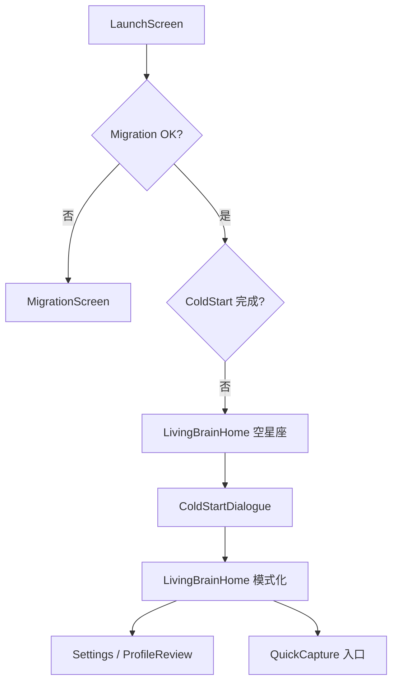

# my_brain Mobile — Screen Specs

> **来源**：`mobile-app-ui-design` + `DESIGN_SYSTEM.md` v2 + `docs/MOBILE_PRODUCT_PLAN.md`  
> **版本**：v2.0 · 2026-06-12  
> **画布**：390×844 · zh-CN · Light/Dark 双主题

---

## 0. 信息架构（无底部 Tab）



| 路由 | M 阶段 | 说明 |
|------|--------|------|
| `LaunchScreen` | M1 | 短唤醒，非 HUD Boot |
| `MigrationScreen` | M0 | 阻塞态，不挂载业务 UI |
| `LivingBrainHome` | M1 | 单主场景；空态 / 冷启动 / 模式化三态 |
| `ColdStartDialogue` | M1 | 叠在 Home 或替换情境区 |
| `SettingsScreen` | M1 | 含 ProfileReview、provider、导出 |
| `QuickCapture` | M4 | 分享/剪贴板；M1 可占位入口 |

---

## 1. LaunchScreen

### 目的

仪式感唤醒，建立「伴侣」而非「工具」第一印象。

### 布局

| 区域 | 内容 |
|------|------|
| 中央 | 品牌字标 `my_brain`（DM Sans 600） |
| 其下 | 一句口语：「你的大脑，慢慢亮起来」 |
| 背景 | 极淡星座点阵（3–5 颗，30% 透明度），随主题变色 |
| 底部 | 无进度条、无 BOOT SEQUENCE 文案 |

### 动效

- 0–400ms：logo opacity 0→1
- 400–1200ms：副文案 fade in
- 1200ms+：交叉淡化至 `LivingBrainHome` 或 `MigrationScreen`

### 时长

- 最长展示 **1.8s**；migration 未完成则切 Migration，不假 loading 百分比

---

## 2. LivingBrainHome — 状态机

同一屏三个互斥主态（非三个路由）：

| 状态 ID | 条件 | 星座区 | 情境区 | 意图条 |
|---------|------|--------|--------|--------|
| `empty_invite` | 无节点 && 冷启动未完成 | 中央待点亮星 | 邀请文案 + 开始聊 | 隐藏或仅「开始聊」 |
| `cold_start` | 冷启动进行中 | 保持空/微亮 | 对话 transcript | 隐藏（对话引导） |
| `adaptive_live` | 冷启动完成 | 有点+连线 | AdaptiveContextCard | 三意图全开 |

### 2.1 `empty_invite`（首次 / 冷启动前）

**峰值目标**：让用户感到「这是我的空间」，而非被塞资讯。

| 元素 | 规格 |
|------|------|
| 星座 | `ConstellationField` 空态；中央 **四角星** `pending` 脉冲；周缘 `dim` 星轻闪 |
| 标题 | hero：「这里还空着」 |
| 正文 | body：「聊几句，我就知道怎么陪你。第一颗星，会来自你的话。」 |
| 主 CTA | pill 按钮：「开始聊」→ 进入 `cold_start` |
| VoiceOrb | idle 呼吸；点击也可开始聊 |
| **禁止** | 今日雷达、资讯列表、Top3、Mock 角标 |

### 2.2 `cold_start`（ColdStartDialogue）

**原则**：自然对话，非问卷表单。

| 元素 | 规格 |
|------|------|
| 布局 | 星座缩至 28% 高（仍可见）；下方对话区 scroll |
| 伴侣气泡 | 左对齐，`surface` 卡，圆角 `md` |
| 用户气泡 | 右对齐，`primaryMuted` 底 |
| 输入 | 底栏：文字输入 + 麦克风；与 VoiceOrb 二选一展示（避免双球） |
| 分流 | ≥3 fixture：技术追踪 / 学习者 / 个人记忆（含混合模式） |
| 结束 | 识别 `UserModeProfile` → 切 `adaptive_live`；首节点来自对话提炼 |

**口语示例（伴侣）**：

- 「你更希望我帮你做什么？随便说，不用选类别。」
- 「听起来你更想先把东西记下来，对吗？」

### 2.3 `adaptive_live`（冷启动后）

**原则**：`AdaptiveRadar` = **单张情境卡**，形态随 `UserMode` 变；不是固定资讯雷达。

#### 共性布局

```
ConstellationField (42–48%, 可滑动, 四角星闪烁)
  └─ tap → NodeSummaryCard（概念名 + intro + 多说点/收起）
AdaptiveContextCard (单卡；点星时弱化)
[可选] QuickCapture chip「记下来」
VoiceOrb
IntentRail: 记住这个 | 先不用 | 多说点
```

#### 星图交互（`adaptive_live` / 有节点时）

| 手势 | 行为 |
|------|------|
| 单指拖动 | 平移星图视口（画布 > 屏宽） |
| 点击星点 | 展开 `NodeSummaryCard`；选中星放大 + 模式色环 |
| 点击空白 / 「收起」 | 关闭摘要；恢复情境卡不透明度 |
| 「多说点」（摘要内） | 对该概念进入 `detail` 语音讲解 |
| 双指捏合 | M2+ 可选缩放；M1 可仅平移 |

**摘要卡文案结构**

- 眉标：「你点亮的概念」
- 标题：`Node.title`
- 正文：`Node.intro`（≤2 行）
- 无 intro 时降级为「还没写下介绍，要现在聊聊吗？」

**与语音关系**：星图探索不阻塞底栏语音光球；伴侣可主动提议，用户也可先点星再开口。

参考稿：`v2-home-star-tap-reference.png`

#### 分模式情境卡

| UserMode | 卡片标题示例 | 卡片摘要示例 | suggestedIntent |
|----------|--------------|--------------|-----------------|
| 技术追踪者 | 「今天值得你看的一条」 | 「OpenAI 刚开了新模型通道，和你关注的推理成本有关。」 | 多说点 |
| 学习者 | 「上次聊的概念」 | 「Transformer 你还想继续吗？我可以从注意力机制讲起。」 | 多说点 |
| 创作者/研究者 | 「待整理的素材」 | 「你前天捕获的段落，要并入『写作系统』吗？」 | 记住这个 |
| 创业/项目型 | 「项目里卡住的点」 | 「竞品分析那节点三天没动了，要一起推进吗？」 | 多说点 |
| 个人记忆/生活型 | 「前几天你说过」 | 「周三你提到想早起跑步——要记成习惯节点吗？」 | 记住这个 |

- 卡片可右滑 dismiss → 记为 skip 信号
- 用户说「先不用」→ 同 `skip`
- **禁止**渲染 3 条平行资讯列表作为默认首页

#### 纠偏后即时重路由

用户从 Settings 改模式或说「我不是来学 XX 的」→ 卡片文案与 `modeAccent` 在 **同一 session** 切换，无需重启 App。

---

## 3. 三意图交互（口语）

| key | 文案 | 语音触发示例 | 结果 |
|-----|------|--------------|------|
| `ingest` | 记住这个 | 「记住」「收下」「入库」 | 确认入库 → `nodeBloom` |
| `skip` | 先不用 | 「不用」「跳过」「算了」 | 丢弃 ephemeral |
| `detail` | 多说点 | 「讲细点」「多说点」「展开」 | 伴侣加长讲解 → 再回到意图 |

- 文字按钮与语音等价；按钮高 48px，拇指区
- 选中态 150ms scale 0.97 压感

---

## 4. 入库峰值（Success）

1. 星座目标节点 `nodeBloom`（520ms）
2. 伴侣口语：「好，帮你记下了。」（非系统 Toast）
3. 可选：auto-curate 理由一行 caption 在卡片下淡入
4. **Undo**：卡片内 link「刚才记错了」→ graph history 撤销（M1 必做）

---

## 5. Settings / ProfileReview

### 入口

- 右上 `···` 或轻设置图标（44pt）；不在 Tab 栏

### 区块

| 区块 | 内容 |
|------|------|
| 画像 | 当前 `UserMode` + 置信度；可改主/次模式 |
| 纠偏历史 | 被否定的推断列表，可删除 |
| Provider | voice / llm / radar 状态；**mock 必须明示** |
| 数据 | 导出、schema version |
| 外观 | **浅色 / 深色 / 跟随系统** |

### ProfileReview 口语

- 误判项旁：「这不是我」→ suppression list

---

## 6. 横切状态

### Loading

分步 caption（非全屏 spinner）：

1. 「正在醒来…」（DB）
2. 「准备陪你…」（provider）

### Error（分因）

| 原因 | 文案方向 |
|------|----------|
| 麦克风 | 「听不到你——先用打字也行」 |
| DB | 「大脑暂时醒不过来，点一下重试」 |
| provider | 「连不上服务，演示模式先顶一下」 |

### Partial

- 已入库但未整理：卡片角标「整理中」
- live→mock：Degraded 条常驻直至恢复

### Degraded / Mock

- 顶栏 `PersistWarning`；Settings 内同色说明
- **禁止**与 live 视觉完全一致且无提示

---

## 7. QuickCapture（M4 预留 · M1 占位）

- `adaptive_live` 右下 chip：「记下来」
- M1：点击 → 口语 Toast「捕获还没接好，先用对话记下」

---

## 8. 参考稿生成计划（待审阅）

审阅本规格 + `DESIGN_SYSTEM.md` 后，按序产出 HTML → PNG：

| 文件 | 内容 |
|------|------|
| `v2-launch-reference.html` | Launch · Dark |
| `v2-home-empty-reference.html` | `empty_invite`（即 `v2-home-reference`） |
| `v2-home-adaptive-tech-reference.html` | `adaptive_live` · 技术追踪者 |
| `v2-home-adaptive-learner-reference.html` | `adaptive_live` · 学习者 |
| `v2-home-adaptive-creator-reference.html` | `adaptive_live` · 创作者/研究者 |
| `v2-home-adaptive-founder-reference.html` | `adaptive_live` · 创业/项目型 |
| `v2-home-adaptive-memory-reference.html` | `adaptive_live` · 个人记忆/生活型 |
| `v2-home-star-tap-reference.html` | `adaptive_live` · 点星出摘要（学习者 fixture） |

导出：Playwright 截图 `.phone` 390×844 @3x。

---

## 9. M1 验收对照

| 检查项 | 规格位置 |
|--------|----------|
| 30s 内懂产品非资讯 App | §2.1 文案 |
| 60s 个性化闭环 | §2.2→§2.3→§4 |
| 冷启动 ≥3 fixture | §2.2 |
| 三意图口语 + 文字 | §3 |
| 无首页资讯列表 | §2.3 禁止项 |
| 星图可滑动 + 点星摘要 | §2.3 星图交互 |
| Light/Dark | DESIGN_SYSTEM §2 |
| ProfileReview M1 | §5 |

---

## 10. 与 v1 差异摘要

| v1（作废） | v2 |
|------------|-----|
| HUD 科幻、霓虹青紫 | 温暖伴侣 + Arc 色块 |
| 首页今日雷达 Top3 AI 资讯 | 冷启动后才单卡情境 |
| INGEST/SKIP/DETAIL | 记住这个 / 先不用 / 多说点 |
| 仅深色科幻 | Light + Dark |
| 波形语音球 | 底部柔和呼吸光球 + 四角星闪烁星座 |
| Boot Sequence 进度 | 短唤醒 fade |
